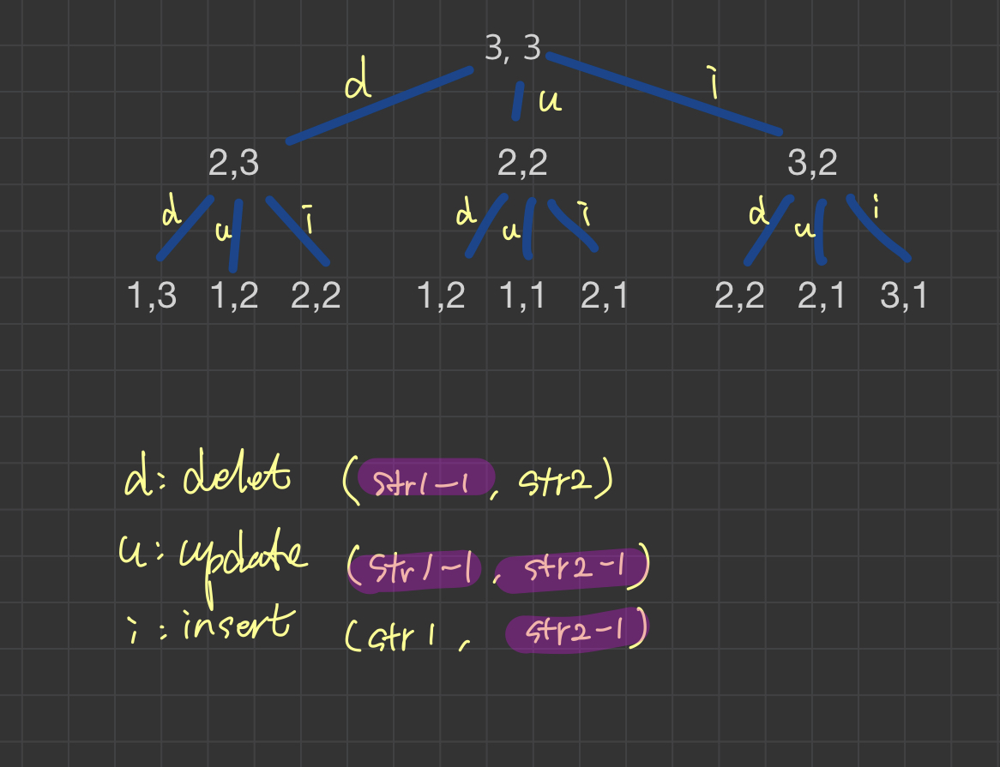

# 문제

두 단어가 주어지며 "삽입, 삭제, 치환"을통해서 같게 만들기 위한 최소 교정 비용을 구하는 문제

# 해결 방법

작은 문제를 사용해 큰 문제를 정의
str1, str2의 첫번째 글자를 비교하는 것이 시작지점.

1. 두글자가 같다면 양쪽 단어의 첫번재 글자에 대해서 아무것도 하지 않아도 되며  
   이 글자를 제외한 두 단어간의 최소 교정 비용을 찾아야 한다.

2. 두글자가 다르다면 아래 3개 연산을 진행한다.

   1. 삭제 연산

      - str1에서 첫번째 글자를 삭제 후
      - str1, str2사이의 최소 교정 비용을 구한다.

   2. 치환 연산

      - str1의 첫번재 글자를 str2의 첫번째 글자로 치환 후
      - 양쪽 첫번재 글자를 제외한 단어 간의 최소 교정 비용을 구한다.
      - 치환 연산이후 양쪽 첫번째 글자가 같아졌다.

   3. 삽입 연산
      - str2첫번째 글자를 str1의 제일 앞에 삽입 후
      - 양쪽 단어의 첫 번재 글자를 제외한 나머지 단어 간의 최소 교정 비용을 구한다.
      - 삽입하고 나번 첫번째 글자가 같아졌고 str1의 길이는 하나 증가

연산 이후의 최소 교정 비용은 재귀 호출에 맞긴다.  
삭제, 치환, 삽입의 어떤 연산을 수행하건 하나의 연산을 수행했으므로 각 재귀 호출의 결과중 제일 최솟값에 1을 더해서 반환한다.

# CODE

```js
/* 
        # 최소 교정 비용 문제

        * 두 단어의 한글자씩 바꿀수 있는 방법: 삽입, 삭제, 치환
        * 두 단어간의 교정 비용은 한 단어에서 다른 단어로 바꾸는데 필요한 글자 연산의 횟수로 정의
               
    */

function editDistance(str, str2) {
  if (!str) {
    return str2.length
  }

  if (!str2) {
    return str.length
  }

  // 첫글자 같을 때
  if (str[0] == str2[0]) {
    return editDistance(str.substr(1), str2.substr(1))
  }

  // 삭제, 치환 연산 recursion
  let d, u, i
  // 삭제 연산
  d = editDistance(str.substr(1), str2)

  // 치환 연산
  u = editDistance(str.substr(1), str2.substr(1))

  // 삽입 연산
  i = editDistance(str, str2.substr(1))

  return Math.min(d, u, i)
}

const str = "SUNDAY"
const str2 = "SATURDAY"

// const str = "CAT";
// const str2 = "DOG";

// const str = "CAT";
// const str2 = "CAR";
console.log(editDistance(str, str2))
```

# 작은 예시

SUNDAY, SATURDAY/ SATURDAY, SUNDAY 두 단어의 최소 연산 과정

```
  -: 삭제, +: 삽입, @: 교환

    S     U N D A Y
      + +   @
    S A T U R D A Y


    S A T U R D A Y
      - -   @
    S     U N D A Y
```

# call stack tree(하향식 접근방법)


