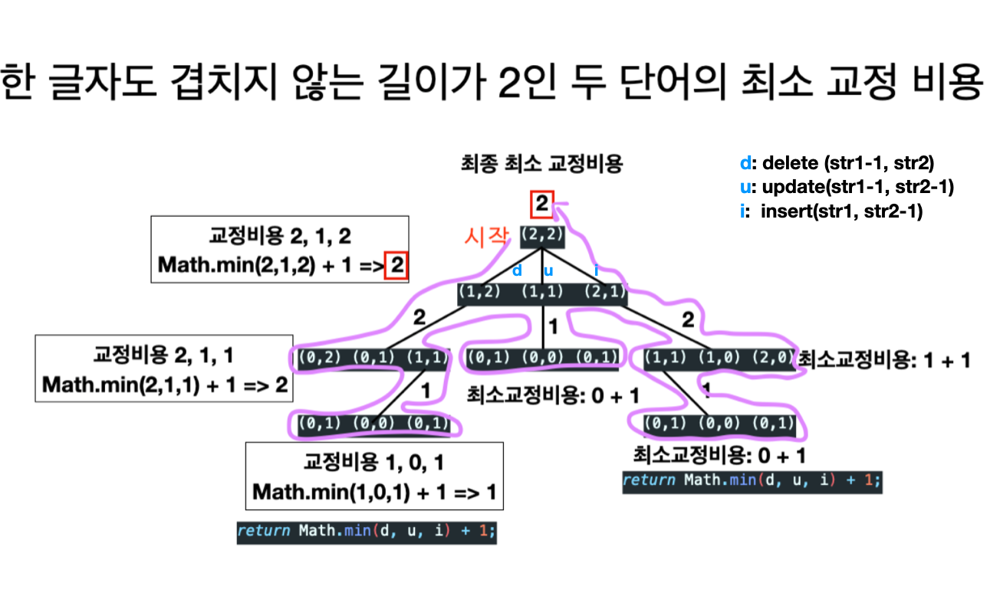

# 문제

두 단어가 주어지며 "삽입, 삭제, 치환"을통해서 같게 만들기 위한 최소 교정 비용을 구하는 문제

# 해결 방법

작은 문제를 사용해 큰 문제를 정의
str1, str2의 첫번째 글자를 비교하는 것이 시작지점.

1. 두글자가 같다면 양쪽 단어의 첫번재 글자에 대해서 아무것도 하지 않아도 되며  
   이 글자를 제외한 두 단어간의 최소 교정 비용을 찾아야 한다.

2. 두글자가 다르다면 아래 3개 연산을 진행한다.

      1. 삭제 연산

         - str1의 첫번째 글자를 삭제 후
         - str1, str2사이의 최소 교정 비용을 구한다.

      2. 치환 연산

         - str1의 첫번재 글자를 str2의 첫번째 글자로 치환 후
         - 양쪽 첫번재 글자를 제외한 단어 간의 최소 교정 비용을 구한다.
         - 치환 연산 이후 양쪽 첫번째 글자가 같아졌다.

      3. 삽입 연산
         - str2의 첫번째 글자를 str1의 제일 앞에 삽입 후
         - 양쪽 단어의 첫 번재 글자를 제외한 나머지 단어 간의 최소 교정 비용을 구한다.
         - 삽입하고 나면 첫번째 글자가 같아졌고 str1의 길이는 하나 증가
         - _그러나, 실제 코드로 구현할때는 str2문자열의 첫번째 문자를 제거하는 것과같은 결과를 반환한다._
           - 아래 코드 하이라이트 부분 "POINT1", "POINT2"참고하면 이해가 쉽다.
           - 예를 들어 dog, doag에서
               - g, ag가 남아 있을때
               - ag, ag나 g, g나 횟수 기준으로 결과는 같다.

연산 이후의 최소 교정 비용은 재귀 호출에 맞긴다.  
삭제, 치환, 삽입의 어떤 연산을 수행하건 하나의 연산을 수행했으므로 각 재귀 호출의 결과중 제일 최솟값에 1을 더해서 반환한다.

# 문제해결 팁

- 삭제와 삽입 "연산 횟수"는 같은 결과를 도출한다.

```
  +: 추가, -: 제거, @: 교환

    S     U N D A Y
      + +   @           
    S A T U R D A Y

    S     U N D A Y
      - -   @           
    S A T U R D A Y
```

# CODE + 분석

```js
/* 
  # 최소 교정 비용 문제
    * 두 단어의 한글자씩 바꿀수 있는 방법: 삽입, 삭제, 치환
    * 두 단어간의 교정 비용은 한 단어에서 다른 단어로 바꾸는데 필요한 글자 연산의 횟수로 정의
    

    * [POINT2]
    * +: 추가, -: 제거, @: 교환
      S     U N D A Y
        + +   @           
      S A T U R D A Y

      S     U N D A Y
        - -   @           
      S A T U R D A Y
*/

function editDistance(str1, str2) {
  if (!str1) {
    return str2.length; // highlight-line // POINT0: str1이 모두 삭제됐다면, str2의 남은 길이 만큼 "추가" 해야 함으로 str2 길이를 반환한다.
  }

  if (!str2) {
    return str1.length; // highlight-line // POINT0: 위쪽 코드 주석 참고
  }

  // 첫글자 같을 때
  if (str1[0] == str2[0]) {
    return editDistance(str1.substr(1), str2.substr(1)); // highlight-line
  }

  // 삭제, 치환 연산 recursion
  let d, u, i;
  // 삭제 연산
  // : 실제로 삭제하는 대신 str의 첫번째 글자를 제외한다.
  // : 그리고, 두 문자열의 최소 교정 비용을 구한다.
  d = editDistance(str1.substr(1), str2); // highlight-line

  // 치환 연산
  // : 치환하면 첫번째 글자가 같아지므로 두 문자열의 첫번재 글자를 제외한다.
  // : 그래서, 실제 치환하는대신 두 문자열(str, str2)의 두번째 문자부터의 최소교정 비용을 구한다.
  u = editDistance(str1.substr(1), str2.substr(1)); // highlight-line

  // 삽입 연산
  // : 실제로 삽입하는 대신 str2의 첫번째 글자를 제외한다.
  // : 그리고, 두 문자열의 최소 교정 비용을 구한다.
  i = editDistance(str1, str2.substr(1)); // highlight-line // POINT1

  return Math.min(d, u, i) + 1;
}

var str1 = "SUNDAY";
var str2 = "SATURDAY";

// var str = "CAT";
// var str2 = "DOG";

// var str = "CAT";
// var str2 = "CAR";
console.log(editDistance(str1, str2));
```

# CODE ONLY

```js
function editDistance(str1, str2) {
  if (!str1) {
    return str2.length;
  }
  if (!str2) {
    return str1.length;
  }

  // 앞글자 비교
  if (str1[0] === str2[0]) {
    return editDistance(str1.substr(1), str2.substr(1));
  }

  // 삭제,치환,추가별 교정비용 처리
  var d, u, i;

  d = editDistance(str1.substr(1), str2);
  u = editDistance(str1.substr(1), str2.substr(1));
  i = editDistance(str1, str2.substr(1));

  return Math.min(d, u, i) + 1;
}

var str1 = "SUNDAY";
var str2 = "SATURDAY";
console.log(editDistance(str1, str2));
```

# 작은 예시

SUNDAY, SATURDAY/ SATURDAY, SUNDAY 두 단어의 최소 연산 과정

```
  -: 삭제, +: 삽입, @: 교환

    S     U N D A Y
      + +   @
    S A T U R D A Y


    S A T U R D A Y
      - -   @
    S     U N D A Y
```

# call stack tree(하향식 접근방법)

한 글자도 겹치지 않는 길이가 2인 두 단어의 최소 교정 비용



- (0,2) -> 이진트리 level + 2 가 교정비용이다.
    - 위 2는 2번 문자 추가하면 되기 때문이다.
- (0,0) -> 이진트리 level이 교정비용
    - 추가로 교정할게 없다.
- (2,0) -> 이진트리 level + 2 가 교정비용이다.
    - 2번 문자 삭제하면 된다.

# 시간 복잡도

지수시간 O(3^n)
