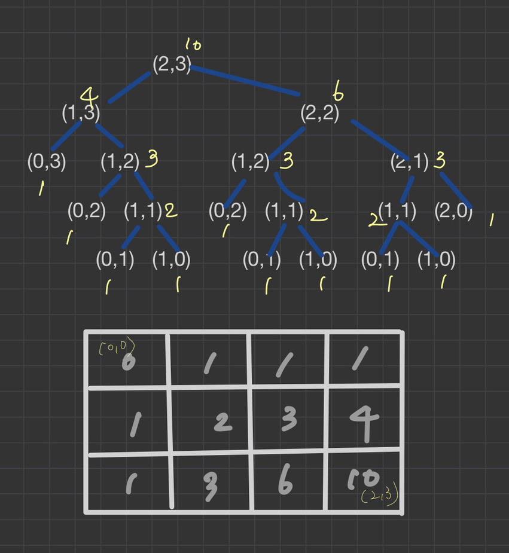

# 문제

- M X N개의 방으로 구성된 직사각형이 있을 때 좌상단 방에서 우하단 방까지 이동하는 모든 경로의 수를 구한다.
- 단 이동은 오른쪽, 아래 방향으로만 이동가능

# 해결 방법

방(m, n)은 다은 두방에서 접근이 가능

1. 바로 위방 방: 방(m-1, n)
2. 바로 왼쪽 방: 방(m, n-1)

```
  방 (m-1, n)까지의 경로기 P1개이고
  방 (m, n-1)까지의 경로가 P2개라면
  방 (m, n)까지는 방(m-1, n)과, 방(m, n-1)을 경유하는 P1+P2 개의 경로로 도달 할 수 있다.
  이를 재귀 호출로직으로 정의할 수 있다.
```

# CODE

```js
function numOfPaths(m, n) {
  // 종료 조건
  if (m == 0 && n == 0) {
    // 방 (0, 0)
    return 0
  }

  if (m == 0 || n == 0) {
    //첫 번째 행 또는 첫번째 열
    return 1
  }

  return numOfPaths(m - 1, n) + numOfPaths(m, n - 1)
}

console.log(numOfPaths(2, 3))
```

# call stack tree(하향식 접근방법)


