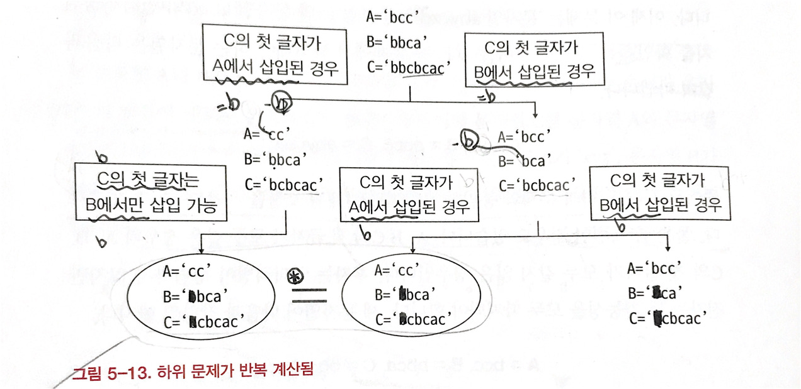

# 문제

주어진 두 문자(str1, str2)가 순서를 유지하고 섞었을때 str3이 되는가?

# 해결 방법

아래 두가지 경우에 재귀 호출을 하면서 str1, str2의 모든 경우의 수를 확인하면서 인터리빙인지 확인한다.

1. str1의 첫 글자와 str3의 첫글자가 같은 경우
2. str2의 첫 글자와 str3의 첫글자가 같은 경우

# CODE

```js
function isInterleaving(str1, str2, str3) {
  // 모든 문자열이 빈문자열인 경우 인터리빙 문자
  if (str1.length == 0 && str2.length == 0 && str3.length == 0) {
    return true
  }

  // str1, str2문자열의 길이의 합이 str3 문자열의 길이와 다를 때
  if (str1.length + str2.length != str3.length) {
    return false
  }

  var case1 = false
  var csee2 = false

  // str1의 첫 글자와 str3의 첫글자가 같은 경우
  if (str1[0] == str3[0]) {
    case1 = isInterleaving(str1.substr(1), str2, str3.substr(1))
  }
  // str2의 첫 글자와 str3의 첫글자가 같은 경우
  if (str2[0] == str3[0]) {
    case2 = isInterleaving(str1, str2.substr(1), str3.substr(1))
  }

  //두 경우 중 하나라도 참이면 인터리빙
  return case1 || case2
}

var str1 = "bcc"
var str2 = "bbca"
var str3 = "bbcbcac"

console.log(isInterleaving(str1, str2, str3))
```

# call stack tree(하향식 접근방법)


