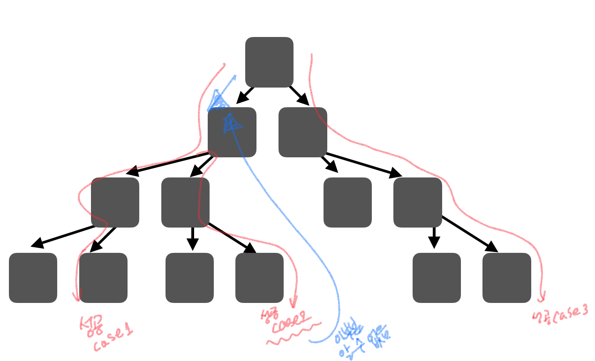

# 문제

주어진 두 문자(str1, str2)가 순서를 유지하고 섞었을때 str3이 되는가?

# 해결 방법

아래 두가지 경우에 재귀 호출을 하면서 str1, str2의 모든 경우의 수를 확인하면서 인터리빙인지 확인한다.

1. str1의 첫 글자와 str3의 첫글자가 같은 경우
2. str2의 첫 글자와 str3의 첫글자가 같은 경우

# CODE

```js
function isInterleaving(str1, str2, str3) {
  // 모든 문자열이 빈문자열인 경우 인터리빙 문자
  if (str1.length == 0 && str2.length == 0 && str3.length == 0) {
    return true //highlight-line
  }

  // str1, str2문자열의 길이의 합이 str3 문자열의 길이와 다를 때
  if (str1.length + str2.length != str3.length) {
    return false
  }

  var case1 = false
  var case2 = false

  // str1의 첫 글자와 str3의 첫글자가 같은 경우
  if (str1[0] == str3[0]) {
    case1 = isInterleaving(str1.substr(1), str2, str3.substr(1)) //highlight-line
  }
  // str2의 첫 글자와 str3의 첫글자가 같은 경우
  if (str2[0] == str3[0]) {
    case2 = isInterleaving(str1, str2.substr(1), str3.substr(1)) //highlight-line
  }

  //두 경우 중 하나라도 참이면 인터리빙
  return case1 || case2
}

var str1 = "bcc"
var str2 = "bbca"
var str3 = "bbcbcac"

console.log(isInterleaving(str1, str2, str3))
```

# CODE + 성공한 케이스 노드 기록

```js
  var successStack = []; //highlight-line
  var stackIndex = -1;
  var isSuccess = false;
  function isInterleaving(str1, str2, str3) {
    // 종단점
    if (str1.length == 0 && str2.length == 0 && str3.length == 0) {
      isSuccess = true;
      successStack.push([]) && ++stackIndex;  //highlight-line

      // left stack 처리 하기
      // 성공하는 첫번째 stack은 모두 가능
      // 두번째 부터는 트리구조에서 root에 도달하지 않고 자식 노드 부터 successStack을 쌓을 수 있기 때문에 추가한 로직
      // # stackIndex 2부터 확이하는 이유
      //  * 실제로 이 것을 수행하는 stack은 2번째 성공 케이스가 아닌 3번째 성공 케이스 스택부터 수행되기 때문
      if (
        stackIndex >= 2 &&
        successStack[stackIndex - 2].length !==
          successStack[stackIndex - 1].length
      ) {
        var leftCount =
          successStack[stackIndex - 2].length -
          successStack[stackIndex - 1].length;
        var leftIndex = successStack[stackIndex - 2].length - leftCount;
        var leftStack = successStack[stackIndex - 2].slice(leftIndex);
        successStack[stackIndex - 1] = [    //highlight-line
          ...successStack[stackIndex - 1],    //highlight-line
          ...leftStack,   //highlight-line
        ];
      }
      return true;
    }

    var case1 = false;
    var case2 = false;
    var removeStr = "";

    if (str1[0] === str3[0]) {
      case1 = isInterleaving(str1.substr(1), str2, str3.substr(1));
      removeStr = "str1[0]";
      pushStack(str1, str2, str3, removeStr);
    }

    if (str2[0] === str3[0]) {
      case2 = isInterleaving(str1, str2.substr(1), str3.substr(1));
      removeStr = "str2[0]";

      pushStack(str1, str2, str3, removeStr);
    }

    return case1 || case2;
  }

  function pushStack(str1, str2, str3, removeStr) {
    if (isSuccess) {
      successStack[stackIndex].push({ str1, str2, str3, removeStr }); //highlight-line
      if (
        isSuccess &&
        str1.length == str1Len &&
        str2.length == str2Len &&
        str3.length == str3Len
      ) {
        isSuccess = false;
      }
    }
  }

  var str1 = "bcc";
  var str2 = "bbca";
  var str3 = "bbcbcac";
  var str1Len = str1.length;
  var str2Len = str2.length;
  var str3Len = str3.length;
  console.log(isInterleaving(str1, str2, str3));
  console.log(successStack);
```

* 트리 노드로 보는 stack 도식화


# call stack tree(하향식 접근방법)


