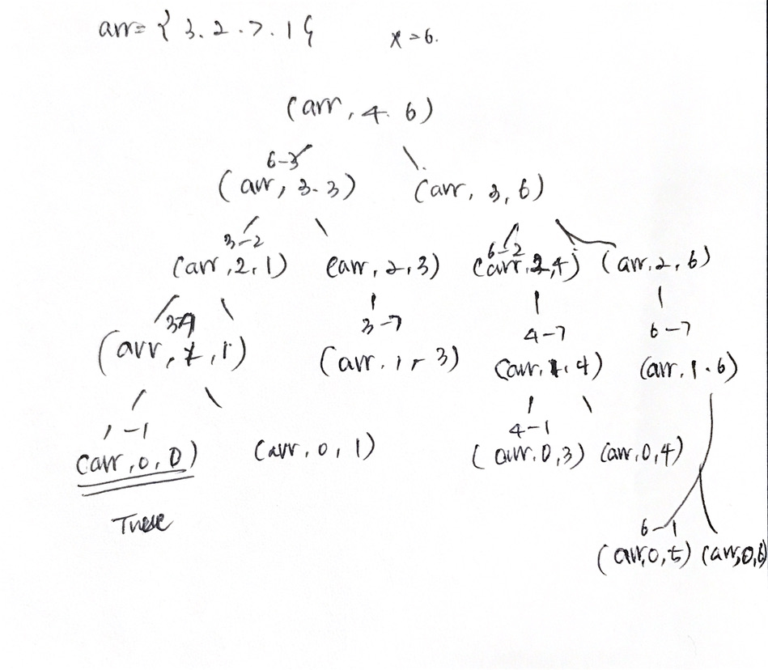

# 문제

- 0과 양의 정수로 이루어진 집합이 있고 또 다른 양의 정수 X가 있다.
- 주어진 집합의 부분집합중에 원소의 합이 X인 부분집합이 존재하는지 검사를 하는 함수
- 예로 집합 {3,2,7,1}이고 X가 6인 경우, 한 부분집합 {3,2,1}의 원소의 합이 6이므로 이 함수는 참을 반환해야 한다.

# 해결 방법

합 X가 되는 부분 집합을 찾을때 집합의 각 원소에 대해서 두가지 가능성이 있다.
집합 내의 어떤 원소 P에 대해 다음 두가지 경우를 살펴보자

```
1. 부분집합에 이 원소를 포함한다면 -> 집합의 나머지에서 합이 X-P가 되는 부분집합을 찾아야 한다.

2. 부분집합에 이 원소를 포함하지 않는다면 -> 집합의 나머지에서 합이 X가 되는 부분 집합을 찾아야 한다.
```

- 종료조건

  1. X가 0이
  2. 집합내 모든 원소를 모두 사용했는지(실패)의 여부

- 조건

  1. 한가지 특수한 경우 원소의 값이 X보다 큰 경우, 이런 원소는 재귀 호출 없이 부분 집합에 포함하지 않아도 된다.

# CODE

```js
function isSubsetSum(arr, n, X) {
  // 종료 조건1: X가 0이면 성공 종료 조건
  if (X == 0) return true

  // 종료 조건2: X가 0이 아니고 남은 원소가 없다면 실패 종료 조건
  if (n == 0) return false

  // X보다 큰 원소는 무시해도 좋습니다.
  if (arr[0] > X) {
    return isSubsetSum(arr.slice(1), n - 1, X)
  }

  // 부분집합에 원소를 포함하지 않는 경우와
  // 원소를 포함하는 경우 각각에 대해 재귀 호출
  return (
    isSubsetSum(arr.slice(1), n - 1, X) ||
    isSubsetSum(arr.slice(1), n - 1, X - arr[0])
  )
}

var arr = [3, 2, 7, 1]
console.log(isSubsetSum(arr, arr.length, 6))
```

# call stack tree(하향식 접근방법)


