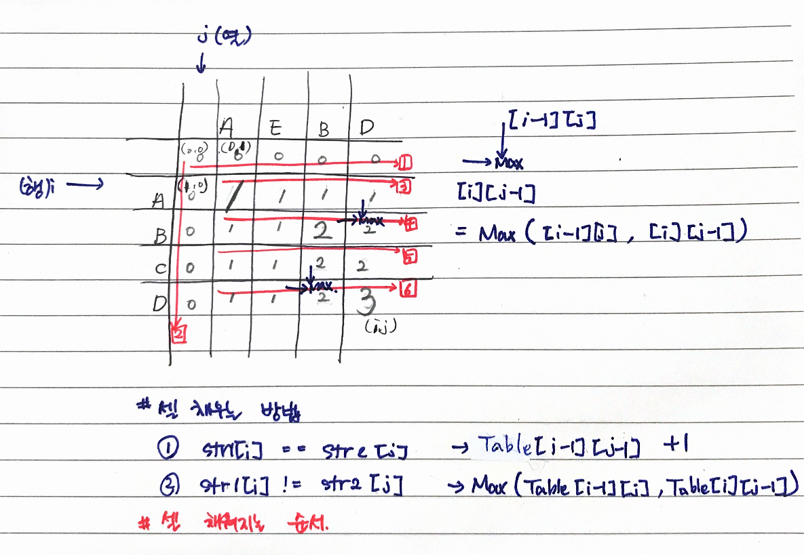

# 문제

최장 공통 부분 수열(Longest common subsequce - LCS)
문자열 내에서 왼쪽에서 오른쪽 방향으로 문자열 내에 들어 있는 글자의 수열
반드시 연속적인 글자들로 구성될 필요 x

- 예

```
  문자열 X가 ABCDE라면
  AB, ACD, BDE 등은 문자열 X의 부분 집합
```

# 해결 방법

- 2차원 행렬을 가정하고 문자열 하나는 행에, 문자열 하나는 열에 배치한다.
- 주어진 문자 두개의 마지막 글자를 비교하면서 행렬을 채워나간다.
- 아래 코드에서 point1, point2 부분을 확인하자.

# CODE

```js
function lcs_length(str1, str2, m, n) {
  // # point1
  // lcs_table 첫번째 열, 첫번째 행을 0으로 채우는것 행략 위 코드에서 모든 요소에 0으로 초기화함.
  var lcs_table = Array(m + 1)
    .fill(0)
    .map(v => Array(n + 1).fill(0))

  // # point2
  // 배열의 나머지 셀을 채운다
  for (var i = 1; i <= m; i++) {
    for (var j = 1; j <= n; j++) {
      // 추가된 글자가 같은 글자면 LCS에 이 글자를 추가 할 수 있다.
      if (str1[i - 1] === str2[j - 1]) {  //highlight-line
        lcs_table[i][j] = lcs_table[i - 1][j - 1] + 1 //highlight-line
      } else {
        lcs_table[i][j] = Math.max(lcs_table[i - 1][j], lcs_table[i][j - 1]) //highlight-line
      }
    }
  }

  return lcs_table[m][n]
}

var str1 = "ABCD"
var str2 = "AEBD"
var m = str1.length
var n = str2.length

console.log(lcs_length(str1, str2, m, n)) // 3
```

# 시간복잡도

상향식 다이내믹 프로그래밍을 적용하면 시간 복잡도는 O(mn)이 되며, 양쪽 문자 열의 길이가 똑같으면 O(n2) - n의 제곱이 됩니다.

# call stack tree(하향식 접근방법)


