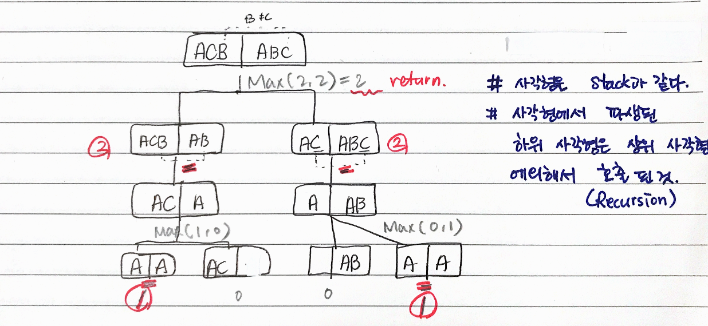

# 문제

최장 공통 부분 수열(Longest common subsequce - LCS)
문자열 내에서 왼쪽에서 오른쪽 방향으로 문자열 내에 들어 잇는 글자의 수열
반드시 연속적인 글자들로 구성될 필요 x

- 예

```
  문자열 X가 ABCDE라면
  AB, ACD, BDE 등은 문자역 X의 부분 집합
```

# 해결 방법

- 마지막 글자를 비교하며 시작한다.
- 마지막 글자를 비교할 때 다음 두가지 경우가 있다.

```
1. 마지막 두 글자가 같은 경우
- LCS에 들어가는 글자 하나를 찾아 냈다는 의미
- 결과에 1을 더하고 양쪽 문자열을 삭제한 문자열로 함수를 재귀 호출한다.
  = LCS_LENGTH('ABCD', 'AEBD') = 1 + LCS_LENGTH('ABC', 'AEB')

2. 마지막 두 글자가 다른 경우
- 아래 두 LCS의 길이를 구해서 이 중 큰 값을 반환한다.

2-1. 문자열 A의 마지막 글자를 제외한 문자열(길이 m-1)과 문자열 B(길이 n  )의 LCS
2-2. 문자열 A의 마지막 글자를 제외한 문자열(길이 m  )과 문자열 B(길이 n-1)의 LCS

 = LCS_LENGTH('ABCDE', 'ABCDF') = MAX( LCS_LENGTH('ABCD', 'ABCDF'),
                                       LCS_LENGTH('ABCDE', 'ABCD'))

```

# CODE

- Memoization

```js
function lcs_length(str1, str2, m, n) {
  // 종단점: 두문자열 중 하나가 빈 문자열(length == 0)
  if (m == 0 || n == 0) {
    return 0
  }

  // 캐시단계
  if (!!LCSLTable[m][n]) {
    return LCSLTable[m][n]
  }

  // 문자열 마지막 글자를 비교해 조건에 따라 재귀 호출
  if (str1[m - 1] == str2[m - 1]) {
    LCSLTable[m][n] = 1 + lcs_length(str1, str2, m - 1, m - 1)
  } else {
    LCSLTable[m][n] = Math.max(
      lcs_length(str1, str2, m, n - 1),
      lcs_length(str1, str2, m - 1, n)
    )
  }

  return LCSLTable[m][n]
}

var str1 = "ABCD"
var str2 = "AEBD"
// var str1 = 'ACB';
// var str2 = 'ABC';
var m = str1.length
var n = str2.length

//lcs_length 저장한 캐시
var LCSLTable = Array(m + 1)
  .fill(0)
  .map(v => Array(n + 1).fill(0))

console.log(lcs_length(str1, str2, m, n))
```

# call stack tree(하향식 접근방법)


