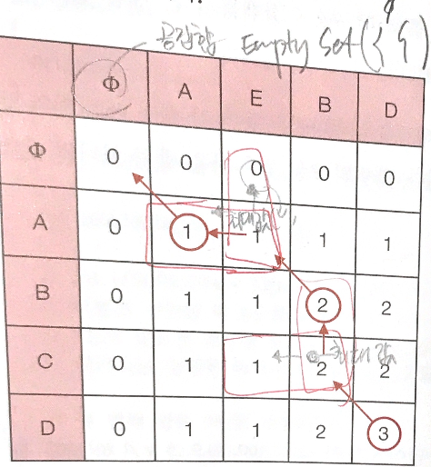

# 문제

최장 공통 부분 수열(Longest common subsequce - LCS)
LCS의 문자열을 구해보자

# 해결 방법

최장 공통 부분 수열 길이를 다이내믹 프로그래밍으로 구했을때
거꾸로 좌상단 행까지 경로를 따라 이동해 가면서 LCS의 공통 부분 수열을 출력해보자

- POINT1: LCS를 구하는 코드
- POINT2: LCS의 문자열을 구하는 코드

# CODE

```js
function lcs_length(str1, str2, m, n) {
  // POINT1
  var lcsTable = Array(m + 1)
    .fill(0)
    .map(v => Array(n + 1).fill(0))

  for (var i = 1; i <= m; i++) {
    for (var j = 1; j <= n; j++) {
      if (str1[i - 1] === str2[j - 1]) {
        lcsTable[i][j] = lcsTable[i - 1][j - 1] + 1
      } else {
        lcsTable[i][j] = Math.max(lcsTable[i - 1][j], lcsTable[i][j - 1])
      }
    }
  }

  var lcsLength = lcsTable[m][n]

  // ------------------------
  // POINT2
  // LCS를 저장할 문자열
  var LCS = Array(lcsLength)
  lcsLength--

  // 우하단에서 시작
  var i = m,
    j = n

  while (i > 0 && j > 0) {
    // str1, str2의 현재의 글자가 같으면 LCS에 포함
    if (str1[i - 1] == str2[j - 1]) {
      LCS[lcsLength] = str1[i - 1]
      i--
      j--
      lcsLength--
    } else if (lcsTable[i - 1][j] > lcsTable[i][j - 1]) {
      //같지 않다면 위쪽 또는 왼쪽 셀의 값 중 큰 값을 따라 이동.
      i--
    } else {
      j--
    }
  }

  console.log(LCS.join(""))

  return lcsTable[m][n]
}

var str1 = "ABCD"
var str2 = "AEBD"

console.log(lcs_length(str1, str2, str1.length, str2.length))
```

# call stack tree(하향식 접근방법)


