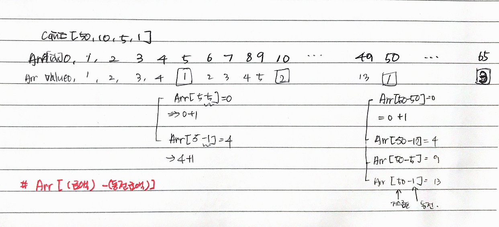

# 문제

105원을 50원, 10원, 5원, 1원 4개 동전으로 최소한의 동전으로 거스를수 있는 방법 구하기

# 해결 방법

재귀 호출을 사용할 때 와 비슷한 방법으로 다이내믹 프로그래밍을 사용할수 있다.  
다른 점은 작은 액수부터 큰 액수의 방향으로 구해나간다는 점

# CODE

```js
function minCoins(coin, N, C) {
  // # POINT1
  // resultArray[i]에는 i원을 거슬러줄 때 필요한 최소 동전의 개수를 저장
  // 마지막에 resultArr[C]를 반환합니다.

  // 최솟값을 구하기 위해 resultArr의 모든 값을 매우 큰 값으로 초기화
  var maxNum = Number.MAX_SAFE_INTEGER
  var resultArr = Array(C + 1).fill(maxNum)

  // C = 0일 때
  resultArr[0] = 0
  /*
   * N: 동전 종류
   * C: 거슬러줄 금액
   */
  for(var i =1; i<=C; i++){
    for(var j =0; j<N j++> ){
      if(coin[j] < i){
        var temp = resultArr[i-coin[j]];

        if(temp != maxNum && temp + 1 < resultArr[i]){
          resutArr[i] = temp + 1;
        }
        if( temp != maxNum && temp + 1 < resultArr[i]){
          resultArr[i] = temp + 1;
        }
      }
    }
  }

  for (var i = 1; i <= C; i++) {
    for (var j = 0; j < N; j++) {
      // # POINT2
      // 현재 구하려는 금액보다 작은 액변가의 동전에 대해서만 검사
      if (coin[j] <= i) {
        var temp = resultArr[i - coin[j]]

        // resultArr[0] = 0; 이기 때문에 가능.
        // # POINT3
        // i원의 최소 거스름돈 보다(resultArr[i])
        if (temp != maxNum && temp + 1 < resultArr[i]) {
          resultArr[i] = temp + 1
        }
      }
    }
  }

  return resultArr[C]
}

var coin = [50, 10, 5, 1]
var N = coin.length
var C = 105

console.log(minCoins(coin, N, C))
```

# call stack tree(상향식 접근방법)

예, i=5인 경우

```
  * resultArr[i]: 거스름돈 i원의 최소 거스름돈 동전 개수
  * temp: resultArr[i]를 구하기 위한 temporary 변수(동전 종류를 순회하면서 temp가 결정 됨)
```

- 50원, 10원은 coin[j] <= i에 부적합으로 5원, 1원만 가능
- 5원, 1원인 경우
  - j=2, coin[j] = 5원  
     => resultArr[5-5]  
     => 0원 최소 거스름돈 동전 개수 0개(temp = 0)  
     => resultArr[5] = 0(temp) + 1 = 1;
  - j=3, coin[j] = 1원  
     => resultArr[5-1]  
     => 4원 최소 거스름돈 동전 개수 4개(temp = 4)  
     => resultArr[5] = 4(temp) + 1 = 5;


