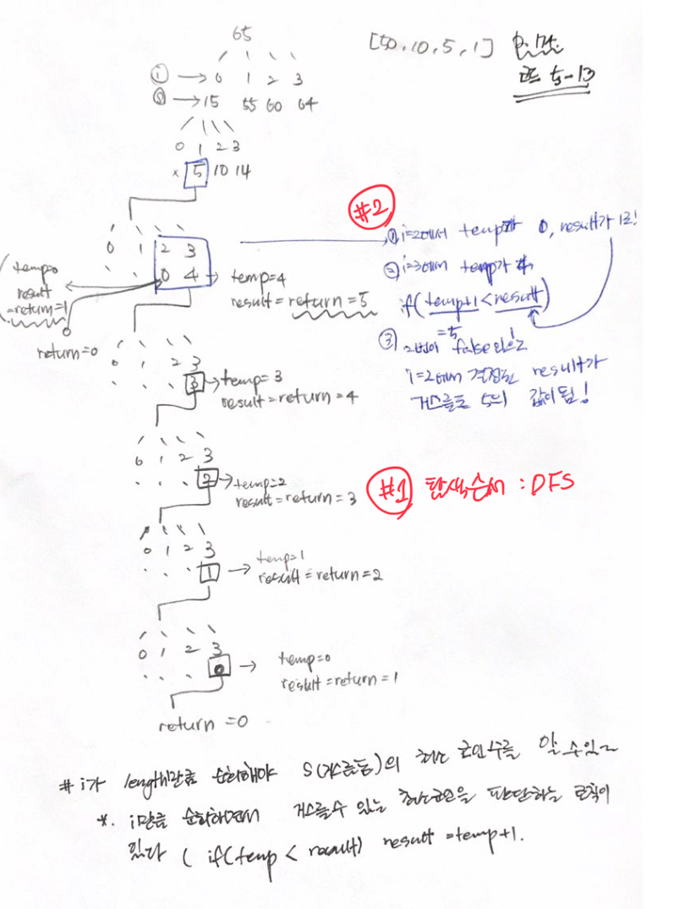

# 문제

105원을 50원, 10원, 5원, 1원 4개 동전으로 최소한의 동전으로 거스를수 있는 방법 구하기

# 해결 방법

탐욕 알고리즘으로 해결 할 수 있다.

- 50원짜리 동전을 사용할 수 있을 때까지 사용한다.
- 그다음 액면가인 10원짜리 동전을 또 사용할 수 있을 때까지 사용하는 방법

# 탐욕알고리즘이란?

- 탐욕 알고리즘은 *가능한 모든 경우를 전부 검사하지 않는다*는 점에서 다이내믹 프로그래밍과 통하는 바가 있다.
- 그러므로 탐욕 알고리즘을 사용해 효율적으로 풀 수 있는 종류의 문제도 있다.
- 하지만 탐욕 알고리즘을 모든 경우에 사용할 수 있는 것은 아니다.

- 거스름돈 동전 개수로 예를 들어 보자
  - 정의: 동전의 개수를 줄이려면 금이 더 작은 동전으로 만든 금액이 바로 상위 동전 금액 보다 작아야 한다.
  - 즉 1원 동전으로 거슬러줄 수 있는 금액은 상위 동전 5원 미만 이어야 한다.  
    => 1원 동전 5개는 5원 동전 하나와 같다.
  - 마찬가지로 5원 동전으로 거슬러줄 수 있는 금액은 상위 동전 10원 미만 이어야 한다.  
    => 5원 동전 2개는 10원 동전 하나와 같다.

# 탐욕 알고리즘을 사용하지 못하는 케이스

- 50원, 10원, 5원, 1원 동전에 12원동전이 추가 되어 65원을 탐욕 알고리즘으로 거슬러 보자
- "50, 12, 1, 1, 1" -> 5개의 동전이 필요.
- 하지만 "50, 10, 5"인 케이스에서는 3개의 동전이 필요.

이런 케이스에서는 탐욕 알고리즘이 최적의 해가 아닌 경우에 해당한다.

# CODE

```js
var maxNum = Number.MAX_SAFE_INTEGER
var resultArr = []

/*
 * N: 동전 종류
 * C: 거슬러줄 금액
 */
function minCoins(coin, N, S) {
  if (S == 0) return 0

  if (!!resultArr[S]) return resultArr[S]

  var result = maxNum
  // 최소값을 저장하는 변수
  for (var i = 0; i < N; i++) {
    // 액면가가 S보다 같거나 작은 모든 동전에 대해서 재귀호출
    if (coin[i] <= S) {
      console.log({ 거스름돈: S, i, coin: coin[i] })
      var temp = minCoins(coin, N, S - coin[i]) // 재귀

      // 지금까지 최솟값보다 더 작으면 최소값 교체
      // # STUDY - 이 부분이 이해하기 어렵다.
      // * 예를 들어 S가 (거스름돈이 5일 경우) 거스름돈 받을 수 있는 방법이 2가지
      //  1. 4원을 거스르는 방법 최소 동전 개수(1원 4개) + 1: 동전 5개
      //  2. 5원 동전 1개로 5원을 거스름: 동전1개
      if (temp + 1 < result) {
        result = temp + 1
      }
      console.log({ 거스름돈: S, i, coin: coin[i], result })
    }
  }
  /*
    # STUDY
    : resultArr[S] = result 시기는
      for문이 i가 N-1 까지 도달한후에 수행힌다.
      (즉 여기서는 거스름돈 1원일때)
  */
  resultArr[S] = result
  console.log(`# 거스름돈 ${S}의 최소 코인 개수 ${result}`)
  return result
}

var coin = [50, 10, 5, 1]
var N = coin.length
var S = 65
console.log(minCoins(coin, N, S))
```

# call stack tree(상향식 접근방법)


