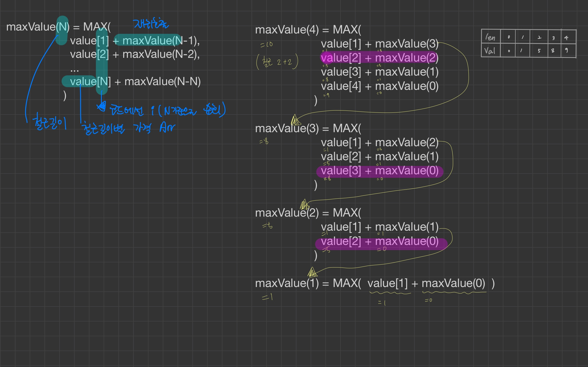
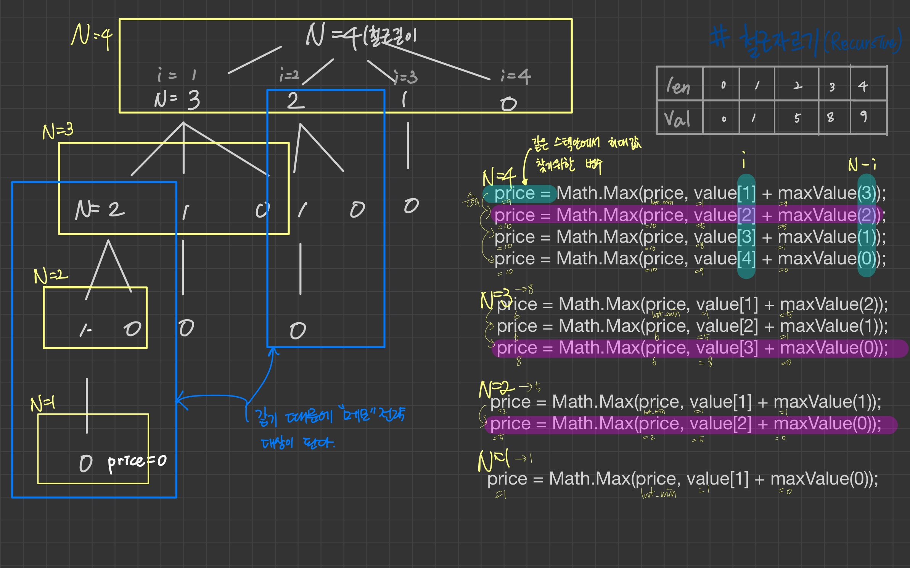

# 문제

길이가 n인 철근이 있을 때 이 철근을 팔아서 얻을 수 있는 이익의 최댓값을 구해보자
단, 철근은 길이 1에서 길이 n까지 정수의 길이로 나눠 판매할 수 있으며 길이별 가격표가 주어진다.

# 해결 방법

```
  maxValue(N) = MAX(
  value[1] + maxValue(N-1),
  value[2] + maxValue(N-2),
  ...
  value[N] + maxValue(N-N)
  )
```

# CODE

```js
const value = [0, 1, 5, 8, 9, 10, 17, 17, 20]
let maxValues = Array(value.length).fill(0)

function MaxValue(barArr, N) {
  // 종단점
  if (N <= 0) {
    return 0
  }

  // 이미 계산된 값이 있으면 반환
  if (maxValues[N - 1] != 0) {
    return maxValues[N - 1]
  }

  // memo 전략
  maxValues[N - 1] = Number.MIN_SAFE_INTEGER

  //순회/ 재귀호출
  for (var i = 1; i <= N; i++) {
    //재귀 호출시 N의 범위: N = 0 ~ N-1
    //재귀 호출로 철근길이 N을 자를 수 있는 모든 경우의 수를 탐색 할 수 있다.
    maxValues[N - 1] = Math.max(
      maxValues[N - 1],
      value[i] + maxValue(value, N - i)
    )
  }

  return maxValues[N - 1]
}

var barArr = [1, 5, 8, 9, 10, 17, 17, 20]
console.log(MaxValue(barArr, barArr.length))
```

## 재귀 문제 풀이 로직 예) maxValue(4)

```
  maxValue(4) = MAX(
    value[1] + maxValue(3),
    value[2] + maxValue(2),
    value[3] + maxValue(1),
    value[4] + maxValue(0)
  )

  maxValue(3) = MAX(
    value[1] + maxValue(2),
    value[2] + maxValue(1),
    value[3] + maxValue(0)
  )

  maxValue(2) = MAX(
    value[1] + maxValue(1),
    value[2] + maxValue(0)
  )

  maxValue(1) = MAX( value[1] + maxValue(0) )
```

## 재귀 문제 풀이 코드 예) maxValue(4)

예) recursive 호출시 maxValue(4) 일때 호출되는 코드

- maxValue(4) 일때 for문 순회 안에서 호출되는 코드
  ```
    price = Math.Max(price, value[1] + maxValue(3));
    price = Math.Max(price, value[2] + maxValue(2));
    price = Math.Max(price, value[3] + maxValue(1));
    price = Math.Max(price, value[4] + maxValue(0));
  ```
- maxValue(3) 일때 for문 순회 안에서 호출되는 코드

  ```
    price = Math.Max(price, value[1] + maxValue(2));
    price = Math.Max(price, value[2] + maxValue(1));
    price = Math.Max(price, value[3] + maxValue(0));
  ```

- maxValue(2) 일때 for문 순회 안에서 호출되는 코드
  ```
    price = Math.Max(price, value[1] + maxValue(1));
    price = Math.Max(price, value[2] + maxValue(0));
  ```
- maxValue(1) 일때 for문 순회 안에서 호출되는 코드

  ```
    price = Math.Max(price, value[1] + maxValue(0));
  ```

  

### callstack 순서

- DFS로 탐색한다.
- 대괄호 순서 확인{}

```

  {1}-> maxValue(4) = MAX(
    value[1] + maxValue(3) <-{2},
    value[2] + maxValue(2) <-{9},
    value[3] + maxValue(1) <-{10},
    value[4] + maxValue(0) <-{11}
  )

  {2}-> maxValue(3) = MAX(
    value[1] + maxValue(2) <-{3},
    value[2] + maxValue(1) <-{7},
    value[3] + maxValue(0) <-{8}
  )

  {3}-> maxValue(2) = MAX(
    value[1] + maxValue(1) <-{4},
    value[2] + maxValue(0) <-{6}
  )

  {4}-> maxValue(1) = MAX(
    value[1] + maxValue(0) <-{5}
  )
```

# call stack tree(하향식 접근방법)


