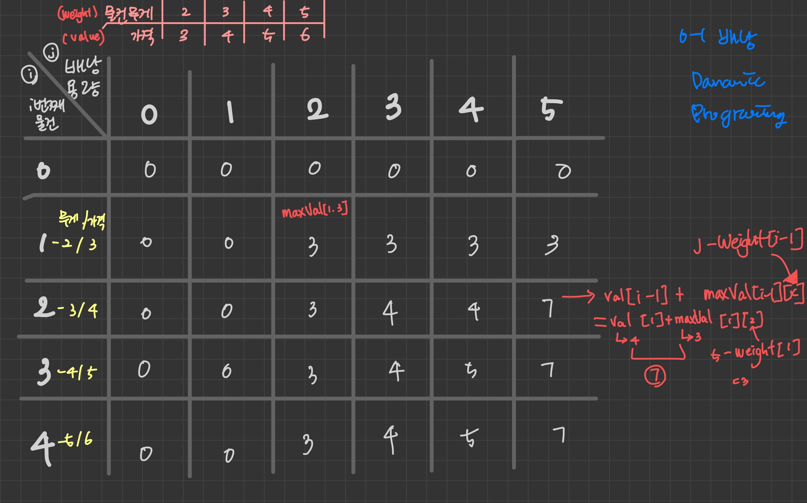

# 문제

n개의 물건이 있으며, 각 물건에는 무게, 가격(weight, value)이 정해져 있다.
이 상점에 도둑이 들어와서 물건을 가져온 배낭 용량 C만큼 물건을 넣을 수 있다.
가져갈 수 있는 물건 가격의 최댓값은?

# 해결 방법

- 고민할 문제

    - 물건의 최대 가격을 저장하는 방법
    - 일반 적으로 값을 결정하는 변수들의 차원민큼 행렬에 대응하는 배열을 사용

- 문제에 배낭용량, 물건의 두개의 변수가 있다.

    - 행(가로, i): 물건 무게
    - 열(세로, j): 배낭 용량

- 행렬의 셀(i, j)의 값의 의미

    - 나열된 물건 중 i번째까지의 물건을, 용량 j의 매낭에 집어 넣을 때의 최대 가격을 저장
    - 이 행렬에는 물건이 0개, 배낭의 용량이 0일 때값도 저장해야 함으로 다름과 같이 선언해야함

    ```
    maxValue[n+1][C+1]
    ```

- i번째 물건 선택 여부에 따른 maxValue 행렬에 대입할 코드

  > i: 물건index, j: 배낭용량

  1. i번째 물건을 선택하지 않았을 때 최대 가격

     ```
       maxValue[i-1][j]
     ```

  2. i번째 물건을 선택했을 때 최대 가격

    - 물건 i를(value[i-1]) 배낭에 넣으려면 배낭에는 "j - weight[i-1]"의 무게만큼 들어 있어야 하므로  
    물건 i의 가격에 이미 계산한 "maxValue[ j - weight[i-1] ]"의 값을 더하면 된다.

    ```
      value[i-1] + maxValue[ j - weight[i-1] ]
    ```

# CODE

```js
/*
      가방수하량: C

      물건무게: weight
      물건가격: value
      상점에 있는 물건 개수: n
    */
function knapSack(C, weight, value, n) {
  var maxVal = Array(n + 1)
    .fill(0)
    .map(v => Array(C + 1).fill(0))

  // 배낭의 공간이 0일 때 도둑은 아무 것도 넣을 수 없다.
  for (var i = 0; i <= n; i++) {
    maxVal[i][0] = 0
  }

  // 물건이 하나도 없을 때 도둑은 훌칠 게 없다.
  for (var j = 0; j <= n; j++) {
    maxVal[0][j] = 0
  }

  // [point0] 배열을 채운다(배열의 각 요소: 각 배낭 용량에 넣을 수 있는 최대 물건 가격)
  // [point1] i번째물건, 배낭용량 = 행, 열 = i, j
  //          i: 행 = 상하 이동 index
  //          j: 열 = 좌우 이동 index
  for (var i = 1; i <= n; i++) {
    // i: i번째 물건 -> (weight[i] i번째 물건 무게)
    for (var j = 1; j <= C; j++) {
      // j: 배낭 용량
      if (weight[i - 1] <= j) {
        var x = j - weight[i - 1] //[point2] 배낭용량(i번째 물건 담고 남은) = 배낭용량 - 물건 무게
        maxVal[i][j] = Math.max(
          value[i - 1] + maxVal[i - 1][x],
          maxVal[i - 1][j]
        )
        // [point3]
        // Math.max(
        //          i-1번째 물건 가격 + i-1번째까지 물건을 x용량 배낭에 집어 넣을때의 최대 가격,
        //          i-1번째까지 물건을 j용량 배낭에 넣을때 최대가격
        //          )

        //[point4] 다음 배열 value, maxVal에서 i-1의 의미 (value[i-1], maxVal[i-1][x])
        //    배열 value의 i-1 의미: 순환 index i가 1부터 시작이라 i-1
        //    배열 maxValue i-1 의미: x가 배낭용량 j에서 물건 i-1을 뺏기 때문에 이전 물건의미
        //        예를들어 물건이 a,b,c,d가 있을때 i가 2이면
        //          물건은 b이고(value[i-1]) maxVal의 i-1은 a!
      } else {
        // [point4]
        //  물건이 배낭의 용량보다 크면 따질 필요 없이 위쪽 셀을 복사
        //  (위쪽셀 = 열은 같고 행-1(i-1) = i-1번째까지 물건을 j용량 배낭에 넣을때 최대가격(배낭용량은 같음)
        maxVal[i][j] = maxVal[i - 1][j]
      }
    }
  }
  return maxVal[n][C]
}

const C = 5
const weight = [2, 3, 4, 5]
const value = [3, 4, 5, 6]
console.log(knapSack(C, weight, value, weight.length))
```

# call stack tree(상향식 접근방법)


