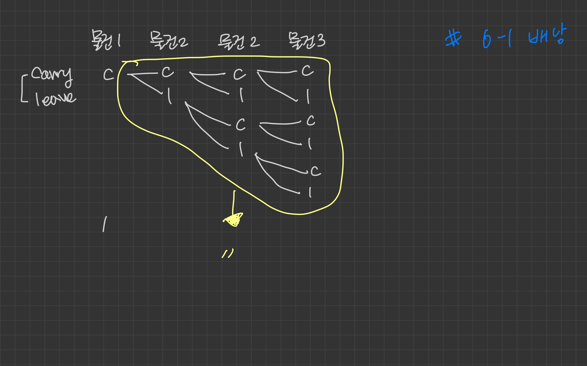
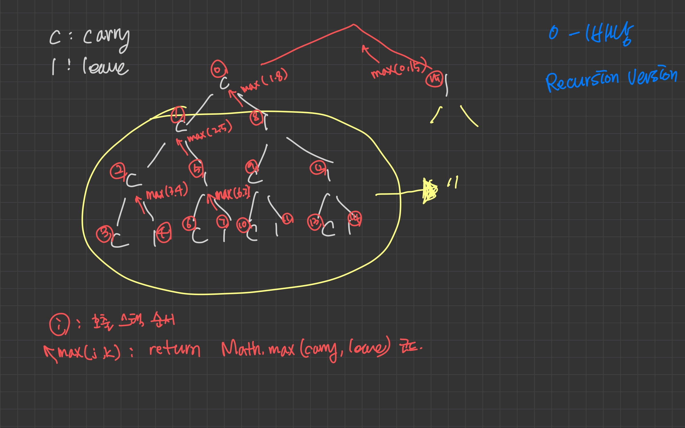

# 문제

n개의 물건이 있으며, 각 물건에는 무게, 가격(weight, value)이 정해져 있다.
이 상점에 도둑이 들어와서 물건을 가져온 배낭 용량 C만큼 물건을 넣을 수 있다.
가져갈 수 있는 물건 가격의 최댓값은?

# 해결 방법

각 물건을 배낭에 넣을지 말지 두가지 선택이 가능

1. 물건을 배낭에 넣을 때

- 이경우 물건은 n-1개 남는다.
- 배낭에 추가로 넣을 수 있는 최대 무게: C-weight[n-1]
- 도둑이 훔친 물건의 가치: value[n-1] 만큼 증가
- n-1개의 물건과 C-weight[n-1]의 무게를 넣을 수 있는 배낭이 있는 원래 문제가 남는다.(재귀호출)

2. 물건을 매낭에 넣지 않을때

- 이경우 물건은 n-1개 남는다.
- 배낭에 추가로 넣을 수 있는 최대 무게: C(그대로 유지)
- 도둑이 훔친 물건의 가치: 그대로 유지
- n-1개의 물건과 C의 무게를 넣을 수 있는 배낭이 있는 원래 문제가 남는다.(재귀호출)

# CODE

```js
function knapSack(C, weight, value, n) {
  // 종단점
  if (C <= 0 || n <= 0) return 0

  // 물건 무게가 배낭 용량 보다 큰 경우
  if (weight[n - 1] > C) {
    return knapSack(C, weight, value, n - 1)
  }

  // n번째 물건을 배낭에 넣는 경우
  const carry = value[n - 1] + knapSack(C - weight[n - 1], weight, value, n - 1)

  // n번째 물건 인넣는 경우
  const leave = knapSack(C, weight, value, n - 1)

  return Math.max(carry, leave)
}

const C = 5 // 배낭 용량
const weight = [2, 3, 4, 5] // 물건 무게
const value = [3, 4, 5, 6] // 물건 가격
const n = weight.length // 물건 개수

console.log(knapSack(C, weight, value, n)) // 7 (무게 2 + 3)
```

# call stack tree(하향식 접근방법)




```
  # 물건을 배낭에 넣을 수 있는 모든 경우의 수(전체탐색) 트리 구조
      o: 배낭에 물건 넣기
      x: 배낭에 물건 안 넣기
                                                              o                                                    - 물건 무게 2 (첫번째 물건)
                                          o                                           x                            - 물건 무게 3 (두번째 물건)
                            o                      x                         o                     x               - 물건 무게 4 (세번째 물건)
                      o           x           o          x            o           x          o           x         - 물건 무게 5 (네번째 물건)


                                                              x                                                    - 물건 무게 2 (첫번째 물건)
                                          o                                           x                            - 물건 무게 3 (두번째 물건)
                            o                      x                         o                     x               - 물건 무게 4 (세번째 물건)
                      o           x           o          x            o           x          o           x         - 물건 무게 5 (네번째 물건)


```

ㅎ
