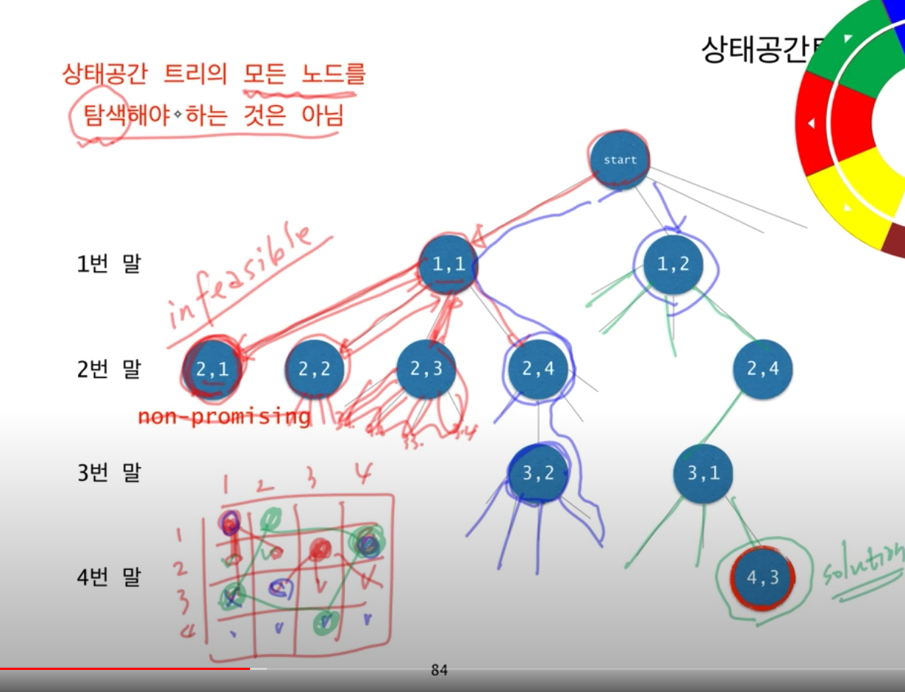
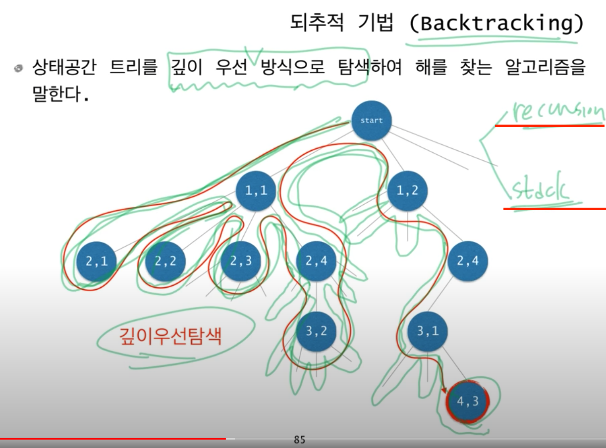
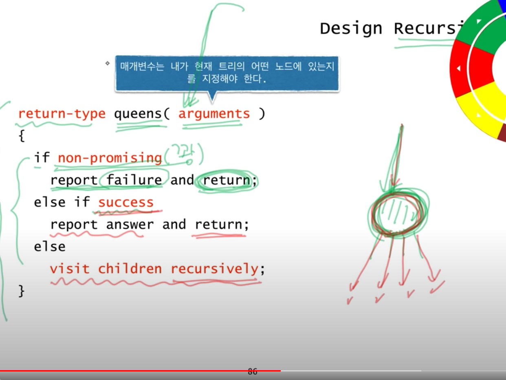
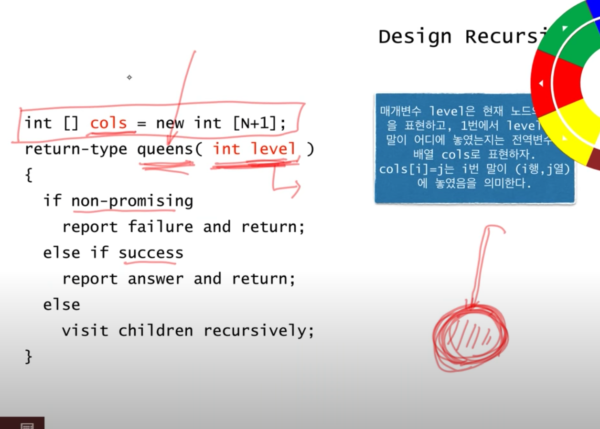
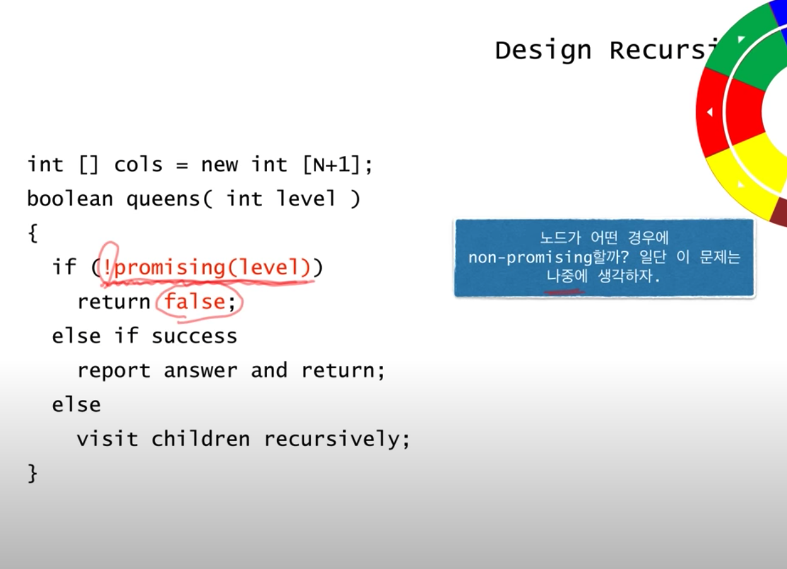
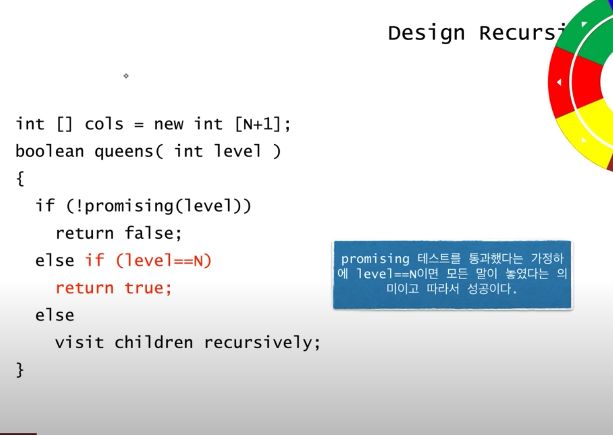
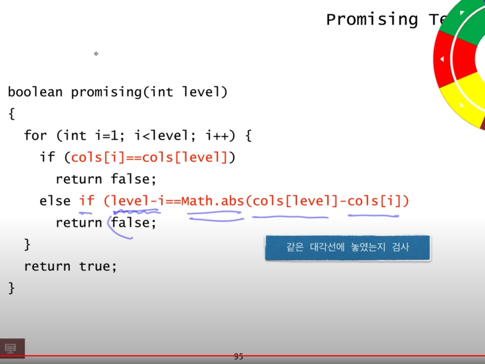
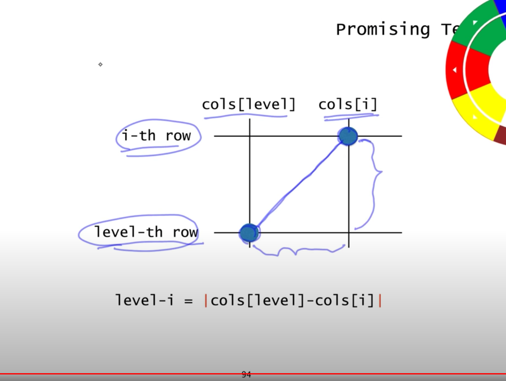
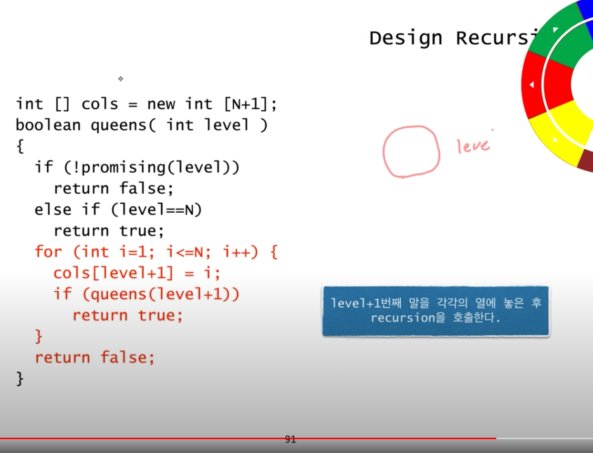

# n-Queens 설명

* NxN의 체스판에 N개의 퀸을 서로 공격하지 않게 놓는 방법 혹은 그 수를 구하는 문제  
* 퀸은 가로, 세로, 대각선 공격할 수 있다.

* DFS(깊이우선탐색, Depth First Search), 재귀(Recursion), 백트래킹(Back tracking), 상태공간 트리개념이 필요 


## DFS
* DFS는 트리 구조에서 노드들을 순회하는 방법 중 하나로, **노드가 자식 노드를 가지고 있다면 자식 노드들을 계속해서 파고 들어가는 순회 방식이다.** 
* 자식노드가 아닌 형제 노드를 먼저 순회하는 방식인 BFS(너비우선탐색, Breadth First Search)에 비해 메모리를 적게 차지한다는 장점이 있다. 
* 원래 DFS는 맨 밑의 자식까지 탐색을 하는 완전탐색 알고리즘이지만, **N-Queens에서는 Back-tracking 방법과 함께 필요없는 노드는 방문하지 않음으로써 탐색 시간을 줄일 수 있다.**


* 미로를 탐색할 때 한 방향으로 갈 수 있을 때까지 계속 가다가 더 이상 갈 수 없게 되면 다시 가장 가까운 갈림길로 돌아와서 이곳으로부터 다른 방향으로 다시 탐색을 진행하는 방법과 유사하다.
* 즉, 넓게(wide) 탐색하기 전에 깊게(deep) 탐색하는 것이다.

* **사용하는 경우: 모든 노드를 방문 하고자 하는 경우**에 이 방법을 선택한다.
* 깊이 우선 탐색(DFS)이 너비 우선 탐색(BFS)보다 좀 더 간단하다.
* 단순 검색 속도 자체는 너비 우선 탐색(BFS)에 비해서 느리다.

* 자기 자신을 호출하는 순환 알고리즘의 형태 를 가지고 있다.
* 전위 순회(Pre-Order Traversals)를 포함한 다른 형태의 트리 순회는 모두 DFS의 한 종류이다.
* 이 알고리즘을 구현할 때 가장 큰 차이점은, 그래프 탐색의 경우 어떤 노드를 방문했었는지 여부를 반드시 검사 해야 한다는 것이다.
  * 이를 검사하지 않을 경우 무한루프에 빠질 위험이 있다.


## Recursion

* DFS에서 재귀가 사용
* base case로 함수를 종료 시켜 무한루프에 빠지지 않도록 해야한다.
* 답을 못찾으면 for문을 빠져나와 무한루프를 피할 수 있다.

## Back tracking
* DFS를 개선한 알고리즘
* 정답이 될 수 없는 노드는 탐색하지 않음으로써 탐색 효율을 높이는 방법 
* 가지 않아도 될 길을 배제하여 시간을 단축하는 방법

``` js
  for (let i = 1; i <= n; i++) {
        cols[level + 1] = i;      // back tracking
        if (queens(level + 1)) {  // level+1번째 말을 각각의 열에 놓은 후 recursion을 호출
          break;                  
        }
      }
```


## 상태공간트리(state space tree)

* 해를 찾기 위해 탐색할 필요가 있는 모든 후보들을 포함하는 트리
* 트리의 모든 노드들을 방문하면 해를 찾을 수 있음
* 루트에서 출발하여 체계적으로 모든 노드를 방문하는 절차를 기술



# 설계
## Design Recursion 1

전체 구조 



## Design Recursion 2

- level: 체스판 row index
- 처음에 quees(0)으로 시작하니 처음엔 0
- visit children recursively 부분에서 증가/backtraking



## Design Recursion 3

- promising: 유망(n-queens 조건에 만족)한지 확인
- 유망하지 않으면 false



## Design Recursion 4

- 종단점
    - level은 체스판 row index 임으로 N(조건-체스판크기)과 같으면 끝



## Design Recursion 5 - promissing

1. if문: 같은 열 여부 확인
2. else if문: 대각선 여부 확인
3. if문에 포함 안되면 행, 열, 대각선에 위치 않는것이라 promising은 true



## Design Recursion 5 - promissing(대각선)

- 대간선에 놓여 있는 위치여부 판단 방법
    - 가로, 세로 길이가 같으면 대각선에 놓인것
- row2 - row1 = |col2 - col1|
    - row는 row2가 항상 크니까 절대값 필요 x
    - col은 col2 > col1 될 수 도 있어 절대값 필요.
    - 같으면 대각선상에 놓여 있는 것
- 예) 위치에 놓여져 있는 말 사이의 가로, 세로 길이는?
    - (row, col) => (0,3) (1,2)
    - 1-0 = |2-3|



# Design Recursion 5 - backTraking

- recursion 부분
- backTracking하는 부분
    - cols[level+1] 이 부분이 backTracking하는 부분이다.



# 구현 코드

```jsx
    let cols = [];  //row별 말들이 놓이 column
    let n;
    let cnt;

    function queens(level) {
      if (!promissing(level)) {
        return false;
      } else if (level === n) {
        //# 종단점: 체스판 마지막 row에 도착 했을 때 
        cols.shift();
        console.log(cols.toString());
        return true;
      }

      //# visit chidren recursively: promissing을 통과해야 아래 로직을 수행
      //# 마지막 퀸 말은 앞에 있는 말들이 놓여있지 않은 곳에 위치하면된다(앞에 있는 말들이 서로 공격안하는 포지션에 위치했으니까)
      for (let i = 1; i <= n; i++) {
        cols[level + 1] = i;
        if (queens(level + 1)) {  // level+1번째 말을 각각의 열에 놓은 후 recursion을 호출
          break;                  // [!] return하지 않는다! : return 하면 dfs(깊잉우선탐색)이 끝나버림으로 queens에 true나오는 조건(level === n)도달하면 끝, 즉 한가지 경우의 n-quues밖에 구하지 못한다.
        }
      }
      return false;
    }

    // 퀸말들이 row마다 공결 할수 없는 위치인지 확인 
    function promissing(level) {
      for (let i = 1; i < level; i++) {
        if (cols[i] == cols[level]) {
          //같은 열에 놓였는지 검사
          return false;
        } else if (level - i == Math.abs(cols[level] - cols[i])) {
          // 같은 대각선에 놓였는지 검사
          return false;
        }
      }
      return true;
    }

    function solution(level) {
      var answer = 0;
      //# level: row index
      n = level;
      queens(0);
    }

    console.log(solution(4));
```

# 참고 
https://gmlwjd9405.github.io/2018/08/14/algorithm-dfs  
https://velog.io/@junyong92/Algorithm-N-Queens-vck3jj8f1g