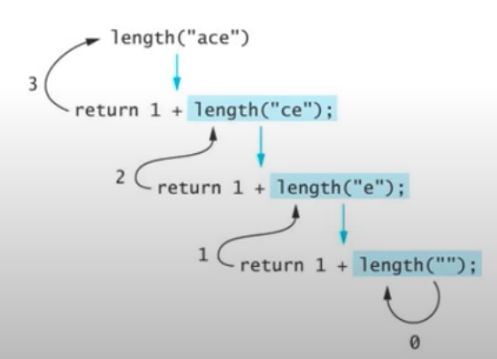

# 문제
  문자열 길이 계산 

# 해결 방법
  ```
    if the string is empty 
      return 0;
    else
      return 1 plus the length of the string that excludes the first character;
  ```

# CODE
  ``` js
    function length(str) {
      if (str.length === 0) {
        return 0;
      } else {
        return 1 + length(str.substring(1));
      }
    }

    console.log(length('asdf'));
  ```


# recursion stack
