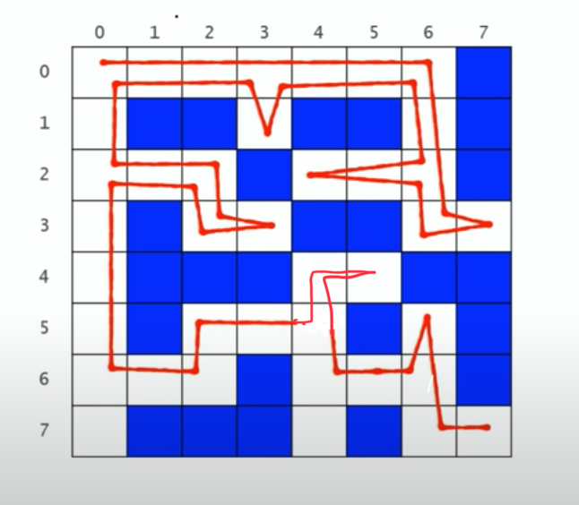

 
# 문제

- N*N 크기의 미로에서 0,0 부터 시작해서 N,N까지 도착 가능 여부를 확인

# 해결 방법1

- POINT1 : 미로 밖 여부 확인
- POINT2 : 길이 아닌경우(벽, 가본길, 막힌길)
- POINT3 : 출구
- POINT4 : 길찾기(재귀호출로 현재위치 기준 서,북,동,남 순으로 확인)

- **POINT5 4방향 모두 꽝이면 출구까지 가는길은 없다**
    - 아래 return을 만나면 이 함수는 끝이다.
    - 즉, stack이 끝나면서 미로 밖도 아니고 길도 아닌 경우이기 때문에
        - 이 길을 "BLOCKED_COLOUR(=2)로" 변경 시켜준다. (원래는 "PATHWAY_COLOUR(=0)")
        - **그래야 출구가 아닌 막다른 곳 까지 다다랏을때의 경로를 제외 시킴으로 출구까지 갈때 "재귀호출"로 탐색할때 제외한 길은 탐색하지 않는다.**

# CODE1

```js
var N = 8

var maze = [
  [0, 0, 0, 0, 0, 0, 0, 1],
  [0, 1, 1, 0, 1, 1, 0, 1],
  [0, 0, 0, 1, 0, 0, 0, 1],
  [0, 1, 0, 0, 1, 1, 0, 0],
  [0, 1, 1, 1, 0, 0, 1, 1],
  [0, 1, 0, 0, 0, 1, 0, 1],
  [0, 0, 0, 1, 0, 0, 0, 1],
  [0, 1, 1, 1, 0, 1, 0, 0],
]

const PATHWAY_COLOUR = 0
const WALL_COLOUR = 1
const BLOCKED_COLOUR = 2 //visited이며 출구까지의 경로상에 있지 않음이 밝혀진 cell
const PATH_COLOUR = "@" //visited이며 아직 출구로 가는 경로가 될 가능성이 있는 cell

function findMazePath(x, y) {
  if (x < 0 || y < 0 || x >= N || y >= N) {
    // # POINT1 미로 밖 여부 확인
    return false
  } else if (maze[x][y] != PATHWAY_COLOUR) {
    // # POINT2 길이 아닌경우(벽, 가본길, 막힌길)
    return false
  } else if (x == N - 1 && y == N - 1) {
    // # POINT3 출구
    maze[x][y] = PATH_COLOUR
    return true
  } else {
    // # POINT4 길찾기(재귀호출로 현재위치 기준 서,북,동,남 순으로 확인)
    maze[x][y] = PATH_COLOUR
    if (
      findMazePath(x - 1, y) || //서
      findMazePath(x, y + 1) || //북
      findMazePath(x + 1, y) || //동
      findMazePath(x, y - 1) //남
    ) {
      return true
    }
  }
  // # POINT5 4방향 모두 꽝이면 출구까지 가는길은 없다
  //  * 아래 return을 만나면 이 함수는 끝이다. 
  //  * 즉, stack이 끝나면서 미로 밖도 아니고 길도 아닌 경우이기 때문에 
  //     이 길을 "BLOCKED_COLOUR(=2)로" 변경 시켜준다. (원래는 "PATHWAY_COLOUR(=0)")
  //     그래야 출구가 아닌 막다른 곳 까지 다다랏을때의 경로를 제외 시킴으로 출구까지 갈때 "재귀호출"로 탐색할때 제외한 길은 탐색하지 않는다. 
  maze[x][y] = BLOCKED_COLOUR //dead end
  return false
}

function printMaze() {
  maze.forEach(v => {
    console.log(v.toString())
  })
}

printMaze()
console.log(findMazePath(0, 0))
printMaze()
```

# 이동 path


