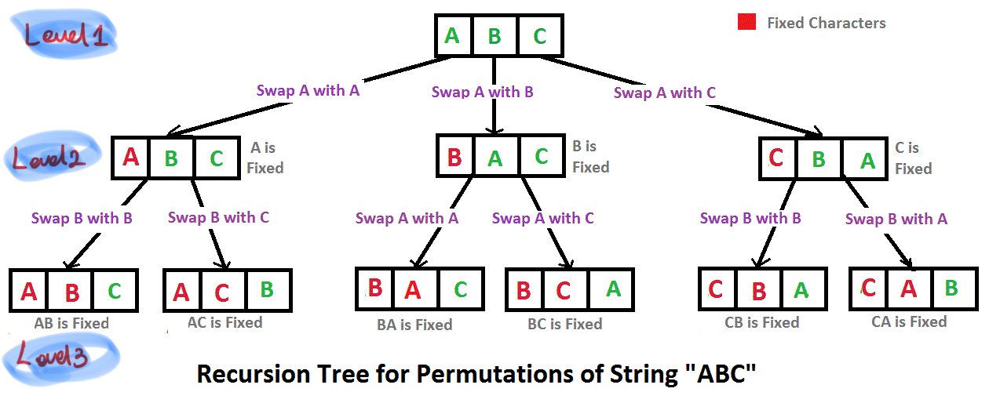

# 문제

- Write a program to print all permutations of a given string

# 해결 방법

- 문자열의 기준을 정하고 "swap, 재귀호출"을 통해서 문자열 자리수를 정하면서 문자열 순열을 구한다.

- POINT1: 변수 point, length, cursor 의미
    - point
        - 문자열 고정 기준점(point번째 이전 문자열은 고정)
        - point번째 문자 이후 문자는 swap 이후 재귀호출한다. 재귀호출 시에 point+1 해준다.
    - length
        - 문자열 길이
    - cursor
        - 문자열에서 기준점(point)과 swap할 index
        - 기준점(point)부터 시작해서 문자열 길이만큼 순회하면서 swap하고 재귀호출한다.
        - _이 과정에서 문자열이 만들 수 있는 문자열을 모두 만든다._
- POINT2: swap한 str 다시 원상복구
    - 재귀함수가 끝나면 문자를 원래대로 돌려놓는다.
    - for문 안에서는 str이 공유 됨으로 swap한것을 다시 swap해준뒤 cursor를 증가해야한다.
- POINT3: 종단점
    - point == length
    - 이 때 각자리에 문자열이 정해진 상태이므로 PRINT 한다.

# solution 함수 설명

- 1st parameter
    - 문자열

- 2nd parameter
    - 이 파라미터 숫자 포함 이후 숫자를 swap 이후 재귀호출한다.
    - **재귀호출 호출할때 두번째 파라미터를 + 1한다.**
    - **재귀호출 이 후 swap 한 문자열을 돌려 놓는다.**
- 3rd parameter
    - 문자열 길이

# CODE

```js
  var arr = [];

  // highlight-line // POINT1
  function solution(str, point, length) {
    str = str.toString();

    if (point == length) {
      // highlight-line // POINT3: 종단점.
      arr.push(str);
    } else {
      // highlight-line // POINT1
      for (var cursor = point; cursor <= length; cursor++) {
        str = swap(str, point, cursor); // highlight-line //POINT2
        solution(str, point + 1, length); 
        str = swap(str, point, cursor); // highlight-line //POINT2  : for문 안에서는 str이 공유 됨으로 swap한것을 다시 swap해준뒤 cursor를 증가해야한다.
      }
    }
  }

  function swap(str, point, cursor) {
    let arr = [...str];
    [arr[point], arr[cursor]] = [arr[cursor], arr[point]];
    return arr.join("");
  }

  var str = "ABC";
  solution(str, 0, str.length - 1);

  console.log(arr);
  // (6) ["ABC", "ACB", "BAC", "BCA", "CBA", "CAB"]
```

# 설명

- recursion tree와 tree레벨 기준으로 수행되는 코드 두가지를 보면서 이해해 보자

## recursion tree



## tree레벨 기준으로 수행되는 코드

- 'ABC'의 Tree의 level 기준 코드
    - Level-1, Level-2 단계가 있음

- permute 함수 설명
    - 1st parameter
        - 문자열
    - 2nd parameter
        - 이 파라미터 숫자 포함 이후 숫자를 swap 이후 재귀호출한다.
        - **재귀호출 호출할때 두번째 파라미터를 + 1한다.**
        - **재귀호출 이 후 swap 한 문자열을 돌려 놓는다.**
    - 3rd parameter
        - 문자열 길이
- 기준
    - 종단점( l = r )
        - 2md, 3rd parameter가 같을 때
        - PRINT(Level-2 참고)

```js
# permute 함수 수도코드 // highlight-line
permute (a, 0, n-1) 
      i=0 ... n-1
      swap( a+l, a+i )
      permute( a, l+1, r)
      swap( a+l, a+i );

# Tree level 기준 코드 // highlight-line
Level-1 // highlight-line
permute (ABC, 0, 2)
      i=0
      swap( A, A )
      permute (ABC, 1, 2)
      swap( A, A )

      i=1
      swap ( A, B )
      permute (BAC, 1, 2)
      swap ( A, B )

      i=2
      swap( A, C )
      permute (CAB, 1, 2)
      swap( C, A )

Level-2 // highlight-line
permute (ABC, 1, 2) <------------------------------------ i=1 of Level-1
      i=1
      swap( B, B )
      permute (ABC, 2, 2) ---> PRINT ABC
      swap ( B, B )
      i=2
      swap( B, C )
      permute (ACB, 2, 2) ---> PRINT ABC
      swap ( C, B )

permute (BAC, 1, 2) <------------------------------------ i=2 of Level-1
      i=1
      swap( A, A )
      permute (BAC, 2, 2) ---> PRINT BAC
      swap ( A, A )
      i=2
      swap( A, C )
      permute (BCA, 2, 2) ---> PRINT BCA
      swap ( C, A )  

permute (CAB, 1, 2) <------------------------------------ i=3 of Level-1
      i=1
      swap( A, A )
      permute (CAB, 2, 2) ---> PRINT CAB
      swap ( A, A )
      i=2
      swap( A, B )
      permute (CBA, 2, 2) ---> PRINT CBA
      swap ( B, A ) 
```

# REF

- [geeksforgeeks](https://www.geeksforgeeks.org/write-a-c-program-to-print-all-permutations-of-a-given-string/)
- [Youtube - Write a program to print all permutations of a given string - GeeksforGeeks](https://www.youtube.com/watch?time_continue=472&v=AfxHGNRtFac&feature=emb_logo)
- [Youtube - String Permutation Algorithm - Tushar Roy](https://www.youtube.com/watch?v=nYFd7VHKyWQ&t=451s)
