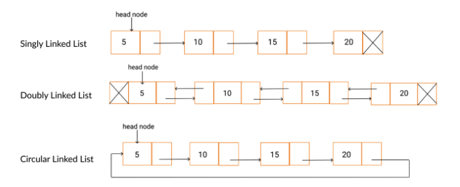

# git
  [전체 구현 코드와 테스트 코드](https://github.com/happyjy/learning-dataStructure/blob/master/src/07.1%20SinglyLinkedList.js)

# 설명 
1. 각 노드가 다음 노드를 가르키는 자료구조 
2. 실행 시간에 메모리를 할당, 해제 가능한 동적 자료구조  
(배열은 고정된 크기를 갖는다.)

## 구조 


## time complexity


# 구현 List
## node

```js
  function SinglyLinkedListNode(data) {
    this.data = data;
    this.next = null;
  }
```


## SinglyLinkedList

```js
  class SinglyLinkedList {
    constructor() {
      this.head = null;
      this.size = 0;
    }
  }
```

## insert 
구현 리스트 

```txt
  * 7.1.1 삽입(position 입력) - insert
  * 7.1.2 삽입(at head) - insertAtHead
  * 7.1.3 삽입(at tail) - insertAtTail
```

```js
  class SinglyLinkedList {
    constructor() {
      this.head = null;
      this.size = 0;
    }
    // 원하는 위치에 insert
    insert(position, value) {
      if (position >= 0 && position <= this.size) {
        let newNode = new SinglyLinkedListNode(value),
          currNode = this.head,
          prevNode,
          nextNode, // 명시적인 이해를 위해서 추가
          index = 0;

        if (position === 0) {
          newNode.next = currNode;
          this.head = newNode;
        } else {
          while (index++ < position) {
            prevNode = currNode;
            currNode = currNode.next;
          }
          nextNode = currNode;

          newNode.next = nextNode;
          prevNode.next = newNode;
        }
        this.size++;
        return true;
      } else {
        return false;
      }
    }

    insertAtHead(value) {
      // Linked List head 유무에 따라서 insertAtHead 로직이 달라진다.
      const newNode = new SinglyLinkedListNode(value);

      if (this.head === null) {
        this.head = newNode;
      } else {
        //기존에 있던 head를 추가할 Node next로 옮긴다.
        //추가할 Node -> 기존 head
        const temp = this.head;
        this.head = newNode;
        this.head.next = temp;
      }

      this.size++;
    }

    insertAtTail(value) {
      const newNode = new SinglyLinkedListNode(value);
      let currNode;

      if (this.head === null) {
        this.head = newNode;
      } else {
        currNode = this.head;
        //tail까지 이동
        while (currNode.next) {
          currNode = currNode.next;
        }
        currNode.next = newNode;
      }
      this.size++;
    }
  }
```

## delete
구현 리스트 
```txt
  * 7.1.4 삭제(by value) - remove
  * 7.1.5 삭제(by position) - removeAt
  * 7.1.6 삭제(by head) - removeAtHead
  * 7.1.7 삭제(by tail) - removeTail
```

```js
  class SinglyLinkedList {
    constructor() {
      this.head = null;
      this.size = 0;
    }

    // Node 값 기준으로 삭제
    remove(value) {
      //지우려고 하는 value가 아래와 같이 세가지 경우로 나뉠 수 있다.
      //1. head
      //2. !(head || tail): value를 Node를 순회한다.
      //3. tail
      let currNode = this.head;
      if (currNode.data == value) {
        // 1. head
        this.head = currNode.next;
        this.size--;
      } else {
        let prevNode = currNode;
        while (currNode.next) {
          // 2. !(head || tail)
          if (currNode.data == value) {
            //삭제 대상 Node: "currNode"
            prevNode.next = currNode.next;
            // prevNode = currNode; //[&&&]이 코드는 필요 없어 보임...
            currNode = currNode.next; //[&&&]아래 두 code는 break 되고 3.tail 조건에 만족하기 때문에 필요한 코드
            break;
          }
          //Node 이동
          prevNode = currNode;
          currNode = currNode.next;
        }
        // 3. tail
        if (currNode.data == value) {
          prevNode.next = null;
        }

        this.size--;
      }
    }

    // Node 위치 기준으로 삭제
    removeAt(position) {
      if (position > -1 && position < this.size) {
        let currNode = this.head,
          prevNode,
          index = 0;

        if (position === 0) {
          this.head = currNode.next;
        } else {
          while (index++ < position) {
            prevNode = currNode;
            currNode = currNode.next;
          }

          // 현재 노드의 다음과 이전 것을 연결(삭제)
          prevNode.next = currNode.next;
        }
        this.size--;
        return currNode.data;
      } else {
        return null;
      }
    }

    removeAtHead() {
      let headData = null;

      if (this.head !== null) {
        headData = this.head.data;
        this.head = this.head.next;
        this.size--;
      }

      return headData;
    }

    removeAtTail() {
      let headData = null;
      if (this.head !== null) {
        let currNode = this.head,
          prevNode = this.head;
        //tail까지 이동
        if (!currNode.next) {
          while (currNode.next) {
            prevNode = currNode;
            currNode = currNode.next;
          }
          //제일 마지막 노드의 이전 노드에서 마지막노드를 끊음
          prevNode.next = currNode.next;
        } else {
          //노드가 하나 밖에 없을때
          this.head = null;
        }
        headData = currNode.data;
      }
      this.size--;
      return headData;
    }
  }
```