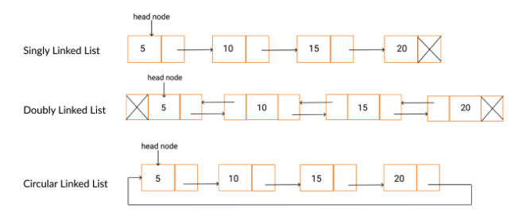
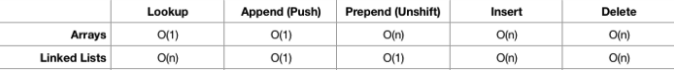

# git
  [전체 구현 코드와 테스트 코드](https://github.com/happyjy/learning-dataStructure/blob/master/src/07.2%20DoublyLinkedList.js)


# 설명 
1. 각 노드에 next, prev 포인터가 있어 이전, 다음 노드를 가르키는 구조
2. 실행 시간에 메모리를 할당, 해제 가능한 동적 자료구조  
(배열은 고정된 크기를 갖는다.)

## 구조 


## time complexity



# 구현 List
## node
```js
  class DoublyLinkedListNode {
    constructor(data) {
      this.data = data;
      this.next = null;
      this.prev = null;
    }
  }
```

## DoublyLinkedList 
```js
  class DoublyLinkedList {
    constructor(data) {
      this.head = null;
      this.tail = null;
      this.size = 0;
    }
  }
```

## insert 
구현 리스트 
```text
  * 7.2.1 원하는 위치항목 삽입하기 - insert
  * 7.2.2 헤드에 항목 삽입하기 - insertAtHead
  * 7.2.3 테일에 항목 삽입하기 - insertAtTail
```

```js
  class DoublyLinkedList {
    insert(position, value) {
      //범위외의 값 체크
      if (position >= 0 && position <= this.size) {
        let newNode = new DoublyLinkedListNode(value),
          currNode = this.head,
          prevNode,
          nextNode, // 명시적인 이해를 위해서 추가
          index = 0;
        /*
          아래 3가지 조건일때 추가한는 로직이 다름
            1. head에 추가
              1.1 size가 0인 경우
              1.2 size가 0이 아닌 경우
            2. tail에 추가
            3. !(head || tail): value를 Node를 순회한다.
        */
        if (position === 0) {
          //1. head
          this.insertAtHead(value);
        } else if (position === this.size) {
          //2. tail
          this.insertAtTail(value);
        } else {
          //3. !(head || tail): value를 Node를 순회한다.
          //position 바로 직전까지 순회하면서 prevNode, nextNode 이동
          while (index++ < position) {
            prevNode = currNode;
            currNode = currNode.next;
          }
          nextNode = currNode;

          newNode.next = nextNode;
          prevNode.next = newNode;
          nextNode.prev = newNode;
          newNode.prev = prevNode;
        }
        this.size++;

        return true;
      } else {
        // else statement of 범위체크 if statement
        return false;
      }
    }

    insertAtHead(value) {
      if (this.head === null) {
        this.head = new DoublyLinkedListNode(value);
        this.tail = this.head; // [A] ref.
      } else {
        const newNode = new DoublyLinkedListNode(value);
        newNode.next = this.head;
        this.head.prev = newNode;
        // 0. this.head, this.tail을 callbyreference로 연결 되어 있다.
        // 1. this.head.prev는 this.Tail의 prev프로퍼티 제일 마지막 위치다. 그래서 this.head.prev는 this.Tail의 제일 끝 노드의 prev다.
        // 2. 1 -> 2 -> 3 이있을때 Tail의 prev 속성으로 프린트 하면 다음과 같다. 3 -> 2 -> 1
        // this.head는 1이다. 여기에 this.head.prev에 값을 연결하면 1다음에 연결되는 것이다.
        this.head = newNode;
      }
      this.size++;
    }

    insertAtTail(value) {
      if (this.tail === null) {
        this.tail = new DoublyLinkedListNode(value);
        this.head = this.tail;
      } else {
        const newNode = new DoublyLinkedListNode(value);
        newNode.prev = this.tail;
        this.tail.next = newNode; // === this.tail.prev = newNode; (callbyreference 때문) <-[A] ref.
        this.tail = newNode;
      }
      this.size++;
    }
  }
```

## remove - recursive
* recursive, node value 기준으로 제거
* 구현 리스트
```txt
    * 7.2.4 원하는 위치항목 삭제하기(recursive - node value 기준) - delete
      - Node 값 기준으로 삭제
      - recursiveDelFromHead, recursiveDelFromTail 호출로 Head, Tail 제거 
    * 7.2.4.1 헤드의 항목 삭제하기 - recursiveDelFromHead
    * 7.2.4.2 테일의 항목 삭제하기 - recursiveDelFromTail
```

```js
  class DoublyLinkedListNode {
      constructor(data) {
        this.data = data;
        this.next = null;
        this.prev = null;
      }
      
    // Node 값 기준으로 삭제
    // DoublyLinkedList constructor에 head, tail이 있기 때문에 두개 메소드 호출로 각각 data를 삭제해준다.
    delete(value) {
      this.recursiveDelFromHead(this.head, value);
      this.recursiveDelFromTail(this.tail, value);
    }

    recursiveDelFromHead(node, value) {
      let currNode = node;

      if (currNode.data === value) {
        if (!currNode.prev) {
          this.head = currNode.next;
          this.head.prev = null;
          return currNode.value;
        } else if (!currNode.next) {
          let returnValue = currNode.value;
          currNode = null;
          return returnValue;
        } else {
          currNode.prev.next = currNode.next;
          currNode.next.prev = currNode.prev;
        }
        this.size--;
        return currNode.data;
      }

      if (currNode.next === null) return null;
      if (currNode.next) this.recursiveDelFromHead(currNode.next, value);
    }

    recursiveDelFromTail(node, value) {
      let currNode = node;

      if (currNode.data === value) {
        if (!currNode.prev) {
          this.tail = currNode.prev;
          this.tail.prev = null;
          return currNode.value;
        } else if (!currNode.next) {
          let returnValue = currNode.value;
          currNode = null;
          return returnValue;
        } else {
          currNode.prev.next = currNode.next;
          currNode.next.prev = currNode.prev;
        }
        this.size--;
        return currNode.data;
      }

      if (currNode.prev === null) return null;
      if (currNode.prev) this.recursiveDelFromTail(currNode.prev, value);
    }
  }
```

## remove - iterator
* iterator, node position 기준으로 제거
* 구현 리스트
```txt
  * 7.2.5 원하는 위치항목 삭제하기(loop - node position 기준) - deleteAt
    - Node 위치 기준으로 삭제
    - deleteAtHead, deleteAtTail 호출
  * 7.2.5.1 헤드의 항목 삭제하기 - deleteAtHead
  * 7.2.5.2 테일의 항목 삭제하기 - deleteAtTail
```

```js
  class DoublyLinkedListNode {
    constructor(data) {
      this.data = data;
      this.next = null;
      this.prev = null;
    }
    // Node 위치 기준으로 삭제
    deleteAt(position) {
      if (position > -1 && position <= this.size) {
        let currNode = this.head,
          prevNode,
          index = 0;

        if (position === 0) {
          this.deleteAtHead();
        } else if (position === this.size) {
          this.deleteAtTail();
        } else {
          while (index++ < position) {
            prevNode = currNode;
            currNode = currNode.next;
          }

          prevNode.next = currNode.next;
          currNode.next.prev = prevNode;
          this.size--;
        }
        return currNode.value;
      } else {
        return null;
      }
    }

    deleteAtHead() {
      let toReturn = null;

      if (this.head !== null) {
        toReturn = this.head.data;

        if (this.tail === this.head) {
          //node가 하나 밖에 없는 경우
          this.head = null;
          this.tail = null;
        } else {
          this.head = this.head.next;
          this.head.prev = null;
        }
      }
      this.size--;
      return toReturn;
    }

    deleteAtTail() {
      let toReturn = null;
      if (this.tail !== null) {
        toReturn = this.tail.data;
        if (this.tail === this.head) {
          this.head = null;
          this.tail = null;
        } else {
          this.tail = this.tail.prev;
          this.tail.next = null;
        }
      }
      this.size--;
      return toReturn;
    }
  }
```


## find value
```txt
  * 7.2.6 원하는 value 찾기 (head로 부터) - findStartingHead
  * 7.2.7 원하는 value 찾기 (tail로 부터) - findStartingTail
```

```js
  class DoublyLinkedListNode {
    constructor(data) {
      this.data = data;
      this.next = null;
      this.prev = null;
    }
    
    findStartingHead(value) {
      let currentHead = this.head;
      while (currentHead.next != null) {
        if (currentHead.data == value) {
          return true;
        }
        currentHead = currentHead.next;
      }
      return false;
    }

    findStartingTail(value) {
      let currentHead = this.tail;
      while (currentHead.prev) {
        if (currentHead.data == value) {
          return true;
        }
        currentHead = currentHead.prev;
      }
      return false;
    }
  }
```