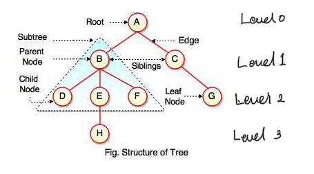
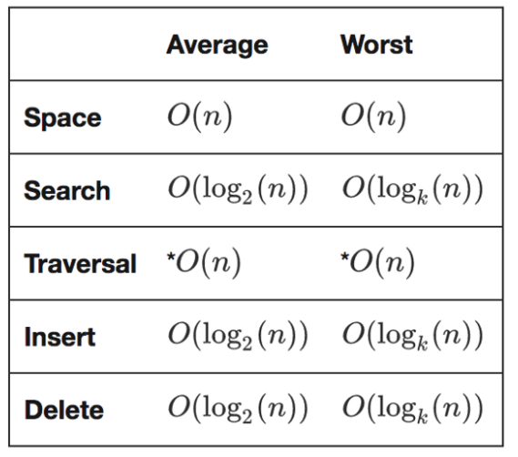

# git
  [전체 구현 코드와 테스트 코드](https://github.com/happyjy/learning-dataStructure/blob/master/src/09.%20Tree.js)

# 설명 
1. Tree 순회
  * 다음 네가지 종류가 있다.(traversePreOrder, traverseInOrder, traversePostOrder, traverseLevelOrder)
  
2. BinarySearchTree(이진검색트리)
  * 왼쪽 자식이 부모보다 작고, 오른쪽 자식이 부모보다 크다.

## 구조 


## time complexity


# 구현 List
1. node
2. Tree 순회
3. BinarySearchTree(이진검색트리)

4. 연습문제
    ```txt
      4.1. 두개 노드의 가장 가까운 공통 node 찾기
        * findLowestCommonAncestor(root, value1, value2)
      4.2. N level tree 구하기 
        * printNthLevels(root, n = 0)
      4.3. 이진트리가 다른 트리의 하위 트리인지 확인하기
        * checkIfSubTree(root, subTree)
          - isSameTree 호출로 두개 트리가 같은 트리인지 확인
      4.4. 인수로 받은 두개 tree가 같은 트리 여부 확인
        * isMirrorTrees(tree1, tree2)
    ```

## node
```js
  function TreeNode(value) {
    this.value = value;
    this.children = [];
  }

  function BinaryTreeNode(value) {
    this.value = value; // root node
    this.left = null; // leaf node
    this.right = null; // leaf node
  }
```

## Tree 순회
* 3종류 순회(preOrder, inOrder, postOrder) 각각 recursive, iterator 버전이 있음.
* traverseLevelOrder(단계순위 순회)(== 너비 우선 검색(BFS - breadth first search)

```txt

  - traversePreOrder  
    : 재귀 호출 방법으로 아래 traversePreOrderHelper 함수 호출
    - traversePreOrderHelper
  - traversePreOrderIterative

  - traverseInOrder
    : 재귀 호출 방법으로 아래 traverseInOrderHelper 함수 호출
    - traverseInOrderHelper
  - traverseInOrderIterative

  - traversePostOrder
    : 재귀 호출 방법으로 아래 traversePostOrderHelper 함수 호출
    - traversePostOrderHelper
  - traversePostOrderIterative
  
  - traverseLevelOrder
    : 단계순위 순회(== 너비 우선 검색(BFS - breadth first search)
```

```js
  class BinaryTree {
    constructor() {
      this._root = null;
      this.traverseArr = [];
    }

    // 선순위 순회(재귀호출)
    traversePreOrder() {
      this.traversePreOrderHelper(this._root);
      return this.printTraverse();
    }
    traversePreOrderHelper(node) {
      if (!node) return;

      // console.log(node.value);
      this.traverseArr.push(node.value);
      this.traversePreOrderHelper(node.left);
      this.traversePreOrderHelper(node.right);
    }
    // 선순위 순회(반복문)
    /*
      # 전략
        : nodeStack 배열이 재귀 호출 했을때 stack과 똑같이 동작한다.
        step1. 항목을 출력한다. 
        step2. right leaf node를 nodeStack에 push
        step3. left leaf node를 nodeStack에 push 

      # right leaf node을 먼저 넣는이유는 ?
        * let node = nodeStack.pop(); 단계에서 나중에 넣은 왼쪽 자식을 먼저 빼내기 때문이다. 
    */
    traversePreOrderIterative() {
      let nodeStack = [];
      nodeStack.push(this._root);

      while (nodeStack.length) {
        let node = nodeStack.pop();
        //step1
        // console.log(node.value);
        this.traverseArr.push(node.value);

        //step2
        if (node.right) nodeStack.push(node.right);
        //step3
        if (node.left) nodeStack.push(node.left);
      }

      return this.printTraverse();
    }

    // 중순위 순회(재귀호출)
    traverseInOrder() {
      //재귀 호출로 트리 순회
      this.traverseInOrderHelper(this._root);
      return this.printTraverse();
    }
    traverseInOrderHelper(node) {
      if (!node) return;

      this.traverseInOrderHelper(node.left);
      // console.log(node.value);
      this.traverseArr.push(node.value);
      this.traverseInOrderHelper(node.right);
    }
    // 중순위 순회(반복문)
    /*
      # 전략
      step1. currNode가 null이 아닐경우 현재 root node의 left leaf node으로 이동하면서 가장 왼쪽에 있는 노드로 이동   
              - 이동하면서 root node를 nodeStack 배열에 push
      step2.0 currNode = nodeStack 배열에 넣은 node를 pop()
      step2.1. step2에서 pop()한 node value 콘솔 찍고
      step2.2. currNode = currnode의 right노드
              ([***] currnode의 right leaf node 여부에 따라 왼쪽 노드를 순회 할지말지 결정된다.)
      step2.3. currNode == null && nodeStack이 0일때까지 순회
    */
    traverseInOrderIterative() {
      let currNode = this._root,
        nodeStack = [],
        done = false;

      while (!done) {
        if (currNode != null) {
          //step1
          nodeStack.push(currNode);
          currNode = currNode.left;
        } else {
          //step2.3
          if (nodeStack.length) {
            //step2.0
            currNode = nodeStack.pop();
            //step2.1
            // console.log(currNode.value);
            this.traverseArr.push(currNode.value);
            //step2.2
            currNode = currNode.right;
          } else {
            done = true;
          }
        }
      }
      return this.printTraverse();
    }

    // 후순위 순회(재귀호출)
    traversePostOrder() {
      this.traversePostOrderHelper(this._root);
      return this.printTraverse();
    }
    traversePostOrderHelper(node) {
      if (node.left) {
        this.traversePostOrderHelper(node.left);
      }
      if (node.right) {
        this.traversePostOrderHelper(node.right);
      }
      this.traverseArr.push(node.value);
      // console.log(node.value);
    }
    // 중순위 순회(반복문)
    traversePostOrderIterative() {
      let stack1 = [],
        stack2 = [];

      stack1.push(this._root);

      while (stack1.length) {
        let currNode = stack1.pop();
        stack2.unshift(currNode.value);

        if (currNode.left) stack1.push(currNode.left);
        if (currNode.right) stack1.push(currNode.right);
      }

      return stack2.join('->');
      // while (stack2.length) {
      //   const node = stack2.pop();
      //   console.log(node.value);
      // }
    }

    /* 
      # 단계순위 순회
        * == 너비 우선 검색(BFS - breadth first search)
        * 핵심
          - leaf node(right, left leaf node)로 깊게 들어가며 N level Tree 각 노드 단계를 방문 
    */
    traverseLevelOrder() {
      let root = this._root,
        queue = [],
        stack = [];

      if (!root) return;
      queue.push(root);

      while (queue.length) {
        let currNode = queue.shift();
        // console.log(currNode.value);
        stack.push(currNode.value);
        if (currNode.left) queue.push(currNode.left);
        if (currNode.right) queue.push(currNode.right);
      }

      return stack.join('->');
    }

    printTraverse() {
      const copyTraverseArr = [ ...this.traverseArr ];
      this.traverseArr = [];
      return copyTraverseArr.join('->');
    }
  }
  ```

## BinarySearchTree(이진검색트리)

```txt
  BinarySearchTree 클래스 (extends BinaryTree)
    * insert
    * remove(deleteRecursively, findMin)
    * findNode
```

```js
  /* 
    # 이진 검색 트리
      * root보다 작으면 왼쪽, 크면 오른쪽 노드에 위치 한다.
  */
  class BinarySearchTree extends BinaryTree {
    constructor() {
      super();
      this._root = null;
    }

    insert(value) {
      let thisNode = {
        left: null,
        right: null,
        value: value
      };
      if (!this._root) {
        this._root = thisNode;
      } else {
        let currentRoot = this._root;
        while (true) {
          if (currentRoot.value > value) {
            if (currentRoot.left != null) {
              currentRoot = currentRoot.left;
            } else {
              currentRoot.left = thisNode;
              break;
            }
          } else if (currentRoot.value < value) {
            if (currentRoot.right != null) {
              currentRoot = currentRoot.right;
            } else {
              currentRoot.right = thisNode;
              break;
            }
          } else {
            break;
          }
        }
      }
    }

    // 시간 복잡도(균형트리) O(log2(n))
    // 시간 복잡도(불균형 트리) O(n)
    remove(value) {
      return deleteRecursively(this._root, value);

      //노드보다 작으면 왼쪽 노드로, 크면 오른쪽 노드로 설정하는 이진 검색 트리 특징을 이용
      //left node를 찾아가면 가장 작은 숫자의 노드를 찾을 수 있다.
      function findMin(root) {
        while (root.left) {
          root = root.left;
        }
        return root;
      }

      function deleteRecursively(root, value) {
        if (!root) {
          return null;
        } else if (value < root.value) {
          root.left = deleteRecursively(root.left, value);
        } else if (value > root.value) {
          root.right = deleteRecursively(root.right, value);
        } else {
          //value를 찾은 경우
          //no child
          if (!root.left && !root.right) {
            //case1
            return null;
          } else if (!root.left) {
            //case2
            root = root.right;
            return root;
          } else if (!root.right) {
            //case2
            root = root.left;
            return root;
          } else {
            //case3
            //  - 자식 노드 두개 있는 경우 왼쪽 하위 트리의 최대치, 또는 오른쪽 하위 트리의 최소치를 찾아서 해당 노드 대체
            let tempNode = findMin(root.right);
            root.value = tempNode.value;
            root.right = deleteRecursively(root.right, tempNode.value);
            return root;
          }
        }
      }
    }

    findNode(value) {
      let currentRoot = this._root,
        found = false;
      while (currentRoot) {
        if (currentRoot.value > value) {
          currentRoot = currentRoot.left;
        } else if (currentRoot.value < value) {
          currentRoot = currentRoot.right;
        } else {
          //노드 찾음
          found = true;
          break;
        }
      }
      return found;
    }
  }
```

## 두개 노드의 가장 가까운 공통 node 찾기
  ```js
    // 연습문제 1. 두개 노드의 가장 가까운 공통 node 찾기
    function findLowestCommonAncestor(root, value1, value2) {
      function findLowestCommonAncestorHelper(root, value1, value2) {
        if (!root) return;
        //[point] 조건문
        if (Math.max(value1, value2) < root.value) return findLowestCommonAncestorHelper(root.left, value1, value2);
        //[point] 조건문
        if (Math.min(value1, value2) > root.value) return findLowestCommonAncestorHelper(root.right, value1, value2);
        return root.value;
      }
      return findLowestCommonAncestorHelper(root, value1, value2);
    }
  ```
## N level tree 구하기 
  ```js
    // ## 연습문제 2. N level 노드 구하기
    function printNthLevels(root, n = 0) {
      let arrayNth = [];
      queue = [];

      if (!root) return;

      // 너비 우선 검색: 자바스크립트로 하는 자료구조와 알고리즘 p.266 참고(stack별로 stack 구조 그림)
      queue.push([ root, 0 ]);
      while (queue.length) {
        let tuple = queue.shift(),
          node = tuple[0],
          level = tuple[1];

        if (level == n) {
          arrayNth.push({ value: node.value, level });
        }
        if (node.left) queue.push([ node.left, level + 1 ]);
        if (node.right) queue.push([ node.right, level + 1 ]);
      }
      console.log(`${n} 번째 level node list`);
      console.log(arrayNth);
    }
  ``` 
## 이진트리가 다른 트리의 하위 트리인지 확인하기
  ```js
    /*  
      # 같은 트리 인지 확인
        * checkIfSubTree에서 사용 됨.
        * 주어진 두 트리가 구조가 같은지 확인
        * return 문 예상 시나리오
          - root1, root2의 value가 같으면 해당 노드의 왼쪽을 recursive 하면서 모두 순회하면서 비교
          - 그리고 stack에서 빠져나오면 그 다음 조건인 노드의 오른쪽 조건을 확인한다. 
    */
    function isSameTree(root1, root2) {
      if (root1 == null && root2 == null) return true;
      if (root1 == null || root2 == null) return false;
      return (
        root1.value == root2.value &&
        isSameTree(root1.left) === isSameTree(root2.left) &&
        isSameTree(root1.right) === isSameTree(root2.right)
      );
    }

    // ## 연습문제 3. 이진트리가 다른 트리의 하위 트리인지 확인하기
    // : isSameTree를 재귀 호출하면서 subTree가 root의 하위 subTree인지 확인한다.
    function checkIfSubTree(root, subTree) {
      var queue = [],
        counter = 0;

      if (!root) {
        return;
      }

      queue.push(root);

      while (queue.length) {
        let temp = queue.shift();

        if ((temp.data == subTree.data) === isSameTree(temp, subTree)) {
          return true;
        }

        if (temp.left) {
          queue.push(temp.left);
        }
        if (temp.right) {
          queue.push(temp.right);
        }
      }
      return false;
    }
  ```

## 인수로 받은 두개 tree가 같은 트리 여부 확인
  ```js

    // # 7. 인수로 받은 두개 tree가 같은 트리 여부 확인
    function isMirrorTrees(tree1, tree2) {
      if (!tree1 && !tree2) {
        return true;
      }

      if (!tree1 || !tree2) {
        return false;
      }

      const checkLeftwithRight = isMirrorTrees(tree1.left, tree2.right),
        checkRightwithLeft = isMirrorTrees(tree2.right, tree1.left);

      return tree1.value == tree2.value && checkLeftwithRight && checkRightwithLeft;
    }
  ```