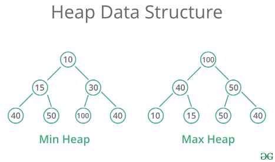

# git
  [전체 구현 코드와 테스트 코드](https://github.com/happyjy/learning-dataStructure/blob/master/src/11.%20Graph.js)

# 설명 
  * 트리와 비슷한 자료구조의 일종
  * 최대힙, 최소힙이 있다. 
    - 최대힙: 부모가 자식보다 크다.
    - 최소힙: 부모가 자식보다 작다.
  * 힙은 자식에 대한 포인터를 갖는 대신에 배열을 사용해 자료를 저장
    - 배열에서 힙 노드의 자식위치(인덱스)를 쉽게 계산할 수 있다. -> 힙을 사용하면 부모와 자식 간의 관계를 쉽게 정의할 수 있다.

## 구조 



## time complexity


# 구현 List
  1. 무지향성 그래프
  ```
    1.1 간선과 정점 추가하기
    1.2 간선과 정점 삭제하기
  ```

  2. 지향성 그래프: 정점간 방향이 있는 그래프
  ```
    2.1 간선과 정점 추가하기
    2.2 간선과 정점 삭제하기
  ```

  3. 그래프 순회
  ```
    3.1 너비 우선 검색
    3.2 깊이 우선 검색
  ```

## 무지향성 그래프
  ```js
    function UndirectedGraph() {
      this.edges = {};
    }
    //#1.1 간선과 정점 추가하기
    UndirectedGraph.prototype.addVertex = function(vertex) {
      this.edges[vertex] = {};
    };
    UndirectedGraph.prototype.addEdge = function(vertex1, vertex2, weight = undefined) {
      this.edges[vertex1][vertex2] = weight;
      this.edges[vertex2][vertex1] = weight;
    };

    //#1.2 간선과 정점 삭제하기
    UndirectedGraph.prototype.removeVertex = function(vertex) {
      for (var adjacentVertex in this.edges[vertex]) {
        this.removeEdge(adjacentVertex, vertex);
      }
      delete this.edges[vertex];
    };
    UndirectedGraph.prototype.removeEdge = function(vertex1, vertex2) {
      if (this.edges[vertex1] && this.edges[vertex1][vertex2] != undefined) {
        delete this.edges[vertex1][vertex2];
      }
      if (this.edges[vertex2] && this.edges[vertex2][vertex1] != undefined) {
        delete this.edges[vertex2][vertex1];
      }
    };
  ```

## 지향성 그래프

```js
  //#2. 지향성 그래프: 정점간 방향이 있는 그래프
  function DirectedGraph() {
    this.edges = {};
  }

  //#2.1 간선과 정점 추가하기
  DirectedGraph.prototype.addVertex = function(vertex) {
    this.edges[vertex] = {};
  };
  DirectedGraph.prototype.addEdge = function(origVertex, destVertex, weight = 0) {
    this.edges[origVertex][destVertex] = weight;
  };

  //#2.2 간선과 정점 삭제하기
  DirectedGraph.prototype.removeVertex = function(vertex) {
    for (let adjacentVertex in this.edges[vertex]) {
      this.removeEdge(adjacentVertex, vertex);
    }
    delete this.edges[vertex];
  };
  DirectedGraph.prototype.removeEdge = function(origVertex, destVertex, weight) {
    if (this.edges[origVertex] && this.edges[origVertex][destVertex] != undefined) {
      delete this.edges[origVertex][destVertex];
    }
  };
```

## 그래프 순회

```js
  //#3. 그래프 순회
  //#3.1 너비 우선 검색
  DirectedGraph.prototype.traverseBFS = function(vertex, fn) {
    let queue = [],
      visited = {};

    queue.push(vertex);
    while (queue.length) {
      vertex = queue.shift();
      if (!visited[vertex]) {
        visited[vertex] = true;
        fn(vertex);
        for (let adjacentVertex in this.edges[vertex]) {
          queue.push(adjacentVertex);
        }
      }
    }
  };

  //#3.2 깊이 우선 검색
  DirectedGraph.prototype.traverseDFS = function(vertex, fn) {
    var visited = {};
    this._traverseDFS(vertex, visited, fn);
  };

  DirectedGraph.prototype._traverseDFS = function(vertex, visited, fn) {
    visited[vertex] = true;
    fn(vertex);
    for (var adjacentVertex in this.edges[vertex]) {
      if (!visited[adjacentVertex]) {
        this._traverseDFS(adjacentVertex, visited, fn);
      }
    }
  };

```