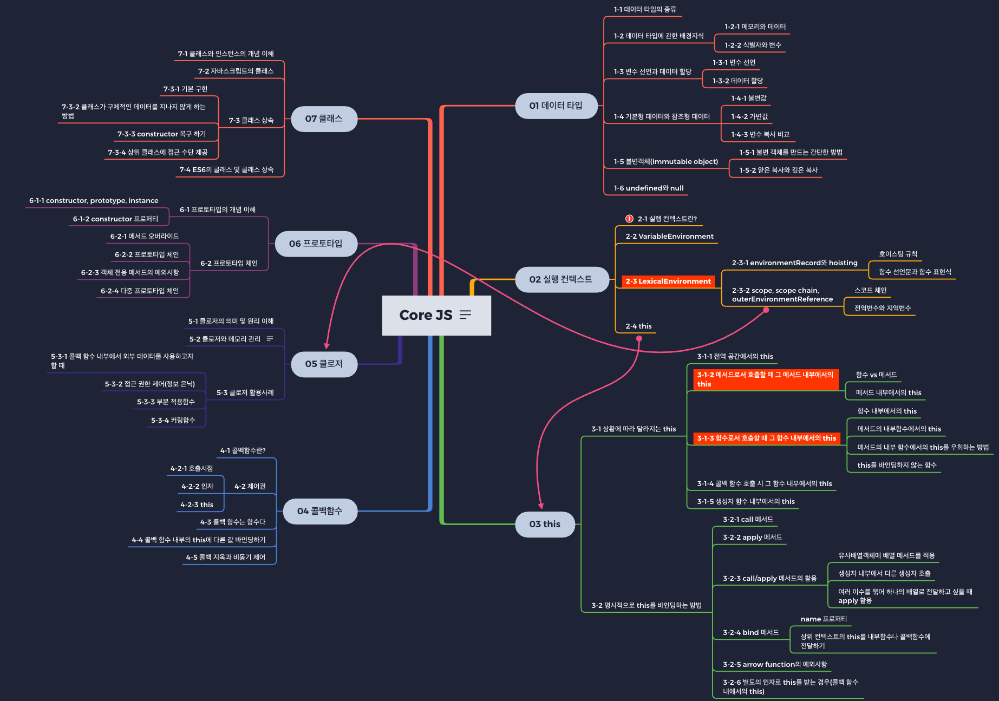

javascript Core를 정리하겠다고 마음먹고 제일 먼저 작성한 목록 입니다.
뭘 정리해 할지 한눈에 보기 편해 정리하는데 확실한 동기부여가 됐습니다.

# index

[execute context](https://happyjy.netlify.app/execute-context/)  
[Callback function](https://happyjy.netlify.app/callback-function)  
[this](https://happyjy.netlify.app/this/)  
[call(), apply(), bind()](https://happyjy.netlify.app/call-apply-bind)  
[Closure](https://happyjy.netlify.app/closure/)  
[Prototype](https://happyjy.netlify.app/prototype/)  
[Class](https://happyjy.netlify.app/class/)  
## 비동기처리 관련 
[Callback](https://happyjy.netlify.app/callback)
[Promise](https://happyjy.netlify.app/promise)  
[Promise chaning](https://happyjy.netlify.app/promise-chaning)  
[async/await](https://happyjy.netlify.app/async-await)  
## 브라우저
[EventLoop](https://happyjy.netlify.app/eventLoop/)

- 참고  
  코어 자바스크립트 - 위키북스
