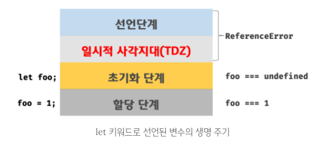

변수선언방법(var, let, const)에 따른 호이스팅, 클로저 현상에 대해서 그리고 Function-level와 비교하며, Block-level scope와도 비교하며 설명합니다.

# var

1. Function-level scope
    * 함수의 코드 블록만을 스코프로인정
      * 전역 함수 외부에서 생성한 변수는 모두 전역 변수
    * for문의 변수 선운문에서 선언한 변수를 for문의 코드 블록 외부에서 참조 할 수 없음
2. var 키워드 생략 허용
    * 암묵적 전역 변수를 양산
3. 변수 중복 선언 허용
    * 의도하지 않은 변수값의 변경이 일어날 가능성 있음
4. 변수 호이스팅
    * 변수를 선언하기 이전에 참조할 수 있음
    * 자바스크립트의 변수는 다른 C-family와는 달리 블록 레벨 스코프(block-level scope)를 가지지 않고 함수 레벨 스코프(function-level scope)를 갖음

# let

## Function, block-level scope

* 함수 레벨 스코프(Function-level scope)
  * var
  * 함수 내에서 선언된 변수는 _함수 내에서만 유효하며 함수 외부에서는 참조할 수 없다._
  * _함수 내부에서 선언한 변수는 지역 변수이며 함수 외부에서 선언한 변수는 모두 전역 변수이다._

* 블록 레벨 스코프(Block-level scope)
  * let, const
  * _코드 블록 내에서 선언된 변수는 코드 블록 내에서만 유효_하며 코드 블록 외부에서는 참조할 수 없다.

## 변수 중복 선언 금지

* let 키워드로는 동일한 이름을 갖는 변수를 중복해서 선언할 수 없다

# hoisting

* var 선언문, function 선언문 등을 해당 스코프의 선두로 옮긴 것처럼 동작하는 특성
* var 키워드로 선언된 변수와는 달리 let 키워드로 선언된 변수를 선언문 이전에 참조하면 참조 에러(ReferenceError)가 발생
* 이는 let 키워드로 선언된 변수는 스코프의 시작에서 변수의 선언까지 _일시적 사각지대(Temporal Dead Zone; TDZ)_에 빠지기 때문이다.
* Execution Context개념과 관련이 있는 내용
  * 뿐만아니라 다음 키워드들의 동작원리를 담고 있는 핵심내용이다.(scope, hoisting, this, function, closure)

```js
console.log(foo); // undefined
var foo;

console.log(bar); // Error: Uncaught ReferenceError: bar is not defined
let bar;
```

# 변수생성과정

1. 선언 단계(Declaration phase)
    * _변수를 실행 컨텍스트의 변수 객체(Variable Object)에 등록_
    * 이 변수 객체는 스코프가 참조하는 대상
2. 초기화 단계(Initialization phase)
    * _변수 객체(Variable Object)에 등록된 변수를 위한 공간을 메모리_에 확보
    * 이 단계에서 변수는 undefined로 초기화된다.
3. 할당 단계(Assignment phase)
    * _var 키워드는 undefined로 초기화된 변수에 실제 값을 할당한다._
    * _let, const는 직접 할당하기 전까지 일시적 사각지대(TDZ) 상태가 된다._

## var의 변수생성과정

* var 키워드로 선언된 변수는 _선언 단계와 초기화 단계가 한번_에 이루어진다.  
  * (스코프에 변수를 등록(선언 단계) -> 메모리에 변수를 위한 공간을 확보, undefined로 초기화(초기화 단계))  
* 따라서 변수 선언문 이전에 변수에 접근하여도 스코프에 변수가 존재하기 때문에 에러가 발생하지 않음
  * 다만 undefined를 반환
* 이후 변수 할당문에 도달하면 값이 할당.
  * _**이러한 현상을 변수 호이스팅(Variable Hoisting)**_

* 예

    ```js
    // 스코프의 선두에서 선언 단계와 초기화 단계가 실행된다.
    // 따라서 변수 선언문 이전에 변수를 참조할 수 있다.
    console.log(foo); // undefined

    var foo;
    console.log(foo); // undefined

    foo = 1; // 할당문에서 할당 단계가 실행된다.
    console.log(foo); // 1
    ```

* var 키워드로 선언된 변수의 생명주기


## let의 변수생성과정

* let 키워드로 선언된 변수는 _선언 단계와 초기화 단계가 분리되어 진행_
* 스코프에 변수를 등록(선언단계)하지만 _초기화 단계는 변수 선언문에 도달했을 때_ 이루어진다.
  * 초기화 이전에 변수에 접근하려고 하면 참조 에러(ReferenceError)가 발생
    * 이는 변수가 아직 초기화되지 않았기 때문
    * 다시 말하면 변수를 위한 메모리 공간이 아직 확보되지 않았기 때문
* 따라서 스코프의 시작 지점부터 초기화 시작 지점까지는 변수를 참조할 수 없음.
  * 스코프의 시작 지점부터 초기화 시작 지점까지의 구간을 `일시적 사각지대(Temporal Dead Zone; TDZ)`라고 부른다.

* 예

  ```js
  // 스코프의 선두에서 선언 단계가 실행된다.
  // 아직 변수가 초기화(메모리 공간 확보와 undefined로 초기화)되지 않았다.
  // 따라서 변수 선언문 이전에 변수를 참조할 수 없다.
  console.log(foo); // ReferenceError: foo is not defined

  let foo; // 변수 선언문에서 초기화 단계가 실행된다.
  console.log(foo); // undefined

  foo = 1; // 할당문에서 할당 단계가 실행된다.
  console.log(foo); // 1
  ```



# var, let의 차이점

* ES6의 _let으로 선언된 변수는 블록 레벨 스코프_를 가지므로 코드 블록 내에서 선언된 변수 foo는 지역 변수
  * 지역 변수 foo도 해당 스코프에서 호이스팅되고 코드 블록의 선두부터 초기화가 이루어지는 지점까지 일시적 사각지대(TDZ)에 빠짐
  * 전역 변수 foo의 값이 출력되지 않고 참조 에러(ReferenceError)가 발생

  ```js
  let foo = 1; // 전역 변수
  {
    console.log(foo); // [POINT]ReferenceError: foo is not defined
    let foo = 2; // 지역 변수
  }
  ```

# closure(for문 안에서 var, let)

세가지 상황에 대한 코드와 설명으로 var, let & closure를 관련지어 설명합니다.  
(var을 for문에서 사용했을 때, var을 for문에서 사용시 closure를 사용했을 때, let을 사용했을 때)

1. var을 for문에서 사용했을 때
    * 결과: 3이 3번 찍힘
    * _var이 **전역변수**이며 **함수 레벨 스코프**로 인해 for 루프의 초기화 식에 사용된 변수가 전역 스코프를 갖게 된기때문에 일어난 현상_

    ```js
      var funcs = [];

      // 함수의 배열을 생성하는 for 루프의 i는 전역 변수다.
      for (var i = 0; i < 3; i++) {
        funcs.push(function () { console.log(i); });
      }

      // 배열에서 함수를 꺼내어 호출한다.
      for (var j = 0; j < 3; j++) {
        funcs[j]();
      }
    ```

2. var을 for문에서 사용시 closure를 사용했을 때
    * 결과: 0,1,2 직힘
    * _**함수 레벨 스코프**로 인해 for 루프의 초기화 식에 사용된 변수가 전역 스코프를 갖게 되는 문제를 회피하기 위해 **클로저**를 활용_

    ```js
      var funcs = [];

      // 함수의 배열을 생성하는 for 루프의 i는 전역 변수다.
      for (var i = 0; i < 3; i++) {
        (function (index) { // index는 자유변수다.
          funcs.push(function () { console.log(index); });
        }(i));
      }

      // 배열에서 함수를 꺼내어 호출한다
      for (var j = 0; j < 3; j++) {
        funcs[j]();
      }
    ```

3. let을 사용했을 때
    * 결과, 0,1,2
    * _let i는 for loop에서만 유효한 지역변수_
    * i는 는 자유변수로서 for loop의 생명주기가 종료되어도 변수 i를 참조하는 합수가 존재하는 한 계속 유지 된다.

    ```js
      var funcs = [];

      // 함수의 배열을 생성하는 for 루프의 i는 for 루프의 코드 블록에서만 유효한 지역 변수이면서 자유 변수이다.
      for (let i = 0; i < 3; i++) {
        funcs.push(function () { console.log(i); });
      }

      // 배열에서 함수를 꺼내어 호출한다
      for (var j = 0; j < 3; j++) {
        console.dir(funcs[j]);
        funcs[j]();
      }
    ```

# 전역 객체와 let

* 전역 객체(Global Object)는 모든 객체의 유일한 최상위 객체를 의미하며 일반적으로 Browser-side에서는 window 객체, Server-side(Node.js)에서는 global 객체를 의미한다.

* _var 키워드로 선언된 변수를 전역 변수로 사용하면 전역 객체의 프로퍼티_

* let 전역 변수는 전역 객체의 프로퍼티가 아님
  * 즉, window.foo와 같이 접근할 수 없음
  * let 전역 변수는 보이지 않는 개념적인 블록 내에 존재

  ```js
  var foo = 123; // 전역변수
  console.log(window.foo); // 123

  let foo = 123; // 전역변수
  console.log(window.foo); // undefined
  ```

# const

## 선언과 초기화

* let은 재할당이 자유로우나 const는 재할당이 금지된다.

  ```js
    {
      const FOO = 10;
      console.log(FOO); //10
    }
    console.log(FOO); // ReferenceError: FOO is not defined
  ```

## 상수

* 가독성과 유지보수성이 대폭 향상

  ```js
    // 10의 의미를 알기 어렵기 때문에 가독성이 좋지 않다.
    if (rows > 10) {
    }

    // 값의 의미를 명확히 기술하여 가독성이 향상되었다.
    const MAXROWS = 10;
    if (rows > MAXROWS) {
    }
  ```

## const와 객체

* const는 재할당이 금지(이는 const 변수의 타입이 객체인 경우, _객체에 대한 참조를 변경하지 못한다는 것을 의미_)
  * _하지만 이때 객체의 프로퍼티는 보호되지 않는다._
* 다시 말하자면 _재할당은 불가능하지만 할당된 객체의 내용(프로퍼티의 추가, 삭제, 프로퍼티 값의 변경)은 변경할 수 있다._
* 객체의 내용이 변경되더라도 _객체 타입 변수에 할당된 주소값은 변경되지 않는다._
  * 따라서 객체 타입 변수 선언에는 const를 사용하는 것이 좋다.
  * _만약에 명시적으로 객체 타입 변수의 주소값을 변경(재할당)하여야 한다면 let을 사용_

  ```js
    const user = { name: 'Yoon' };
    // const 변수는 재할당이 금지
    // user = {}; // TypeError: Assignment to constant variable.

    // 객체의 내용은 변경할 수 있음
    user.name = 'JaeYoon';

    console.log(user); // { name: 'JaeYoon' }
  ```

# var, let, const

* var
  * function-level scope
* let, const
  * block-level scope

* 추천 사용
  * var: ES6를 사용한다면 사용하지 않는다
  * let: 재할당이 필요한 경우에 한정해 사용(이때 변수의 스코프는 최대한 좁게 만든다.)
  * const: 변경이 발생하지 않는(재할당이 필요 없는 상수) 원시 값과 객체에는 사용(const 키워드는 재할당을 금지하므로 var, let 보다 안전)

# 함수 레벨 스코프(Function-level scope) vs 블록 레벨 스코프(Block-level scope)

* 함수 레벨 스코프(Function-level scope)
  * 함수 내에서 선언된 변수는 함수 내에서만 유효하며 함수 외부에서는 참조할 수 없다.
  * 함수 내부에서 선언한 변수는 지역 변수이며 함수 외부에서 선언한 변수는 모두 전역 변수이다.

* 블록 레벨 스코프(Block-level scope)
  * 코드 블록 내에서 선언된 변수는 코드 블록 내에서만 유효하며 코드 블록 외부에서는 참조할 수 없다.

# 참고

* [poiema](https://poiemaweb.com/es6-block-scope)
