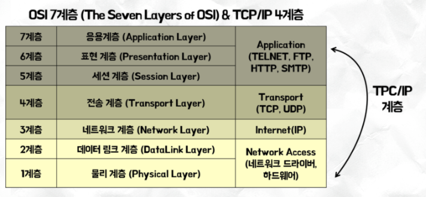
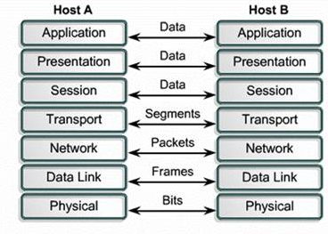

# OSI 7 Layer

국제 표준화기구(OSI)에서 개발하여 컴퓨터 네트워크 프로토콜 디자인 및 통신을 7계층으로 나눈것. 간단히 말해서 프로토콜을 기능별로 나눈것

## OSI 7 Layer architecture

## 1. 왜 계층이 나뉘었을까?

- 표준화를 통해서 다른 회사에서 만든 제품끼리도 통신이 될 수 있도록 하기 위함
(하드웨어 제조업체들의 공통의 플랫폼을 만들 수 있다. )
- 큰 단위의 데이터를 작은 단위로 나눠 이해하기 쉽고, 관리/문제 해결하기 쉽게하기 위해서
- 나뉜 각 계층은 각자의 역할을 하면서 세부내용을 은폐한다. 또 각 계층이 독립적으로 작동한다.
- 만약 표준화가 되어 있지 않으면 같은 회사의 제품들기리만 통신을 할 수 있다. 
개발자는 네트워크 카드, 물리적인 것부터 시작해서 다른 프로토콜을 신경써서 통신해야 한다.

## 2. 각 계층별로 사용되는 프로토콜

- 응용계층(Application Layer) : HTTP, FTP, Telnet, SMTP
- 표현계층(Presentation Layer) : MPGE, MIDI, ASCII, JPEG
- 세션계층(Session Layer) : NetBIOS, SAP, SDP
- 전송계층(Transportaion Layer) : TCP, UDP
- 네트워크(Network Layer) : IP, IPX
- 데이터링크계층(Datalink Layer) : Ethernet, Token Ring, Apple Talk
- 물리계층(Physical Layer) : 프로토콜은 없고, 물리적 랜(LAN)선, 리피터(Repeater) 허브(Hub)을 통해서 바로 통신이 가능.

## 3. 각 계층별 설명

- 7계층 응용 계층(Physical Layer)
    - 응용프로세스와 직접 연관하여 응용서비스 수행
    - 네트워크 소프트웨어 UI부분과 입출력(I/O)
    - telent, ftp
- 6계층 표현 계층(Presentation Layer)
    - 사용자의 명령어를 완성 및 결과 표현
- 5계층 세션 계층(Session Layer)
    - 양 끝단의 응용프로세스가 통신을 관리하기 위한 방법 제공
    - 통신을 하기 위한 세션을 유지하고 만들고 중단
    - TCP/IP세션을 만들고 없앤다.
- **4계층 전송 계층(Transport Layer)**
    - **전송계층에서 실제적 통신을 지원**
    - 패킷(Packet)들의 전송이 유효한지 확인하고 전송실패시 다시 전송하는 것을 관리
    - 데이터 오류검출, 복구, 흐름제어, 중복검사를 수행한다.
    - TCP 는 양방의 신뢰성 있는 통신방식
    - UDP는 일방적 통신방식으로 보여주고싶은 데이터를 송출해 줄 수 있는 수단이라고
- **3계층 네트워크 계층(Network Layer)**
    - **주소지!**
    - 여러개의 노드를 거칠때마다 경로를 찾아 주는 역할
    - 라우팅, 흐름제어, segmentation, 오류제어, internetworking등을 수행
    - 라우터 장비가 해당 계층에서 동작
    - 라우터 장비를 통해서 경로를 설정하고, IP주소(논리적인 주소)를 할당하여 통신을 관리
- 2계층 데이터 링크 계층(Data Link Layer)
    - 네트워크 개체들간 데이터를 전달하고, 하위계층인 물리 계층에서 발생할 수 있는 오류를 찾아낸다.
    - 주소값은 MAC address(맥주소)를 물리적으로 할당
    - Switching, Bridge 등 장비가 이 계층에서 동작
    - 이 계층에서 흐르는 데이터 단위를 Frame이라 한다.
- 1계층 물리계층(Physical Layer)
    - 네트워크 하드웨어 전송기술, 하드웨어적으로 전기적 신호를 주고 받으므로 가장 복잡
    - 랜선, Repeater, Hub 장비가 이계층에 속한다.

## 3. 데이터 흐름 단위

각 계층별로 데이터 흐름이 단위

# 출처

[wikipedia]([https://ko.wikipedia.org/wiki/OSI_모형](https://ko.wikipedia.org/wiki/OSI_%EB%AA%A8%ED%98%95))

- 각 계층마다 설명이 잘되어 잇다.

[computerNetworkingNotes]([https://www.computernetworkingnotes.com/ccna-study-guide/osi-model-advantages-and-basic-purpose-explained.html](https://www.computernetworkingnotes.com/ccna-study-guide/osi-model-advantages-and-basic-purpose-explained.html))