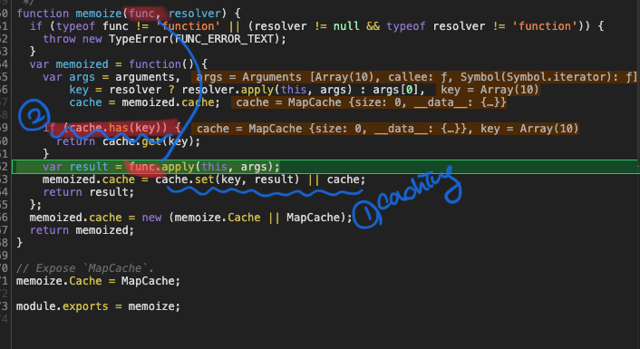

> 3가지에 대해서 다룬다.
1. 상탯값을 불변 객체로 관리 
2. 렌더 함수에서 새로운 객체 만들지 않기 
3. 메모이제이션(memoization)

# 1. 상탯값을 불변 객체로 관리하기

- 리액트는 속성값의 변경 여부를 판단하기 위해 속성값에 직접 연결된 모든 속성을 비교
- 이 말은 Pure.component, React.memo 쓰지 않았을때 모든 속성을 다 비교한다는 얘기
- 그래서 불변객체로 새로운 객체를 만든다는 조건과 "Pure.component, React.memo" 를 사용해 다른 상탯값, 속성값이 설정 됐을때 속성 비교를 한다라는 의미겠다.

```jsx
prevProps.props1 === nextProps.props1 && 
prevProps.props2 === nextProps.props2 && 
prevProps.props3 === nextProps.props3 ...
```

- 정리하면
    - React.memo를 사용했을 때 props가 바뀌었는지 바뀌지 않았는지 알아내서 리렌더링 성능을 최적화 해줄 수 있다.
    - 위 전제 조건으로 새로운 값을 만들어 내는 것을 '불변성을 지키면서' setState해줘야한다.
    - 불변성이 지켜지지 않으면 객체 내부의 값이 새로워 져도 바뀐것을 감지 하지 못한다. 그러면 React.memo에서 서로 비교하지 못해 최적화 하는 것이 불가능하다.

- 불변성 예제

```jsx
const arr = [1,2,3,4,5];

const nextArrBad = arr; // 같은 배열 주소를 가리키고 있다. 
nextArrBad[0] = 100;
console.log(arr === nextArrBad); // true(같은 배열이다)

const nextArrGood = [...arr] // 배열 내부의 값을 모두 복사
nextArrGood[0] = 100;
console.log(arr !== nextArrBad); // true(다른 주소를 가리키고 있는 배열)

---------------------------------------------------
const object = {
	foo: 'bar',
	value: 1
}

const nextObjectBad = object; // 똑같은 객체를 가리킴(같은 객체)
nextObjectBad.value = nextObjectBad.value + 1;
console.log(object === nextObjectBad);  //true(같은 객체)

const nextObjectGood = {
	...object, // 기존에 있던 내용을 모두 복사해서 넣는다.
	value: object.value + 1 // 새로운 값을 덮어 쓴다.
}
console.log(object !== nextObjectGood); // true(다른 객체)

```

# 2. 렌더함수에서 새로운 객체 만들지 않기

- 렌더 함수에서 새로운 객체를 만들어서 자식 컴포넌트의 속성값으로 전달하기
    - 상탯값을 불변 객체로 관리해도 렌더 함수에서 새로운 객체를 만들면 문제가 된다.
    - 렌더 함수에서 새로운 객체를 만들어서 자식 컴포넌트의 속성값으로 입력하면, 속성값의 내용이 변경되지 않아도 자식 컴포넌트 입장에서는 속성값이 변경됐다고 인식한다.

- 예제
  - [참고 코드]([https://github.com/happyjy/learning-react/blob/master/src/component/performance/04-54.js](https://github.com/happyjy/learning-react/blob/master/src/component/performance/04-54.js))

- 설명
    - 예제 코드는 렌더함수에서 새로운 객체를 만드어서 자식 컴포넌트의 속성값으로 전달하는 코드
    - Parent 클래스 컴포넌트에서 render 함수에서 "fruitOptions", "onChange" 프로퍼티에 call by reference로 객체를 호출 하는 것이 아니라 생성할 객체를 넣으면
    - button 클릭 시 count가 증가 할때 SelectFruit 컴포넌트데 생성할 객체를 직접 넣으면(주석 확인해야할 부분에 "fruitOptions, onChange"주석이 풀리 코드 참고) rerendering된다.

```jsx

class Parent extends PureComponent {
	state = {
		count: 0,
		selectedFruit: 'banana',
		fruitOptions: [ 'apple', 'banana', 'orange' ]
	};

	onClick = () => {
		const { count } = this.state;
		this.setState({ count: count + 1 });
	};

	render() {
		const { selectedFruit, count } = this.state;
		return (
			<div>
				<p>{`count: ${count}`}</p>
				<button onClick={this.onClick}>increase count</button>
				<SelectFruit
					count={count}
					selectedFruit={selectedFruit}
					// ### 확인할 부분 1
					// fruitOptions={this.state.fruitOptions}
					fruitOptions={[ 'apple', 'banana', 'orange' ]}

					// ### 확인할 부분 2
					// onChange={this.onChange}
					onChange={(fruit) => {
					 	if (fruit !== selectedFruit) {
					 		this.setState({ selectedFruit: fruit });
					 	}
					}}
				/>
			</div>
		);
	}
}

```


# 3. 메모이제이션 이용하기

- ladash/memoize 를 사용하면 객체를 저장해 놓고 같은 값이 들어오면 기존에 저장했던 것을 반환해 연한을 줄인다.

- 예
    - 아래 sort function을 memoize함수에 배개 변수로 넘겨 받은 return 값 sort2함수에 inputArr1배열을 넣어 반환해보자.
    - sort2(inputArr1) 과정으로 memoize에 cache되어 같은 배열값이 sort2함수에 들어오면sort2(inputArr1)은 sort함수 연산 과정을 거치지 않고 첫번째 sort2(inputArr1) 에 의해서 memoize cache된 객체를 반환한다.

```jsx
import React from 'react';
import memoize from 'lodash/memoize';
/*
  코드 4-55 메모이제이션 사용예
  # fibonacci에 memoization 적용 예
    * https://www.sitepoint.com/implementing-memoization-in-javascript
*/

function sort(arr) {
	debugger;
	let sortedArr = arr.sort();
	console.log('### sort functions');
	return sortedArr;
}

const sort2 = memoize(sort);
const inputArr1 = [ 9, 8, 7, 6, 5, 4, 3, 2, 1, 0 ];
const output1 = sort2(inputArr1);
const output2 = sort2(inputArr1);
console.log(output1 === output2); // true
const inputArr2 = [ 10, 20, 30, 10, 200, 300, 1, 23, 4, 1, 23 ];
const output3 = sort2(inputArr2);
console.log(output1 !== output3); // true
```

- 아래 캡쳐는 memize library 코드 입니다.
    - 1번: sort2 함수에서 받은 매개변수를 key 값으로 caching
    - 2번: caching되어 있는 객체에 전달받은 매개변수를 key 값으로 caching

