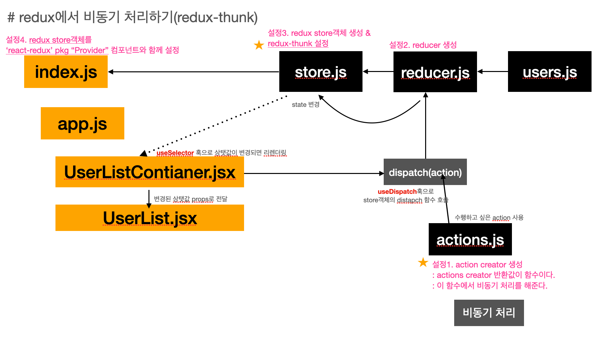

아래 github에 redux-thunk로 비동기 처리한 코드를 확인/동작을 확인 할 수 있다.

* [github 주소](https://github.com/happyjy/learning-2021-redux/tree/6.2%EB%B9%84%EB%8F%99%EA%B8%B0(redux-thunk))

# redux-thunk 란?

> 함수를 dispatch할 수 있게 해주는 미들웨어
> thunk 미들웨어를 사용하지 않으면 dispatch는 action 타입 객체({type, state})를 받아 reducer로 넘긴다.

* 리덕스 미들웨어
* 리덕스를 만든 사람이 만들었음. (Dan)
* 리덕스에서 비동기 처리를 위한 라이브러리
* 액션 생성자를 활용하여 비동기 처리
    * _액션 생성자가 액션을 리턴하지 않고, 함수를 리턴함._
    * _해당 함수가 비동기처리를 한다._
* 이를 가능하게 하는 것은 뭘까?
    * store에 _redux-thunk 미들웨어를 설정_ 하면
    * _dispatch할때 함수를 인자로 사용하면_ (action dictionary 객체가 아닌)
    * reducer전에 redux-thunk 미들웨어에서 dispatch로 전달한 함수에있는 비동기 처리를 가능하게 한다.

# 비동기가 처리되는 위치

> "action creator" 에서 생성한다.
>
> * _redux-thunk middleware 의해서 가능_

* thunk 미들웨어사용시
    * _비동기가 "action creator"함수에서 처리가 된다._
    * _dispatch부분이 action으로 이동 했기 때문에 관심사가 적절하게 분리됨._
        * 라이브러리 사용하지 않고 action으로만 처리할때는 component, container에 비동기 로직이 들어있다.
            * component, container란? react component로 component는 view, container는 logic부분을 담당하고있다.
* 미들웨어를 사용하지않고 actions으로 비동기를 처리할때
    * components, container에서 처리를 한다.
    * redux비동기처리1(actions으로만처리)게시글 설명 참고
* 흐름을 보면 아래와 같이 `비동기 처리 로직`이 이동되는것을 확인 할 수 있다.
    * components → container → _actions creator 함수(by redux-thunk)_

# 도식화

* 노란색 별이 redux비동기처리1(actions으로만처리) 게시글과 다른 부분이다.

  

# redux-thunk middleware 분석

[reduxjs/redux-thunk 코드](https://github.com/reduxjs/redux-thunk/blob/master/src/index.js)

```jsx
function createThunkMiddleware(extraArgument) {
// POINT1:
//   * middleware의 첫번째 인자는 store객체이다.
//   * store객체에서 dispatch, getState를 가지고온다.
  return ({ dispatch, getState }) => (next) => (action) => {
// POINT2:
//   * action 인자를 가진 function이 dispatch가 됐을때 처리되는 부분

// POINT3:
//   * action type이 function 이면
//   * action에 dispatch, getState를 넘겨
    if (typeof action === 'function') {
      return action(dispatch, getState, extraArgument);
    }

    return next(action);
  };
}

const thunk = createThunkMiddleware();
thunk.withExtraArgument = createThunkMiddleware;

export default thunk;
```

# 예제 코드

## 설정1

* thunk middleware 추가

```js
//src/redux/store.js
import { applyMiddleware, createStore } from 'redux';
import reducer from './reducers/reducer';
import { composeWithDevTools } from 'redux-devtools-extension';
import thunk from 'redux-thunk';


const store = createStore(
  reducer,
  composeWithDevTools(
    applyMiddleware(thunk),
  ),
);

export default store;
```

## 설정2 - 비동기 처리 위치

* action 함수 추가
* _비동기 처리 actions creator "getUsersThunk" 함수 return value는 promise 함수_
    * store의 dispatch, getState를 받을 수 있다.
    * 위 의미는 다시 disptach를 할 수 있고, state를 활용할 수 있다.

```js
// src/redux/actions.js

// # users
// 깃헙 API 호출을 시작하는 것을 의미
export const GET_USERS_START = 'GET_USERS_START';
// 깃헙 API 호출에 대한 응답이 성공적으로 돌아온 경우
export const GET_USERS_SUCCESS = 'GET_USERS_SUCCESS';
// 깃헙 API 호출에 대한 응답이 실패한 경우
export const GET_USERS_FAIL = 'GET_USERS_FAIL';

export function getUsersStart() {
  return {
    type: GET_USERS_START,
  };
}
export function getUsersSuccess(data) {
  return {
    type: GET_USERS_SUCCESS,
    data,
  };
}
export function getUsersFail(error) {
  return {
    type: GET_USERS_FAIL,
    error,
  };
}

// #POINT: 비동기 처리 with thunk
export function getUsersThunk() {
  return async (dispatch, getState) => {
    try {
      dispatch(getUsersStart()); //highlight-line
      const res = await axios.get('https://api.github.com/users');
      dispatch(getUsersSuccess(res.data)); //highlight-line
    } catch (e) {
      dispatch(getUsersFail()); //highlight-line
    }
  };
}
```

## 설정3

* container에서 설정2에서 생성한 actions creator 함수 dispatch

```jsx
// src/containers/UserListContainer.jsx

import { useCallback } from 'react';
import { useDispatch, useSelector } from 'react-redux';
import UserList from '../components/UserList';
import {
  getUsersThunk,
} from '../redux/actions';

export default function UserListContainer() {
  const users = useSelector((state) => state.users.data);
  const dispatch = useDispatch();
  const getUsers = useCallback(() => {
    // #POINT: 비동기 처리 thunk dispatch로 호출
    dispatch(getUsersThunk());  //highlight-line // thunk 호출
  }, [dispatch]);

  return <UserList users={users} getUsers={getUsers} />;
}
```

## 설정4

* component에서 설정3에서 설정한 dispatch를 컴포넌트가 마운트 될때 수행하도록 설정

```jsx
import { useEffect } from 'react';

export default function UserList({ users, getUsers }) {
  useEffect(() => {
    getUsers();
  }, [getUsers]);

  if (users.length === 0) {
    return <p>현재 유저 정보 없음</p>;
  }
  return (
    <ul>
      {users?.map((user) => (
        <li key={user.id}>{user.login}</li>
      ))}
    </ul>
  );
}
```

# 마지막으로

redux 공식문서에서 [writing-logic-thunks](https://redux.js.org/usage/writing-logic-thunks)라는 게시글에 _"thunk"를 사용하는 이유가_ **비동기 로직이 UI(react component) useEffect안에 많이 포함되어 있으면 UI layer와 관심사가 다른 역할을 한다.**고 나와 있다. 그래서 비동기 로직을 action creator로 옮기면서 생기는 장점은 테스트의 용이점과 component 재사용성을 높인다는 이유로 사용한다고 하면서 자세한 사용방법이 있어 참고하면 좋을 것같다.
