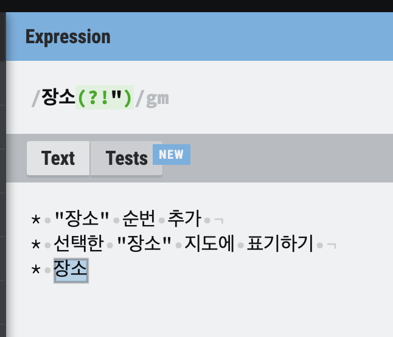
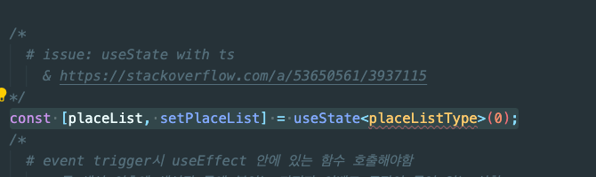
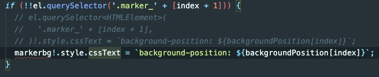
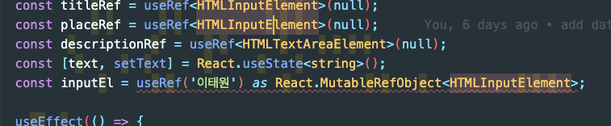

# 210724

## [정규식] nagative lookahead를 이용 해당 단어와 일치하지 않은 단어의 앞에 있는 문자열이 매칭

[아래 이미지 테스트 주소](https://regexr.com/62g3m)


# 210722

## typescriopt

* generator
  * <https://stackoverflow.com/a/53650561/3937115>
  * 

## svg img import 방법

* <https://stackoverflow.com/a/62176569/3937115>

```
import { default as logo } from '../logo.svg';


```

## styled-components

* [ ] 자주 사용하는 패턴 미리 찾아 보기

* [how to change image src using props with styled component and react](https://stackoverflow.com/a/60717134/3937115)

## 타입 단언에 대해서 더 알아보기



## 데이트 기록 지도 붙일때 이슈

### rendering을 jsx로 하는게 아니라 append로 할때 css style이 적용되지 않아. data를 state로 관리하고 styled-component로 변경

## var, let, const hoisting 다시 확인하기

## arrow function, 일반 함수의 scope에 대해서 다시 확인하기

## 카카오맵 npm으로 기능 배포하는 것 확인해보고 어떻게 npm에 올리는건지 확인해보기

## github에 issue 제기 하는 방법 나도 알고 싶다


## [?] typescript as 란?



# 210721

## [?]html meta viewport 의미 찾아보기

<meta name="viewport" content="width=device-width, initial-scale=1.0" />

# 210716

## [블로그대상]useRef 사용햇을때 return value current접근시 "Object is possibly 'null'인경우 해결 방법

* useRef type definition을 확인해보자

  ```ts
    function useRef<T>(initialValue: T|null): <T>;
  ```

  * useRef의 return 값은 "RefObject"이다.

    ```ts
      interface RefObject<T> {
        readonly current: T | null;
      }
    ```

  * 위 타입을 확인해본 결과 우리는 useRef의 제너릭을 설정해줘야 current property에 타입을 설정함으로
    * useRef 반환값 .current 프로퍼티 사용시 Object is possibly 'null'과 같은 에러 문구를 나타나지 않게 할 수 있다.

* 나의 경우 textArea에 useRef를 사용하는데 아래와 같이 useRef에 반환값 타입을(제너릭)을 설정했다.
  * 엘리먼트의 타입은 아래 mdn에서 확인하면 되겠다.
    * mdn 문서에 properties, method가 있다.
      * 이 값들은 useRef로 설정한값(mutable한 값)의 반환값 프로프티인 current로 접근하면 HTML객체가 반환되는데
      * 이 반환된 값에서 사용할 수 있는 프로퍼티, 함수가 나열 되어 잇는 것이다.
  * [web api list - mdn](https://developer.mozilla.org/en-US/docs/Web/API)

  ```ts
    const taRef = useRef<HTMLTextAreaElement>(null)
  ```
  
[How to Fix "Object is possibly 'null'" TypeScript Error When Using useRef React Hook?](https://www.designcise.com/web/tutorial/how-to-fix-object-is-possibly-null-typescript-error-when-using-useref-react-hook)

# 210709

## remote branch 제거 방법

git 에서 remote branch delete 하는 방법.

* 방법 1
git push origin --delete [브렌치이름]

* 방법 2
git branch -d [브렌치이름]
git push origin [브렌치이름]
