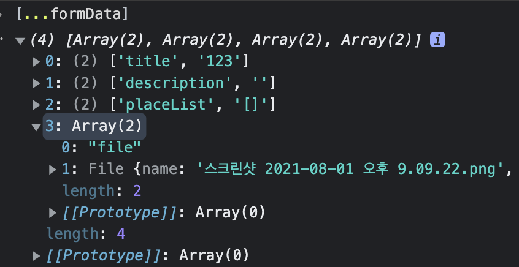
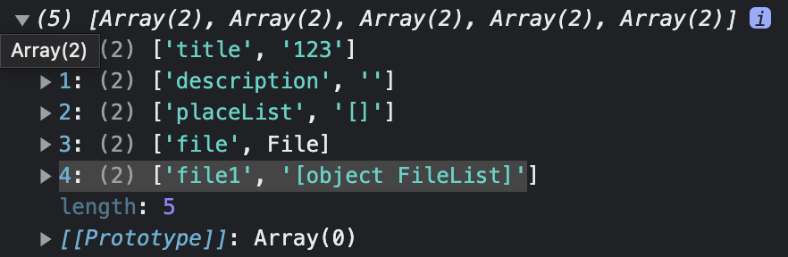

# 210802

## formdata 객체에 multiple file append 하는 방법

* nodejs서버로 파일 업로드시 예시고 한개의 파일만 전송하기 위해서 formdata객체에 input type file을 아래와 같이 세팅

```jsx
const onChangeFileupload = (e: any) => {
  console.log(e);
  setImagefile(e.target.files[0]);  // dateRecord.imageFile 객체에 세팅
};

 <input
  type="file"
  id="imageFile"
  name="imageFile"
  onChange={(e) => onChangeFileupload(e)}
  multiple
></input>
```

* 아래와 같이 서버로 request전에 formdata를 아래와 같이 설정하면 챕쳐파일같이 객체가 설정된다.

```js
    const formData = new FormData();
    formData.append('file', dateRecord.imageFile[0]);
```



* 그래서 input type file객체를 아래 'file1' 키 값으로 설정하면 아래 캡처와 같이 객체 이름 문자열이 설정된다.

```js
    const formData = new FormData();
    formData.append('file1', dateRecord.imageFile);
```



* 그래서 input type file객체를 'formdata'에 설정하는 방법을 찾아보니 아래와 같은 방법으로 설정하면 node.js multer middleware에서 req.files객체로 받게 된다.

    * server req 세팅

  ```js
   [...dateRecord.imageFile].forEach((v) => {
      formData.append('imageFile', v);
    });
  ```

    * express

  ```js
  app.post("/api/dateRecord", upload.array("imageFile"), (req, res) => {
    console.log("# req.files");
    console.log(req?.files);
  });
  //
  //  # req.files
  //[
  //  {
  //    fieldname: 'imageFile',
  //    originalname: '스크린샷 2021-08-01 오후 9.09.22.png',
  //    encoding: '7bit',
  //    mimetype: 'image/png',
  //    destination: './upload',
  //    filename: 'febe431639f8b328d5ee1c5cb705419b',
  //    path: 'upload/febe431639f8b328d5ee1c5cb705419b',
  //    size: 110324
  //  },
  //  {
  //    fieldname: 'imageFile',
  //    originalname: '스크린샷 2021-08-01 오후 9.10.15.png',
  //    encoding: '7bit',
  //    mimetype: 'image/png',
  //    destination: './upload',
  //    filename: 'f42c9f14177ae12c6d6abbcdf784c742',
  //    path: 'upload/f42c9f14177ae12c6d6abbcdf784c742',
  //    size: 137362
  //  }
  //]
  ```

    * Further Reading
        * <https://www.npmjs.com/package/multer>
