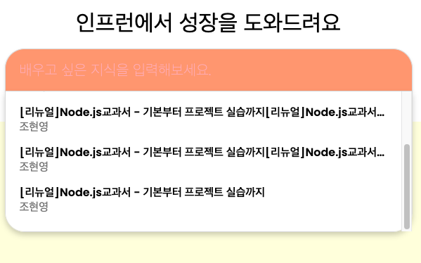

# 21.10.10

## onclick() and onblur() ordering issue

      - 검색 input에 blur이벤트, 검색 결과layer에 click이벤트를 등록 시켜 놨을때
      - blur 이벤트가 먼저 동작함으로 layer를 클릭하지 못하는 이슈가 있었다.
      - click 이벤트를 먼저 동작 하게 하기 위해서 조사 진행
      - mousedown이벤트가 blur이벤트 보다 먼저 trigger되어 prevent 해줄 수 있는 해결 방법을 아래 참고 자료를 통해서 알게 됐다.
      - mousedown에서 event.prevetDafault를 진행.
          - [stackoverflow](https://stackoverflow.com/a/57630197/3937115)
          - [blog](https://newbedev.com/onclick-and-onblur-ordering-issue)

# 21.10.08

## scrollbars respect the border-radius of elements?

* 문제 화면
    * 
* 결과 화면
    * 
* 수도코드 "::-webkit-scrollbar-track"에 margin-bottom을 주는게 모양이 좋다.
[stackoverflow](https://stackoverflow.com/a/65059212/3937115)
[stackoverflow](https://stackoverflow.com/questions/50899642/scroll-with-undamaged-border-radius)
[stackoverflow](https://stackoverflow.com/questions/62789354/how-to-hide-scrollbar-thumb-in-border-radius-element)

```
.search_view_cover::-webkit-scrollbar-track {
  margin-bottom: 20px;
}
```

[Styling Scrollbars with CSS in All Modern Browsers](https://orangeable.com/css/scrollbars)

## constructor에서는 async 키워드가 적용 안된다

* constructor에서 async 키워드가 적용된다.
* 아래 홈페이지 참고
    * Approach 2 - Use async initializer() method 항목을 참고 함.
    * [https://bytearcher.com/articles/asynchronous-call-in-constructor/](https://bytearcher.com/articles/asynchronous-call-in-constructor/)
* 아래 참고해서 개선해보자 - 211008(금)
    * [https://stackoverflow.com/a/47558991/3937115](https://stackoverflow.com/a/47558991/3937115)

    ```jsx
    class MyClass {
      constructor() {
         //static initialization
      }

      async initialize() {
         await WhatEverYouWant();
      }

      static async create() {
         const o = new MyClass();
         await o.initialize();
         return o;
      }
    }
    Then in your code create your object like this:

    const obj = await MyClass.create();
    ```

# 21.10.06

* popstate eventListener

    [mdn]([https://developer.mozilla.org/en-US/docs/Web/API/Window/popstate_event](https://developer.mozilla.org/en-US/docs/Web/API/Window/popstate_event))

    * event trigger
        * 사용자가 마지막으로 방문한 페이지의 항목을 이전, 다음 이동시
        * history.pushState()

    ```jsx
    window.addEventListener('popstate', router);
    ```

* History.pushState()
    * [mdn]([https://developer.mozilla.org/en-US/docs/Web/API/History/pushState](https://developer.mozilla.org/en-US/docs/Web/API/History/pushState))
    * 브라우저 세션 기록 스택에 항목을 추가

* Object.fromEntries()
    * [mdn]([https://developer.mozilla.org/en-US/docs/Web/JavaScript/Reference/Global_Objects/Object/fromEntries](https://developer.mozilla.org/en-US/docs/Web/JavaScript/Reference/Global_Objects/Object/fromEntries))

# 21.10.05

[Throttle, Debounce & Difference](https://webclub.tistory.com/607)
