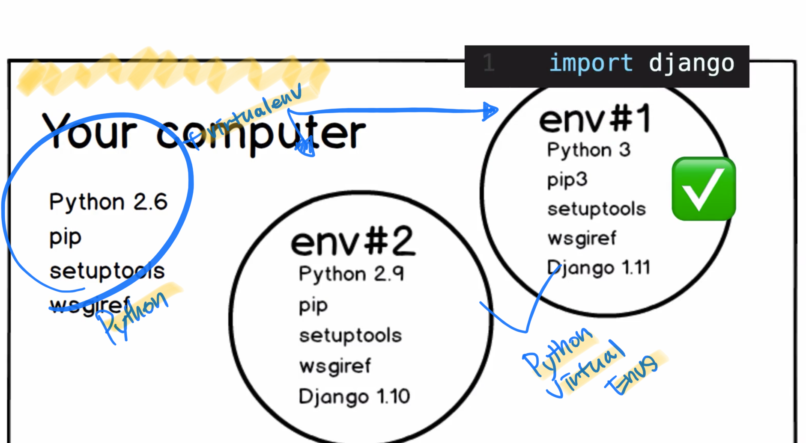

# Python virtual environment


- 가상개발환경 env#1, env#2는 각각 다른 개발환경을 가지고 있다.
- 이렇게 한 로컬 안에 다른 개발환경을 갖게 하기위해서 virtual environment를 구성하고 그안에 개발환경을 갖춘다.

# 가상 개발환경 만드는 방법
```jsx
pipenv --three
pipenv shell
```