Django 가상환경에 문제가 생겨 Django프로젝트 가상환경수정, 쿠키커터 재설치, 디비 설정 재설정을 했습니다. 

# virtual environment에 문제 생김

- 문제

    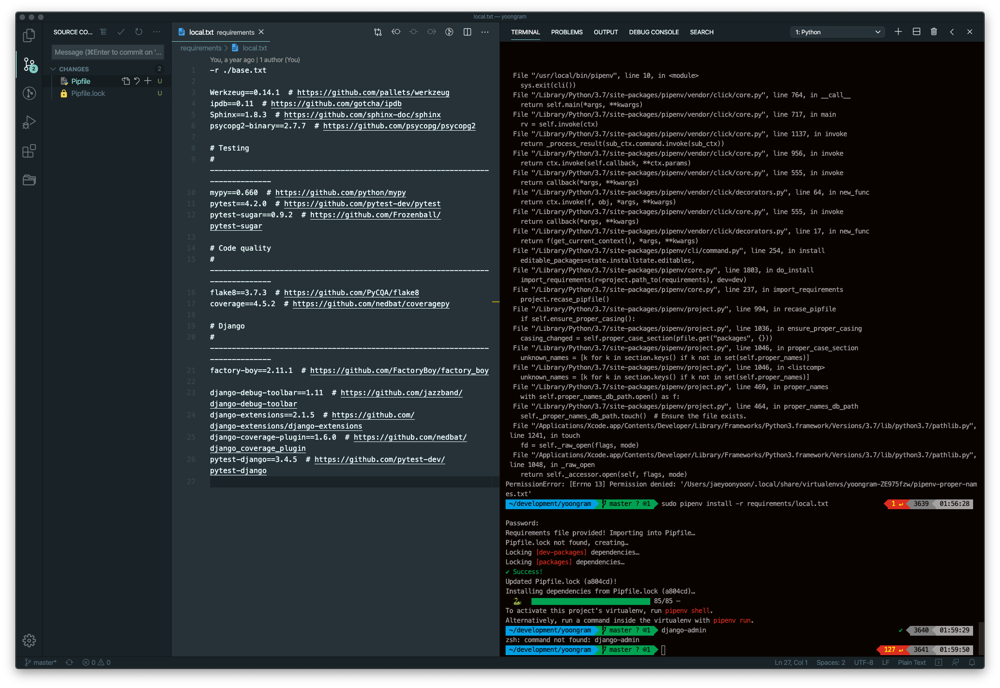

    virtual environment 가 망가졌다. 버전도 업데이트 시켜줘야 했다. 

    ## ref

    - [https://www.youtube.com/watch?v=UHOe1rgCb5w&t=266s](https://www.youtube.com/watch?v=UHOe1rgCb5w&t=266s)
    - [https://tutorial.djangogirls.org/en/django_installation/](https://tutorial.djangogirls.org/en/django_installation/)
    - [youtube.com/watch?v=LNGFczJdZns](http://youtube.com/watch?v=LNGFczJdZns)
- 해결방법

    sudo pipenv shell 수행

    sudo pipenv shell → terminal이 sh-3.2# 으로 변경됨... 백그라운드에서 뭔가 작업하는줄알고 취소 해서 계속 다른 시도를 했는데 이게 shell이 된상태 인것이였다. =)

    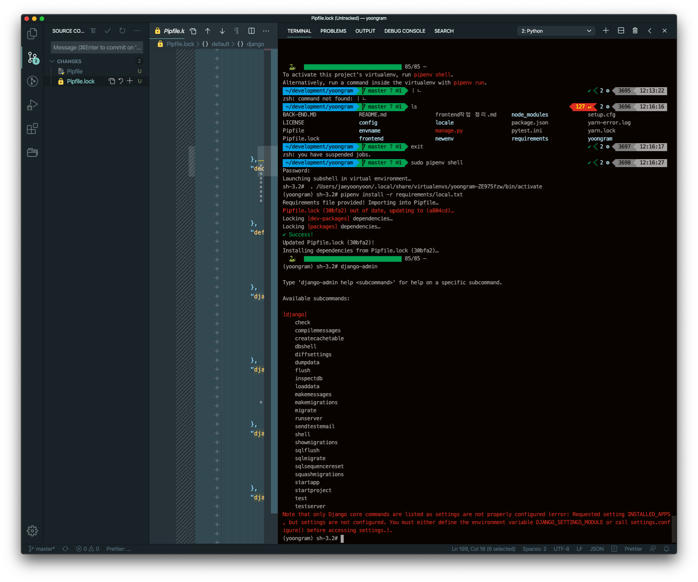

# Third party가 설치가 안돼서 다시 설치

- 해결방법

    - taggit third party 설치가 안되서 다시 설치

    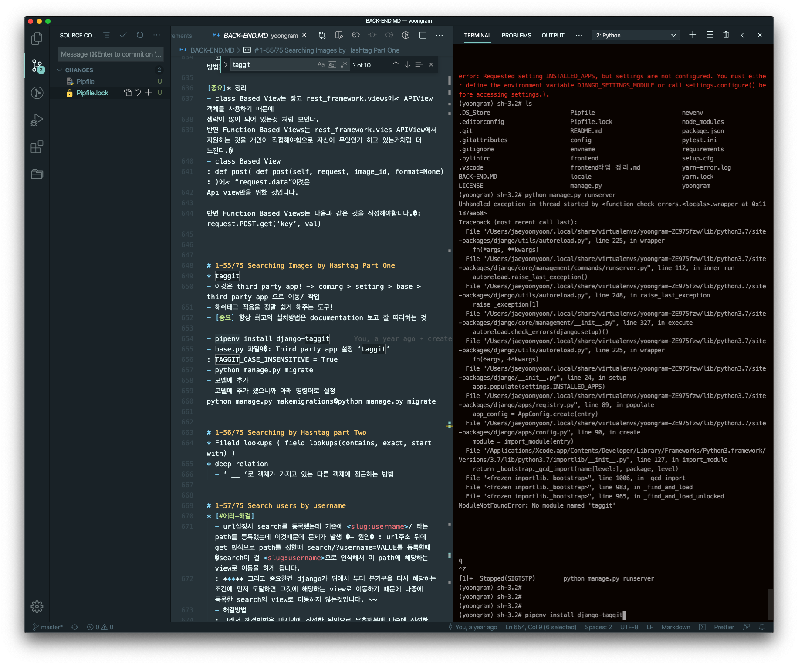

    - taggit_serializer third party 설치

    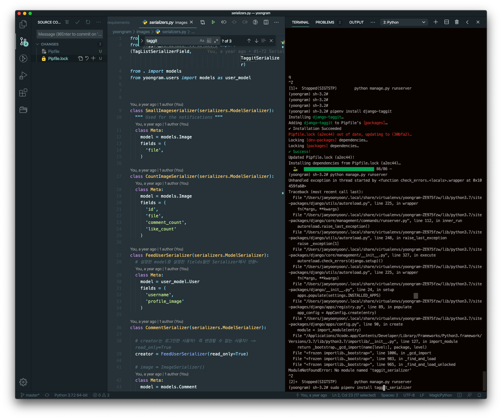

    - THIRD_PARTY_APPS에 설치 안된것 설치
      Python manage.py runserver 하니 THIRD_PARTY_APPS에 설치가 안된것들이 있어서 설치 위에 두개 "taggit , taggit_serializer" 설치

    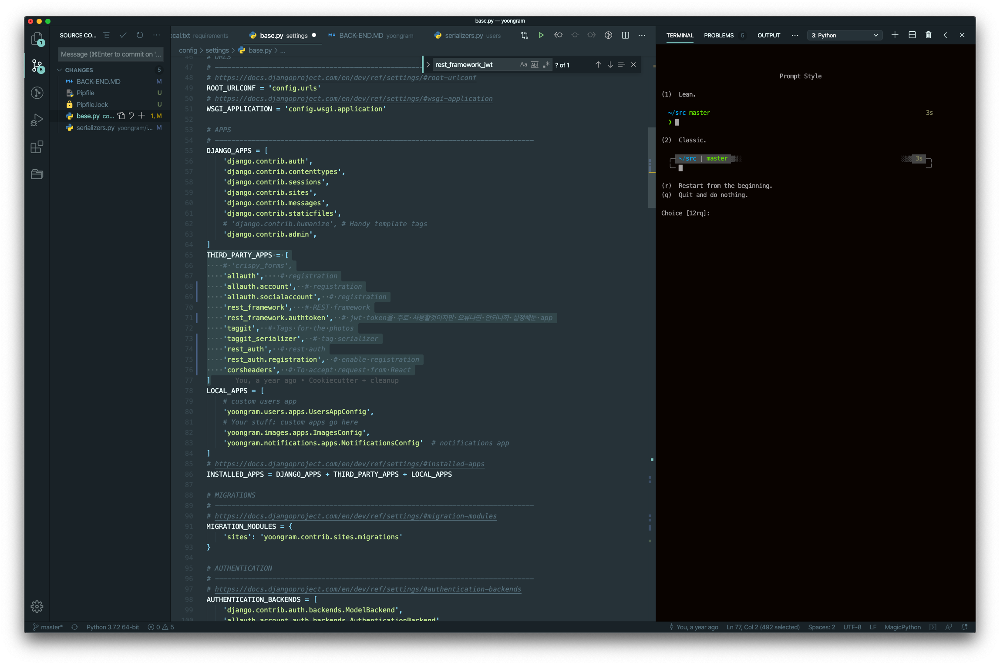

# DB 관련 오류 발생

- 문제

    django.db.utils.OperationsError: FATAL: role "root"does not exist

    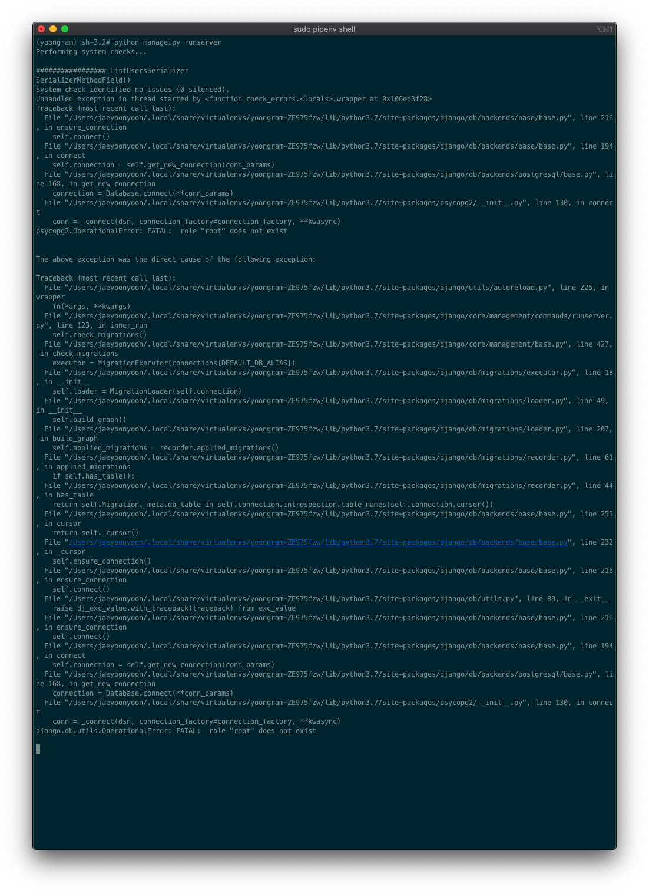

    Progress yoongram 확인해보니 아래와 같은 permission 에러.

    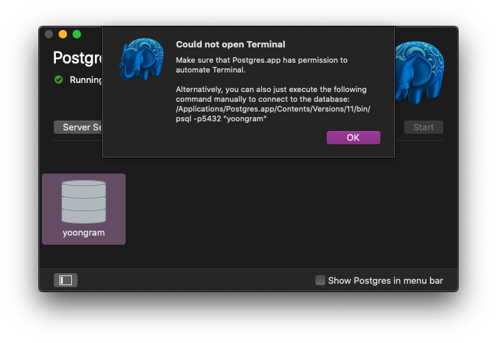

- 해결방법

    [base.py](http://base.py) 파일에 DATABASES.default 설정을 아래 post gress servet Settings와 같이 변경으로 해결

    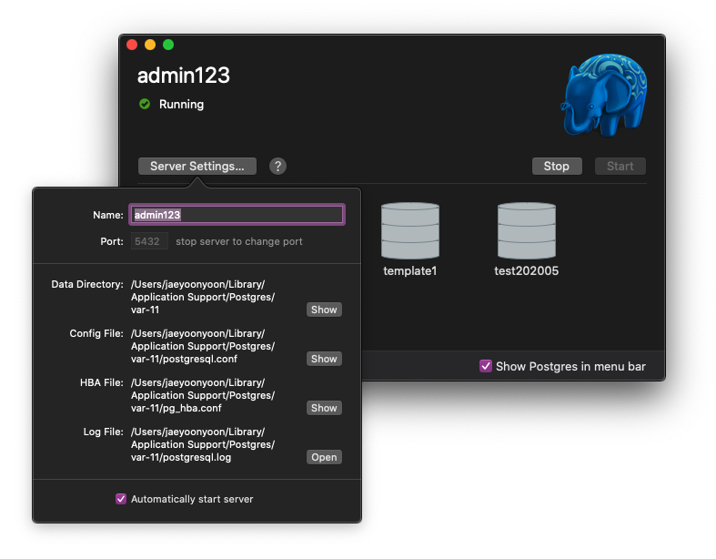

    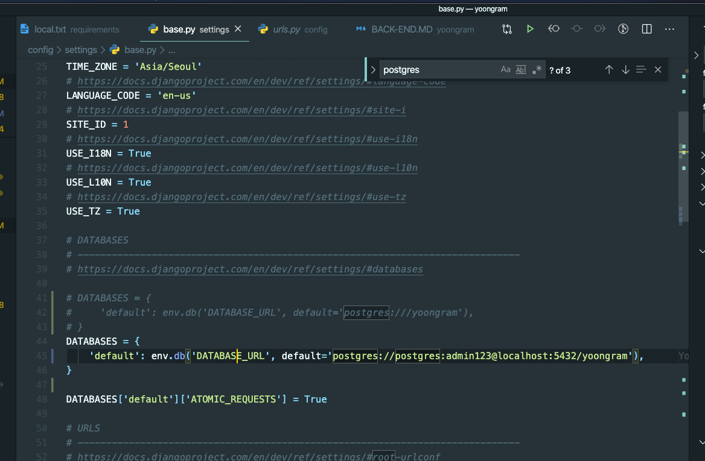

    - DB(progress) 문제 없나 확인 - table list, select 부터 확인 진행

    [https://stackoverflow.com/questions/769683/show-tables-in-postgresql](https://stackoverflow.com/questions/769683/show-tables-in-postgresql)

# 로그인 문제

- 문제
    - 크롬 로그 500 error

    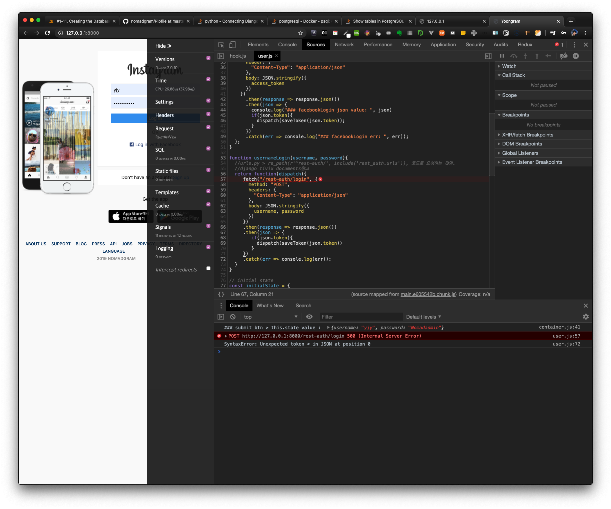

    - 서버 로그
    이 문장이 포인트

    > RuntimeError: You called this URL via POST, but the URL doesn't end in a slash and you have APPEND_SLASH set. Django can't redirect to the slash URL while maintaining POST data. Change your form to point to 127.0.0.1:8000/rest-auth/login/ (note the trailing slash), or set APPEND_SLASH=False in your Django settings.

    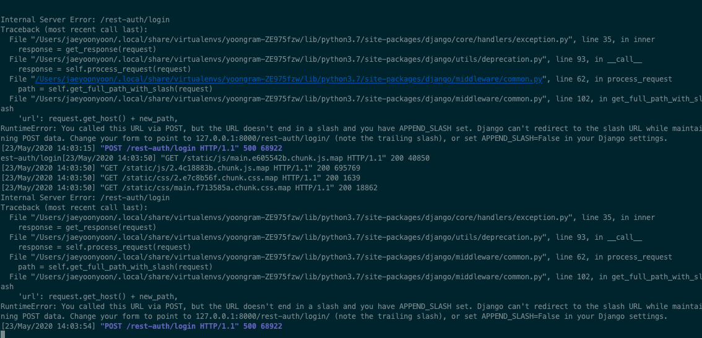

- 해결
    - 서버만 올리고 front-end는 npm stat로 develop 버전으로 접속해서 로그인해야 하는데 생기는 문제
    - /Users/jaeyoonyoon/development/yoongram/frontend 에서 npm start로 react 구동으로 접속해 로그인하면 완료만세

    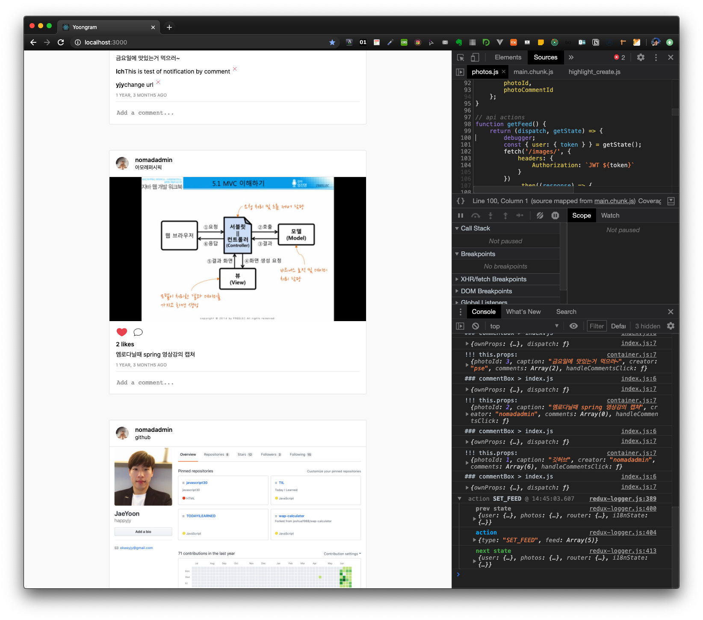

# 확인했던 stackoverflow

- list

    [PermissionError: [Errno 13] Permission denied: 'Pipfile' for pipenv install requests](https://stackoverflow.com/questions/46095253/permissionerror-errno-13-permission-denied-pipfile-for-pipenv-install-requ)

    [Form action doesn't work | Django](https://stackoverflow.com/questions/27348986/form-action-doesnt-work-django)

    [Show tables in PostgreSQL](https://stackoverflow.com/questions/769683/show-tables-in-postgresql)

    [django.db.utils.OperationalError: FATAL: role "django" does not exist](https://stackoverflow.com/questions/40922239/django-db-utils-operationalerror-fatal-role-django-does-not-exist)

    [Pipenv shell fails to create virtual environment in Python 3.8](https://stackoverflow.com/questions/59144091/pipenv-shell-fails-to-create-virtual-environment-in-python-3-8)

    [pipenv shell fails to create virtual environment](https://stackoverflow.com/questions/58959706/pipenv-shell-fails-to-create-virtual-environment)

    [ImportError: Couldn't import Django](https://stackoverflow.com/questions/46210934/importerror-couldnt-import-django)

    [PermissionError: [Errno 13] Permission denied: 'Pipfile' for pipenv install requests](https://stackoverflow.com/questions/46095253/permissionerror-errno-13-permission-denied-pipfile-for-pipenv-install-requ)

    [python - PermissionError : [Errno 13] 사용 권한이 거부되었습니다. pipenv 설치 요청을위한 'Pipfile'](https://stackoverrun.com/ko/q/12645311)