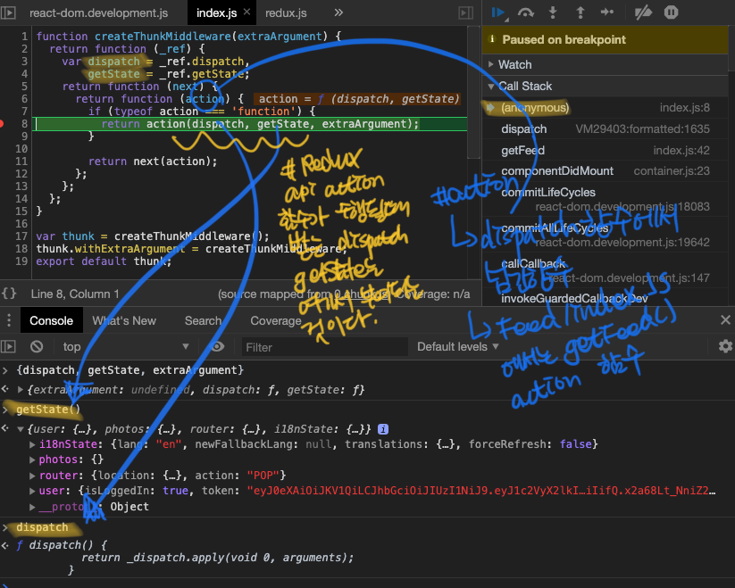
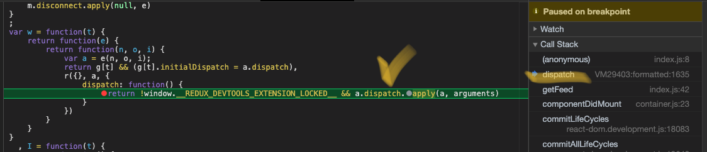
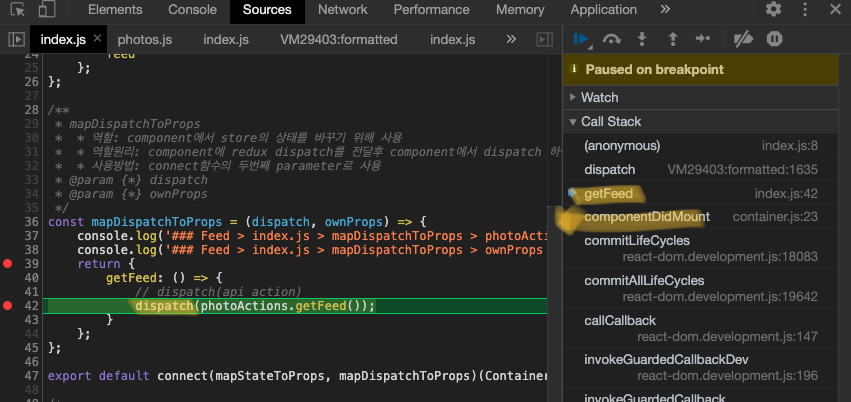
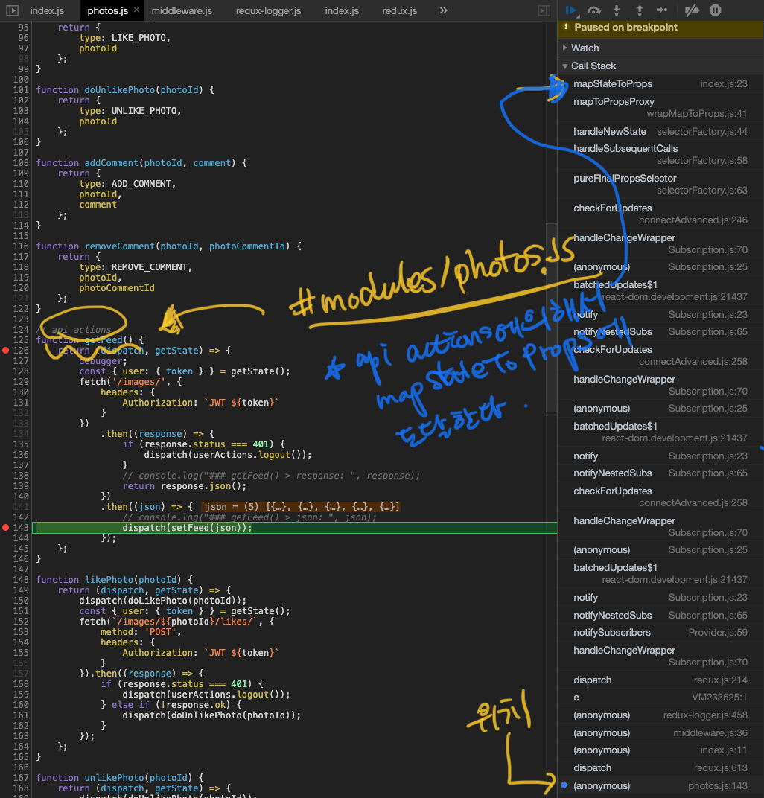

- 이번 클론코딩에서 사용된 패턴 `container and presentational component patterns`이 `redux`와 함께 사용 됐는데 어떻게 구성되고 data fetching할때 redux와 어떤 흐름을 보이는 설명하는 포스트 입니다.

# 구조

```
	index.js
	  : connect with react-redux, container
	  ㄴ contianer.js
			: render 함수에서 presenter(컴포넌트)로 props로 '상탯값, 속성값' 전달
			ㄴ presenter.js
				: component 작성
```

# 흐름

- src/index.js

  ```js
    import ReactDOM from "react-dom"
    import { Provider } from "react-redux"
    import store, { history } from "redux/configureStore"
    import App from "components/App"

    ReactDOM.render(
      <Provider store={store}>
        <App />
      </Provider>,
      document.getElementById("root")
    )
  ```

- Feed/index.js
  - react-redux 라이브러리 connect 함수로 redux와 Container를 바인딩 한다.  
  - 코드 간략 구조 

  ```js
  import { connect } from 'react-redux'
  import Container from './container';
  const mapStateToProps = (state, ownProps) => { }
  const mapDispatchToProps = (dispatch, ownProps) = {}
  export defatul connect(mapStateToProps, mapDispatchToProps)(Container);
  ```

- Feed/container.js
  - 비즈니스모델이 있다.
  - class component
  - presenter에게 props를 넘겨준다.
  - 간략 구조 
  
  ```js
    import Feed from './presenter';

    componentDidMount(){
      const { getFeed } = this.props; //Feed/index.js에서 넘겨 받은 props
      ...
      getFeed();
    }

    render(){
      return <Feed {...props}/>;
    }
    
    export default container;
  ```

- Feed/presenter.js
  - 화면에 보여질 component
  - function component

  ```js
    const Feed = (props) => {
      if (props.loading) {
        return <LoadingFeed />;
      } else if (props.feed) {
        console.log('### Feed > presenter.js > props', props);
        return <RenderFeed {...props} />;
      }
    };

    export default Feed;
  ```

# 요약

- index.js
  - react-redux lib 객체 connect로 Conainer와 mapStateToProps, mapDispatchToProps function을 아래와 같이 binding 설정
  - connect(mapStateToProps, mapDispatchToProps)(Container);
- container.js
  - export <PRESENTER-COMPONENT state={state} props={props}>
- presenter.js
  - export <COMPONENT>

# 질문으로 알아본 container and presentational component patterns

- Feed/index.js "mapDispatchToProps"의 역할은 뭘까?
  - container에 dispatch할 함수를 넘겨준다.
  - dispatch 함수에 redux api action 함수를 수행한 객체를 넘겨준다. (이때 redux api action 함수가 수행)
  - dispatch 함수에 redux api action 함수 결과물을 넘겨 받아 수행된다. 
  - 이렇게 넘겨 받은 dispatch 함수는 store를 업데이트 시킨다.

- Feed/index.js "mapDispatchToProps"의 동작은 어떤 흐름일까 ? 
  - react-redux lib 객체에 binding한 mapDispatchToProps 함수 첫번째 파라미터로 dispatch 객체를 넘겨준다.
  - disaptch 함수에 redux api action 함수를 수행한 객체를 넘겨준다.
    - dispatch(photoActions.getFeed());
  - dispatch 함수는 store를 변경시킨다.
  
- redux api action 함수에 받는 인자 "dispatch", "getState" 객체들은 어디서 넘겨줄까? 
  - connect HOC(higher Order Component)에서 넘겨준 값이다.
  - HOC component가 재사용성에서 좋은데 이렇게 개발자가 모르는 value가 parameter로 넘겨 오는것이 단점이다.

  - 아래 사진 세개는 Feed/index.js > mapDispatchToProps > dispatch(photoActions.getFeed()); 함수 디버깅 한 내용디ㅏ.
  - 순서는 역순으로 되어 있으며 Call Stack 부분을 확인해보자
    
    - 위 사진 설명
      - action함수: dispatch함수에 넘긴 함수 (Feed/index.js에서는 getFeed() api action 함수)
      - api aciton 함수가 수행될때 받는 파라미터 두개 dispatch, getState는 여기서 부여 되는 것이다.

    

    

- Feed/index.js "mapStateToProps"는 언제 수행되는거지?
  - **"api actions function"에 fetching response 받은 promise then 부분에서 "dispatch"함수에 의해 호출**

  
  

- 정리
    ```
      * Feed/index.js > mapDispatchToProps
        - getFeed: () => dispatch(photoActions.getFeed())에 의해서 
          - redux api action function 호출

      * photos.js(redux)
        - getFeed function (api action function)
          : dispatch(setFeed(json))에 의해서 reducer function 호출
        - reducer function을 걸쳐 state값을 update하고 
        - listener에 의해서 mapStateProps에 도달한다

      * Feed/index.js > mapStateProps
        - getFeed의 데이터를 state로 전달받는다
        - 전달 받은 state를 연결한 container props로 전달
    ```

- src/redux/configureStore.js
  - redux라이브러리의 combineReducers 객체는 리듀서를 합치는 과정이 있다.

# 참고

- 개념 설명 참고
  [present, container 설명](https://scotch.io/courses/5-essential-react-concepts-to-know-before-learning-redux/presentational-and-container-component-pattern-in-react)
