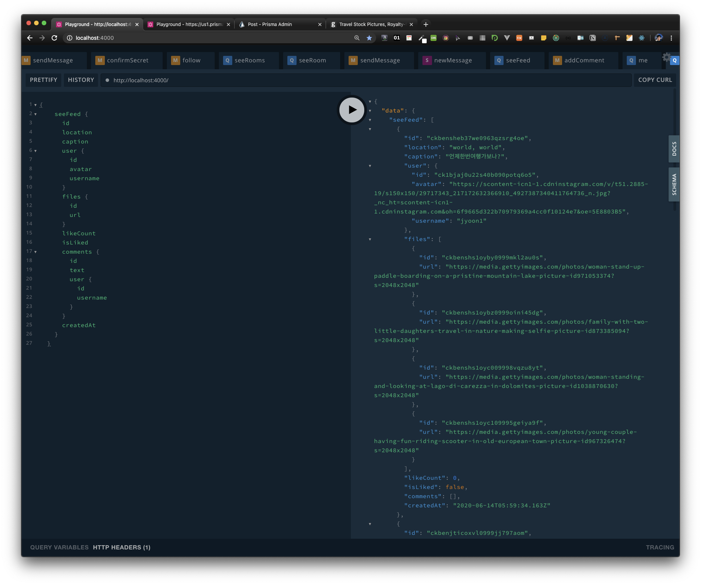

# apollo GraphQL CRUD 에 대해서

react-redux를 사용할때는  connect를 이용 mapDispatchToProps를 통해서 redux로 갔다가 다시 return받은걸 mapStateToProps 로 받아서 presentation으로 보내는 작업이 있었는데 

apollo GraphQL 해당 컴포넌트에 필요한 query가 있어서 편리하다. 생산성은 높아질것 같다. 

어플리케이션의 규모, 안정성, 속도 등은 어떨지 찾아보자 

# Create: ADD_COMMENT에 대해서

- mutation에서 사용될 query객체는 어떤 모습일까?
    - mutation은 create, update, delete에서 사용되기 때문에 variables 설정이 필요하기 때문에 아래 코드와 같이 variables를 받는 과정이 있습니다.
- useMutation함수를 통해서 어떻게 request할까?
    - useMutation은  조회 할 때 쓰이는 "useQuery" 처럼 자동으로 수행되지 않고 "mutation function"을 첫번째 배열 요소로 반환합니다. 반환한 배열을 수행해줘야 mutation이 수행됩니다.(수행할때 필요한 variables를 설정합니다.
- useMutation함수로 반환 받은 첫번째 객체에 대해서
    - 이 객체는 promise 객체라서 await를 사용하게 되면 await 키워드를 사용한 promise객체가 settles and return 할때까지 async를 사용한 function은 기다리게 된다.
    - aynch, Await는 다음을 참고하자
        - [async-await]([https://javascript.info/async-await](https://javascript.info/async-await#async-functions))

- GraphQL query 작성시 Create와 다르게 mutation 이라는 키워드로 시작한다.
자세한 GraphQL query는 공식 문서를 보고 정리하겠습니다.

```jsx
//PostQuery.js
import { gql } from 'apollo-boost';

export const ADD_COMMENT = gql`
  mutation addComment($postId: String!, $text: String!) {
    addComment(postId: $postId, text: $text) {
      id
      text
      user {
        username
      }
    }
  }
`;

//PostContainer.js
import { useMutation } from 'react-apollo-hooks';
import { TOGGLE_LIKE, ADD_COMMENT } from './PostQueries';

const PostContainer = ({
  id,
  user,
  files,
  likeCount,
  isLiked,
  comments,
  caption,
  location,
  createdAt,
}) => {
	const [addCommentMutation] = useMutation(ADD_COMMENT, {
	  variables: { postId: id, text: comment.value },
	});
	const onKeyPress = async (event) => {
    const { which } = event;
    if (which === 13) {
      event.preventDefault();
      try {
        const {
          data: { addComment },
        } = await addCommentMutation();
        // console.log("### addComment: ", addComment);
        setSelfComments([...selfComments, addComment]);
        comment.setValue('');
      } catch {
        toast.error("Can't send comment");
      }
    }
  };
	
  return (
    <PostPresenter
      user={user}
      files={files}
      isLiked={isLikedS}
      likeCount={likeCountS}
      comments={comments}
      caption={caption}
      location={location}
      createdAt={createdAt}
      newComment={comment}
      setIsLiked={setIsLiked}
      setLikeCount={setLikeCount}
      currentItem={currentItem}
      toggleLike={toggleLike}
      onKeyPress={onKeyPress}
      selfComments={selfComments}
    />
  );
};
```

# Retrieve: FEED _QUERY에 대해서

1. Feed 컴포넌트(Feed.js)에서  GraphQL query를 gql(boost패키지) function으로 감싼 객체를 useQuery 객체(react-apollo-hooks패키지)에 설정해 query를 요청합니다.
2. response 객체로 "loading, error, data" 객체를 받을 수 있습니다. 
3. useQuery는 자동으로 query를 수행한다. useMutation은 그렇지 않다. 

- 예제 코드

```jsx
import React from 'react';
import Helmet from 'react-helmet';
import styled from 'styled-components';
import { gql } from 'apollo-boost';
import { useQuery } from 'react-apollo-hooks';
import Loader from '../Components/Loader';
import Post from '../Components/Post';

const FEED_QUERY = gql`
  {
    seeFeed {
      id
      location
      caption
      user {
        id
        avatar
        username
      }
      files {
        id
        url
      }
      likeCount
      isLiked
      comments {
        id
        text
        user {
          id
          username
        }
      }
      createdAt
    }
  }
`;

const Wrapper = styled.div`
  display: flex;
  flex-direction: column;
  align-items: center;
  min-height: 80vh;
`;

export default () => {
  const { data, loading } = useQuery(FEED_QUERY);

  return (
    <Wrapper className="Wrapper">
      <Helmet>
        <title>Feed | Prismagram</title>
      </Helmet>
      {loading && <Loader />}
      {!loading &&
        data &&
        data.seeFeed &&
        data.seeFeed.map((post) => (
          <Post
            key={post.id}
            id={post.id}
            caption={post.caption}
            location={post.location}
            user={post.user}
            files={post.files}
            likeCount={post.likeCount}
            isLiked={post.isLiked}
            comments={post.comments}
            createdAt={post.createdAt}
          />
        ))}
    </Wrapper>
  );
};
```

- Playground에서 확인 할 수 있다.
    - Apollo Client 설정시 설정한 uri에서 확인 할 수 있다. (Client.js)



# Delete: toggleLike(create도함)

- create와 같이 useMutation을 사용하면 사용방법이 같다.

```jsx
//PostQuery.js
import { gql } from 'apollo-boost';

export const TOGGLE_LIKE = gql`
  mutation toggleLike($postId: String!) {
    toggleLike(postId: $postId)
  }
`;

export const ADD_COMMENT = gql`
  mutation addComment($postId: String!, $text: String!) {
    addComment(postId: $postId, text: $text) {
      id
      text
      user {
        username
      }
    }
  }
`;

//PostContainer.js
import { useMutation } from 'react-apollo-hooks';
import { TOGGLE_LIKE, ADD_COMMENT } from './PostQueries';

const PostContainer = ({
  id,
  user,
  files,
  likeCount,
  isLiked,
  comments,
  caption,
  location,
  createdAt,
}) => {
	const [toggleLikeMutation] = useMutation(TOGGLE_LIKE, {
    variables: { postId: id },
  });
  const [addCommentMutation] = useMutation(ADD_COMMENT, {
    variables: { postId: id, text: comment.value },
  });

	const onKeyPress = async (event) => {
    const { which } = event;
    if (which === 13) {
      event.preventDefault();
      try {
        const {
          data: { addComment },
        } = await addCommentMutation();
        // console.log("### addComment: ", addComment);
        setSelfComments([...selfComments, addComment]);
        comment.setValue('');
      } catch {
        toast.error("Can't send comment");
      }
    }
  };

	...	

	const toggleLike = () => {
    toggleLikeMutation();
    if (isLikedS === true) {
      setIsLiked(false);
      setLikeCount(likeCountS - 1);
    } else {
      setIsLiked(true);
      setLikeCount(likeCountS + 1);
    }
  };

  return (
    <PostPresenter
      user={user}
      files={files}
      isLiked={isLikedS}
      likeCount={likeCountS}
      comments={comments}
      caption={caption}
      location={location}
      createdAt={createdAt}
      newComment={comment}
      setIsLiked={setIsLiked}
      setLikeCount={setLikeCount}
      currentItem={currentItem}
      toggleLike={toggleLike}
      onKeyPress={onKeyPress}
      selfComments={selfComments}
    />
  );
};
```

# REF

[apollographgql mutation 공식 문서]([https://www.apollographql.com/docs/react/data/mutations/](https://www.apollographql.com/docs/react/data/mutations/))

[apollographgql queryies 공식 문서]([https://www.apollographql.com/docs/react/data/queries/](https://www.apollographql.com/docs/react/data/queries/))

[async-await]([https://javascript.info/async-await](https://javascript.info/async-await#async-functions))