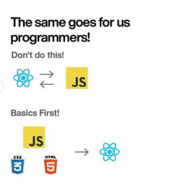

유투브에서 일론머스크가 빠르게 배우기 위한 방법 두가지에 대해서 얘기한 유투브를 봤고 개발자들이 학습할때 도움이 될만한 내용인것 같아서 블로그를 남기게 됐다.

[영상: Elon Musk's 2 Reuls For Learning Anythin Faster](https://www.youtube.com/watch?v=xLkC-ODKQSc)

두가지 규칙은 다음과 같다

첫번째

* 깊은 것을 배우기전에 먼저 기본적인 것을 배운다.
  

두번째 - Connect stuff

* You can't remember what you can't connect
* 부작위로 정보를 배우지 않는다.
* 배운것을 연결시키면서 더 깊게 이해한다.
* 매일 나무를 심는다. 심은 나무가 지식의 숲이 될때까지
