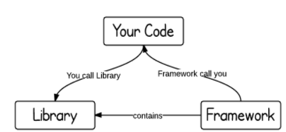

# Library vs Framework?

# 1. Key Difference and Definition of Library and Framework

- 중요 키워드는 "Inversion of Control"이다.
- method를 호출시
    - library: 내가 제어한다.
    - framework: 제어가 역전(IOC)돼 프레임워크가 내가 작성한 코드를 호출한다.
    

- library
    - class 들의 집합
    - 재사용하기 위해서
- Framework
    - 모든 제어의 흐름이 정해져 있다.
    - 이미 정해져 있는 클래스, 함수들이 있다. 이것을 개발자가 스펙에 맞게 사용해야한다.
    - library 보다 복잡하다
    - framework는 개발을 수월할 수 있게 뼈대를 만들고 이것을 만들어 나간다.
    - 개발자는 설계를 고민할 필요 없이 도메인 비즈니스로직 처리에 집중 할 수 있다.

# 2. Their Relation

- 둘 모두 API를 정의 해야 한다.
- 보통 Framework 개발을 시작하며 프레임워크에서 개발할때 API를 통해 libraries을 사용한다.
- 즉 API를 통해서 프레임워크에 라이브러리를 사용할 수 있는 것이다.

# 참고 

[Library vs. Framework?](https://www.programcreek.com/2011/09/what-is-the-difference-between-a-java-library-and-a-framework/)