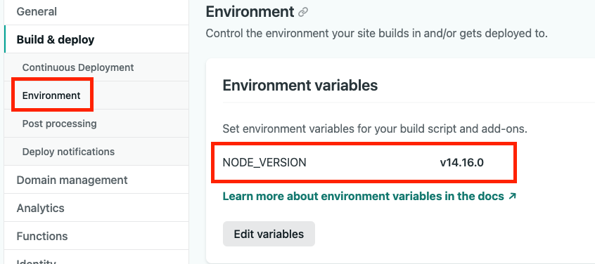

# 문제 발생

* netlify에서 배포시 다음과 같이 node version문제가 생겼다.

```
error extract-files@11.0.0: The engine "node" is incompatible with this module. Expected version "^12.20 || >= 14.13". Got "12.18.0"
```


# 원인

* 빌드시 node version 때문에 다른 패키지와 공존할 수 없는 충동상황이 일어 났다고 한다.
* node version 정보를 다른 프로젝트 하다가 업데이트 해서 발생한 문제 인것 같다.

# 해결

* [netlify docs의 Magane build dependencies](https://docs.netlify.com/configure-builds/manage-dependencies/#node-js-and-javascript)에서 node version을 관리하는 방법이 있다.

* 실제 변경하는 방법은 [Build environment variables 문서에 있다.](https://docs.netlify.com/configure-builds/environment-variables/)
    * 개인 프로젝트면 아래 문구가 있는 곳을 참고 하면 된다.

    ```
    In Site settings > Build & deploy > Environment > Environment variables. Variable values set under site settings will override the team-level settings.
    ```

    * 참고 캡쳐
        * Netlify > Site > setting > Build & deploy > Environment
          
            * node version 확인
              
